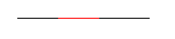
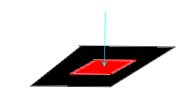
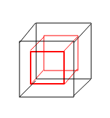
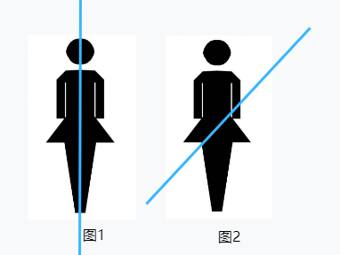

## 什么是四维空间？

首先，我们来看一下百度百科和维基百科中的定义：

> 在物理学和数学中，可将$n$个数的序列理解为一个 $n$ 维空间中的位置。当$n=4$时，所有这样的位置的集合就叫做**四维空间**。四维空间和人居住的三维空间不同，因为多了一个维度。

以上内容很容易理解，这是在数学上和物理上对四维空间的定义；然而在日常生活中，我们经常误将第四维度认为成**时间的概念**，这种观念**是大错特错的！** 这种普遍性的误用，是由于相对论的相关科普和文艺作品的流行。

既然与时间的概念无关，那么我们如何具象化的理解四位空间呢？

## 类比法了解四维空间

最简单的，我们知道一维空间是一条直线，二维空间是一个由无数直线组成的平面，三维空间是一个由无数平面组成的空间，那么四位空间就是一个由无数个空间组成的空间。事实上，我们不应该用“空间”一词来形容一个四维的世界，因为三维世界已经是一个空间，四维世界是由无数个空间组成的世界。然而，很遗憾的是，我们很可能永远也无法理解比空间更庞大的体系，就像一只蚂蚁永远也无法理解三维空间一样。

我们无法脑补四维世界是什么样子的，因为我们根本想象不出把无穷个空间拼接在一起是一个什么样的景象。这里我要再次强调一点的是，不要把“时间“这个概念引入进来，因为无论是三维空间也好，四维空间也罢，都与时间没有任何的关系。所以有些人说，把多个空间连接起来，不就是一条时间线么？再说一遍，这个说法**大错特错！**

我们换一种方式进行推理，假设现在我们所处在**一维空间**，只有左和右一种走向，那么我们如何从外界不经过黑色的区域达到红色的区域呢？

在一维空间中，答案是不可能！如果要抵达红色区域，那么必须要经过黑色的区域。但是我们并不是一维生物，我们可以在二维空间中毫不费力的抵达红色区域而不经过黑色区域，如下图所示。

好了，现在我们将这个问题类比一下，假设现在我们所处在**二维空间**，只有左右和上下两种走向，那么我们如何从外界不经过黑色的区域达到红色的区域呢？

答案同样是不可能！在二维空间中，如果要抵达红色区域，那么必须要经过黑色的区域。但是我们也并不是二维生物，我们可以在三维空间中毫不费力的触碰到红色区域而不经过黑色区域，如下图所示。（图片有点草率，请多多担待）

现在看清楚推理的过程了么？在三维空间中，如果我们要不触碰黑色的外壳而直接触碰红色的内部，那么我们必须要在四维空间才能做到！

因此，我们可以通过类比得出这样一个结论：**在四维空间中，任何三维物体的内部都将暴露无遗。**

从数学角度是很容易去推理四维空间，坐标无非就是从三维空间的$(x，y，z)$到思维空间的 $(x,y,z,k)$，而最关键的一个变量就是这个$k$。我们说在三维空间中有上下，左右，前后这三个维度；对于第四个维度，我们暂且称为”顶底“，而这个$k$也就代表了顶底的值。

而这个$k$的值在四维空间中到底指的是什么呢？我们无从知晓，但是，根据刚才的推理（我们认为这个推理是公理1）我们可以得出$k$跟物体的深度或许有一定的关系，我们暂且假设$k$代表的是一个物体的深度。那么当$k=0$时，我们看到的时一个立体的表面，而当$k\neq 0 $（比如$k=1$）时，我们看到的四维世界在三维空间的投影就是这个物体深度为$1$的内部。对于四维空间的生物来说，触碰一个物体的内部是再简单不过的事情。

当然，这个假设大概率是不正确的，或者说，一定不正确。之所以这样假设，是为了让我们更直观的理解思维空间，事实上的四维空间远不止如此，其复杂程度超出了我们的认知。我们只是管中窥豹罢了，就好比二维世界中的三角形生物费尽千辛万苦终于进入了三维世界，哪怕它可以理解第三维度$z$时什么，它也只是一个三角形纸片罢了，当它看到一个三棱锥时，一定会震惊的无以复加。

而对于三维生物的我们来说，我们还依然无法理解第四维度$k$到底指代的是什么，更别提如何想象四维世界了。

## 四维空间的轴对称性

对于四维空间，人们普遍认为空间有轴对称性，类比二维空间的一个三角形生物，当它进入三维空间之后便可以以任意角度进行旋转和翻转（想象一个三角形纸片漂浮在太空中的场景），当它再次回到二位世界，或许会被“轴对称”了一下；同样的，对于三维世界的生物，进入四维世界再回到三维世界，同样也可能会被”轴对称”（想象一下你的心脏跑到了身体的右侧），这便是四维空间的轴对称性。（我们认为这个推理是公理2）

而这个轴对称性并不是我们想象的那样，沿着你的脑袋到脚一分为二（图一），也可能时这样轴对称的（图二）。因此，如果我们想要从四维世界返回三维空间将是非常危险的一个行为。此外，根据公理1所描述的，如果我们从三维空间进入四维世界，那么我们的一切从里到外将暴露在四维世界中，我们的血液内脏等等将直接暴露在四维世界的空气中，这也是极其危险的行为（根本就活不了的好吧）。

## 四维空间的遐想

根据公理1和公理2，我们可以做出关于四维空间的一个合理的假设：四维空间的第四个维度$k$代表着三维空间中以任何一个点（也可能是一条直线，这个要看我们如何定义零维空间了）为中心，到这个点的距离。而四维空间的生物可以在第四个维度自由穿梭，也就是说可以自由达到任意物体的外部或内部。而这个点也是无穷多个的，空间中的任意一个点都可以作为$k$的基点。我们知道从二维到三维提升了一个数量级，那么从三维到四维也同样提升了一个数量级。

以上想法并非正确，仅仅是在两个并非一定正确的公理上遐想出的结论，这种结论自然是站不住脚的，仅仅是提供了一个可能的观点而已。而我认为，在没有事实基础的情况下，我们是永远也无法得知四维空间真正的面目，就如我之前所说的三角形生物一样，我们做的一切猜想都是基于三维世界观，所做的一切假设都是去尝试将四维世界投影到三维空间中；并非说这种方法不正确，而是我们永远无法通过这种逆向推导去了解真正的四维世界。