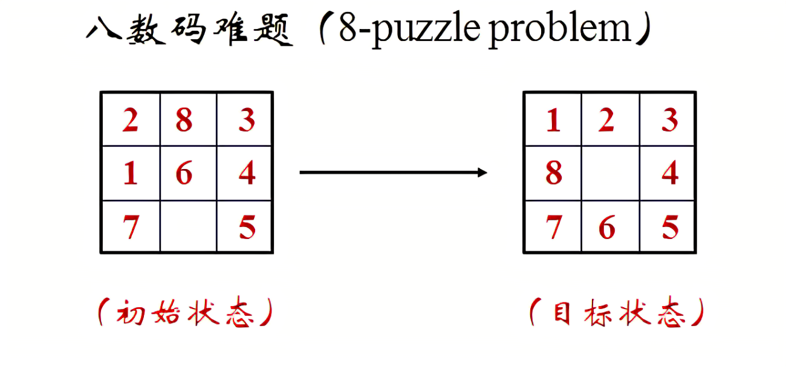
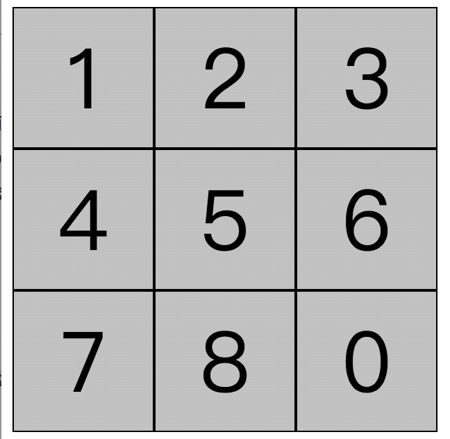
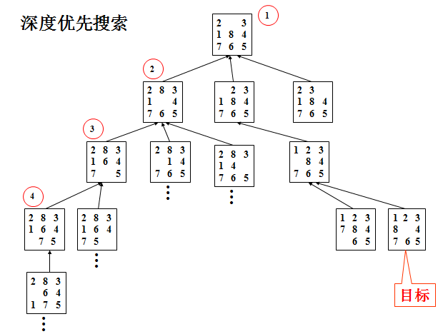
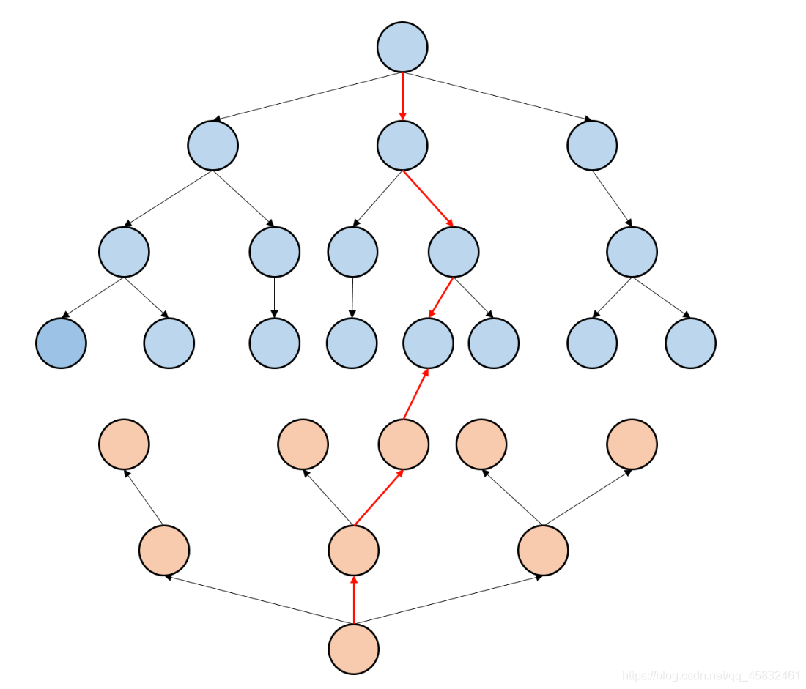

## 题目描述

在$3×3$的棋盘上，摆有八个棋子，每个棋子上标有$1$至$8$的某一数字。棋盘中留有一个空格，空格用$0$来表示。空格周围的棋子可以移到空格中。要求解的问题是：给出一种初始布局（初始状态）和目标布局（为了使题目简单,设目标状态为$123804765$），找到一种最少步骤的移动方法，实现从初始布局到目标布局的转变。



### 输入输出样例

input1: $283104765$

output1: $4$

input2: $603712458$

output2: $15$

input3: $603712458$

output3: $23$



## 问题分析

### 朴素BFS

看完问题我们最先想到的一定是BFS，因为我们知道起始状态和目标状态，且不需要求解过程，只需要知道执行的步骤，那么DFS自然就不需要了。因此最简单的办法就是套用BFS模板，目标状态的深度即为答案。过程很简单，看代码就可以理解的哈，不理解可以温习一下BFS的原理：[BFS简介](https://tonylsx611.github.io/2022/03/10/BFS/)



### 朴素BFS代码

```c
int main()
{
    string start;
    int depth=0;
    queue<string> Q;
    Q.push(start);
    while(!Q.empty())
    {
        int len=Q.size();
        for(int i=0;i<len;i++)//while循环内的for循环代表树的深度
        {
            string node=Q.front();

            int position;//数字0的位置
            if(node[j]=='0')//寻找数字0在九宫格的位置
                position=j;
            
            if(position == 1,2,4,5,7,8)//数字0向左移动
            {
                swap(node[position],node[position-1]);//与0交换位置
				Q.push(node);
                judge();//判断是否是目标状态
                swap(node[position],node[position-1]);//交换回来
            }
            
            if(position == 3,4,5,6,7,8)//数字0向上移动
            {
                swap(node[position],node[position-3]);//与0交换位置
				Q.push(node);
                judge();//判断是否是目标状态
                swap(node[position],node[position-3]);//交换回来
			}

            if(position == 0,1,3,4,6,7)//数字0向右移动
            {
                swap(node[position],node[position+1]);//与0交换位置
				Q.push(node);
                judge();//判断是否是目标状态
                swap(node[position],node[position+1]);//交换回来
            }

            if(position == 0,1,2,3,4,5)//down
            {
                swap(node[position],node[position+3]);//与0交换位置
				Q.push(node);
                judge();//判断是否是目标状态
                swap(node[position],node[position+3]);//交换回来
            }
            Q.pop();
        }
        depth++;
    }
}
```

### 记忆化BFS搜索

但是，这样的搜索显然是有很多重复的节点，会出现返祖现象，就是说后面的搜索包含了前面已经搜索过的节点。比如，数字0第一次向右移动，第二次向左移动，就相当没移动，又回到原来的节点了。那么为了避免这个问题，我们使用一个超大的数组来记录每一次遍历过的节点状态，因为BFS是按照层级顺序搜索的，因此每次搜索前查找一下这个超大数组，如果已经遍历过的节点将不会再次遍历。这样的减枝可以极大的提高搜索效率，可以减少大约50%的重复搜索时间。

### 记忆化BFS搜索代码

```c
string disk[1000001];//记忆数组
int main()
{
    string start;
    string final="123804765";
    int depth=0;
    int ptr=0;
    queue<string> Q;
    disk[0]=start;
    Q.push(start);
    while(!Q.empty())
    {
        int len=Q.size();
        for(int i=0;i<len;i++)
        {
            string node=Q.front();

            int position;//数字0的位置
            if(node[j]=='0')//寻找数字0在九宫格的位置
                position=j;
            
            if(position == 1,2,4,5,7,8)//数字0向左移动
            {
                swap(node[position],node[position-1]);
                //----------------------
                bool judge=true;
                for(int j=ptr;j>=0;j--)//从后向前检查该节点是否遍历过
                    if(disk[j]==node)
                    {
                        judge=false;
                        break;
                    }
                if(judge)//如果没有遍历过
                {
                    Q.push(node);
                    ptr++;
                    disk[ptr] = node;
                    if(node==final)
                    {
                        cout<<depth+1<<endl;
                        return 0;
                    }
                }
                //---------------------
                swap(node[position],node[position-1]);
            }
            
            if(position>2)//数字0向上移动
            {
                swap(node[position],node[position-3]);
				//同上
                swap(node[position],node[position-3]);
            }

            if(position == 0，1，3，4，6，7)//数字0向右移动
            {
                bool judge=true;
                swap(node[position],node[position+1]);
                //同上
                swap(node[position],node[position+1]);
            }

            if(position<6)//数字0向下移动
            {
                swap(node[position],node[position+3]);
				//同上
                swap(node[position],node[position+3]);
            }
            Q.pop();
        }
        depth++;
    }
}
```

### 双向BFS

虽然上述方法已经很快了，但是执行$Input3$依旧需要将近20秒的时间，因此当节点很深的时候，我们有没有更快的办法呢？

对于本题而言，双向BFS就派上用场了，因为本题已知起始状态和目标状态，我们完全可以同时对这两个状态进行BFS，当两面搜索到了同一个节点时，两面的深度之和就是答案。如图所示，同样的，对于一些走迷宫类的问题，给出起始状态和中止状态，我们都可以考虑使用双向BFS来求解。这种方法有多快呢， 对于$Input3$而言，使用双向BFS求解的时间仅需$0.3s$，是单向BFS速度的近百倍！



这里，我们对代码进行了一些小小的优化，将原本的disk数组更换成了更高效的**哈希映射**，通过**康托展开**将$0-8$的全排列一一映射到大小仅为$362880$的哈希表中。或许你会疑惑，原本应该至少需要开`disk[876543210]`这么大的数组，怎么只需要`disk[362880]`就可以储存的下呢？我们来看一下康托展开的具体实现方式：[康托展开_百度百科 (baidu.com)](https://baike.baidu.com/item/康托展开/7968428?msclkid=92fc5a9ab32e11ec926143771748963a).

是不是很神奇呢？

### 双向BFS代码

```c
#include<iostream>
#include<string>
#include<queue>
using namespace std;
struct ant
{
    string str;
    int depth;
    short one_two;
};
int visit[362880];
int depth[362880];

void bfs(string begin, string end);//双向BFS
int hash1(string s);//康托展开

int main()
{
    string final = "123804765";
    string start ="603712458";
    bfs(start, final);
    return 0;
}

int hash1(string s)//康托展开
{
    int f[9]={0,1,2,6,24,120,720,5040,40320};
    int book[9]={0};
    int ans=0;
    int x=s.length();
    for(int i=0;i<s.length();i++)
    {
        int num=0;
        book[s[i]-'0']=1;
        for(int j=0;j<s[i]-'0';j++)
            if(!book[j])
                num++;
        x--;
        ans+=num*f[x];
    }
    return ans;
}

void bfs(string begin, string end)
{
    queue<ant> Q;
    ant temp;
    int str_to_int;//哈希转换

    temp.str = begin;
    temp.depth = 0;
    temp.one_two = 1;//1代表正向BFS
    Q.push(temp);
    str_to_int = hash1(temp.str);
    visit[str_to_int] = 1;
    //depth[str_to_int] = 0;

    temp.str = end;
    temp.depth = 0;
    temp.one_two = 2;
    Q.push(temp);
    str_to_int = hash1(temp.str);
    visit[str_to_int] = 2;//2代表反向BFS
    //depth[str_to_int] = 0;

    while (!Q.empty())
    {
        ant node = Q.front();
        node.depth++;

        int position = -1;//position是数字0所在的位置
        for (int i = 0; i < 9; i++)
            if (node.str[i] == '0')
            {
                position = i;
                break;
            }


        if(position == 1,2,4,5,7,8)//数字0向左移动
        {
            swap(node.str[position], node.str[position - 1]);
            str_to_int = hash1(node.str);

            if (!visit[str_to_int])//没有访问过
            {
                Q.push(node);
                visit[str_to_int] = node.one_two;
                depth[str_to_int] = node.depth;
            }
            if(visit[str_to_int] + node.one_two == 3)//一个是1，一个是2，代表相遇
            {
                int ans = depth[str_to_int] + node.depth;
                cout << ans << endl;
                return;
            }
            swap(node.str[position], node.str[position - 1]);
        }

        if (position >= 3 && position <= 8)//数字0向上移动
        {
            swap(node.str[position], node.str[position - 3]);
            str_to_int = hash1(node.str);

            if (!visit[str_to_int])//没有访问过
            {...}//同上
            judge();//同上
            swap(node.str[position], node.str[position - 3]);
        }

        if(position == 0，1，3，4，6，7)//数字0向右移动
        {
            swap(node.str[position], node.str[position + 1]);
            str_to_int = hash1(node.str);

            if (!visit[str_to_int])//没有访问过
            {...}//同上
            judge();//同上
            swap(node.str[position], node.str[position + 1]);
        }

        if (position >= 0 && position <= 5)//数字0向下移动
        {
            swap(node.str[position], node.str[position + 3]);
            str_to_int = hash1(node.str);

            if (!visit[str_to_int])//没有访问过
            {...}//同上
            judge();//同上
            swap(node.str[position], node.str[position + 3]);
        }
        Q.pop();
    }
}
```

### A*算法


### A*算法代码

```
```

