## Anaconda Python 环境搭建

## 下载并安装anaconda

官网下载链接: [Anaconda | The World's Most Popular Data Science Platform](https://www.anaconda.com/))


下载后一键安装：

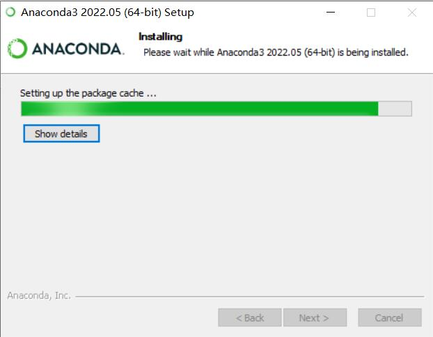

## 添加Anaconda到环境变量

在计算机中搜索“环境变量”（快捷键 Win+S），选择系统变量中的path，编辑Path。

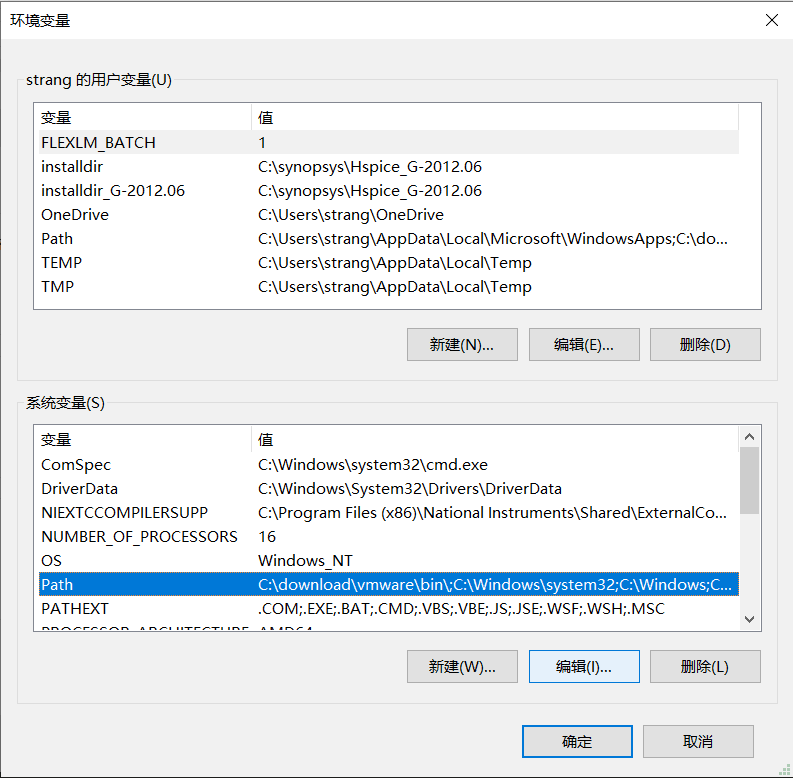

若安装Anaconda时使用的时默认安装位置，在Path中添加如下地址：

```bash
C:\ProgramData\Anaconda3
C:\ProgramData\Anaconda3\Scripts
C:\ProgramData\Anaconda3\Library\bin
C:\ProgramData\Anaconda3\Library\mingw-w64\bin
```

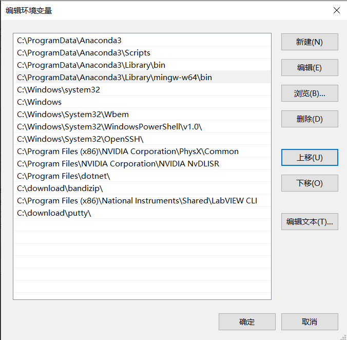

添加后验证是否成功配置环境变量，在本地计算机中搜索`prompt`，以管理员身份运行。

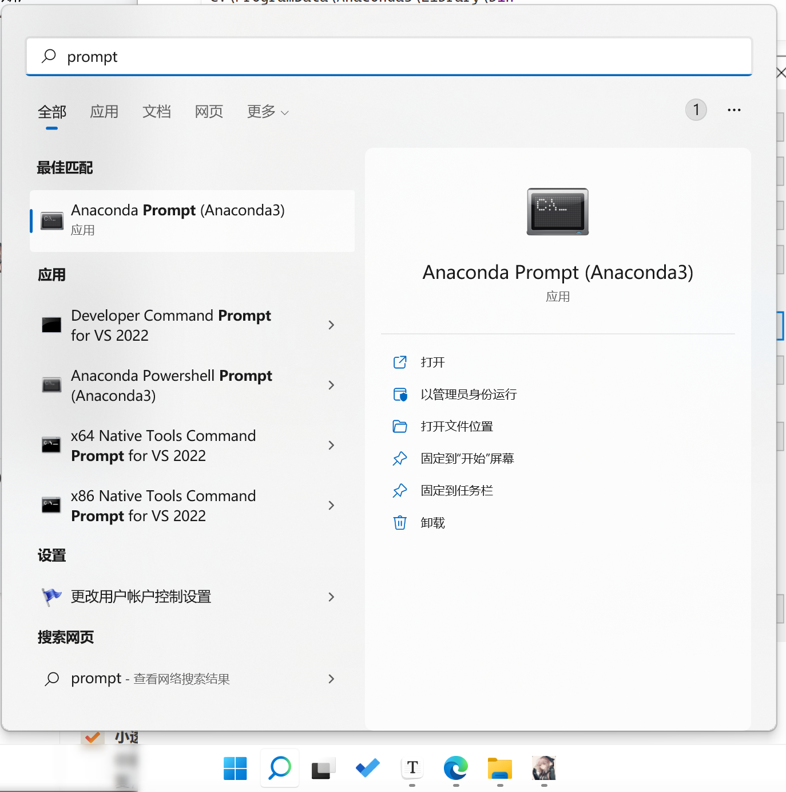

输入以下指令：

```bash
conda --version
conda info
python --version
```

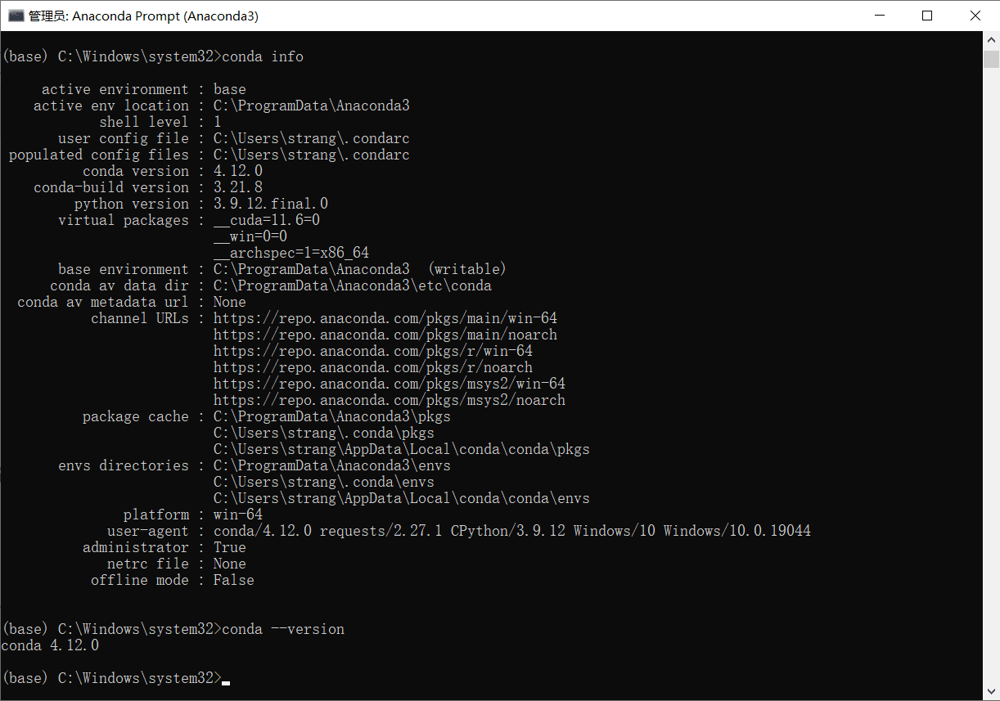

如果可以正常输出则证明安装成功，部分老机型需要重启电脑才能应用path添加的新环境，若仍不成功则检查path路径是否有误。

## 运行Python

打开Anaconda Navigator并运行Spyder，随便输入点什么（比如print语句），若能正常运行，则证明Python安装成功。

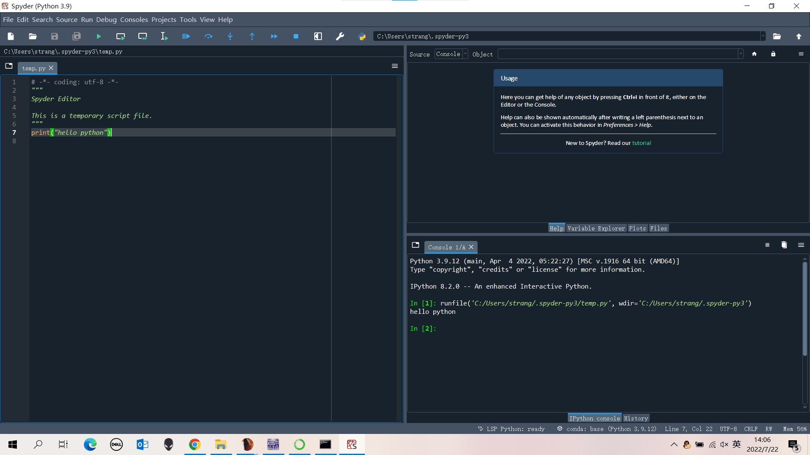

Pycharm是Python较为常用的IDE，这里我们放一个官网链接供快捷跳转下载。

[Pycharm官网安装网址](https://www.jetbrains.com/pycharm/)


安装过程中记得勾选“添加bin到path环境变量中”，否则还得手动添加一遍，麻烦死。

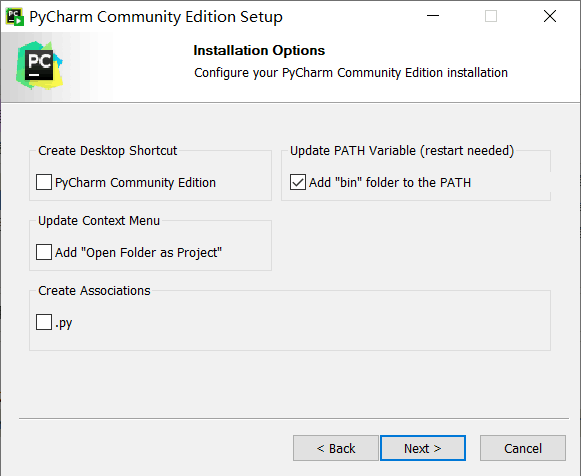

安装好后重启电脑，Anaconda可视化界面下多出了一个Pycharm Community的图标，可从anaconda中直接打开Pycharm。

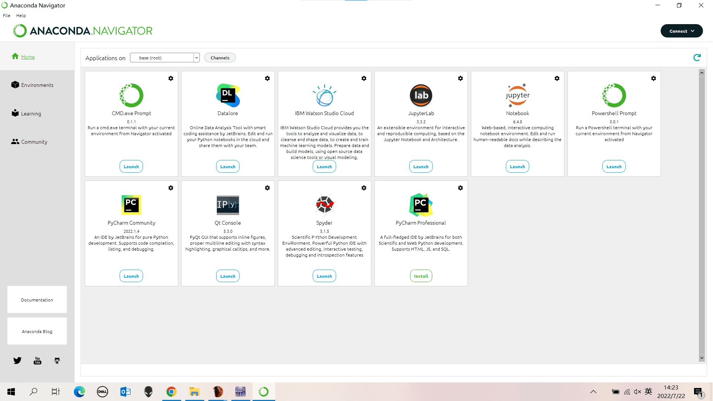

## Python环境管理

当我们通过Pycharm新建一个项目时，可以选择新建环境或者使用之前配置好的环境。

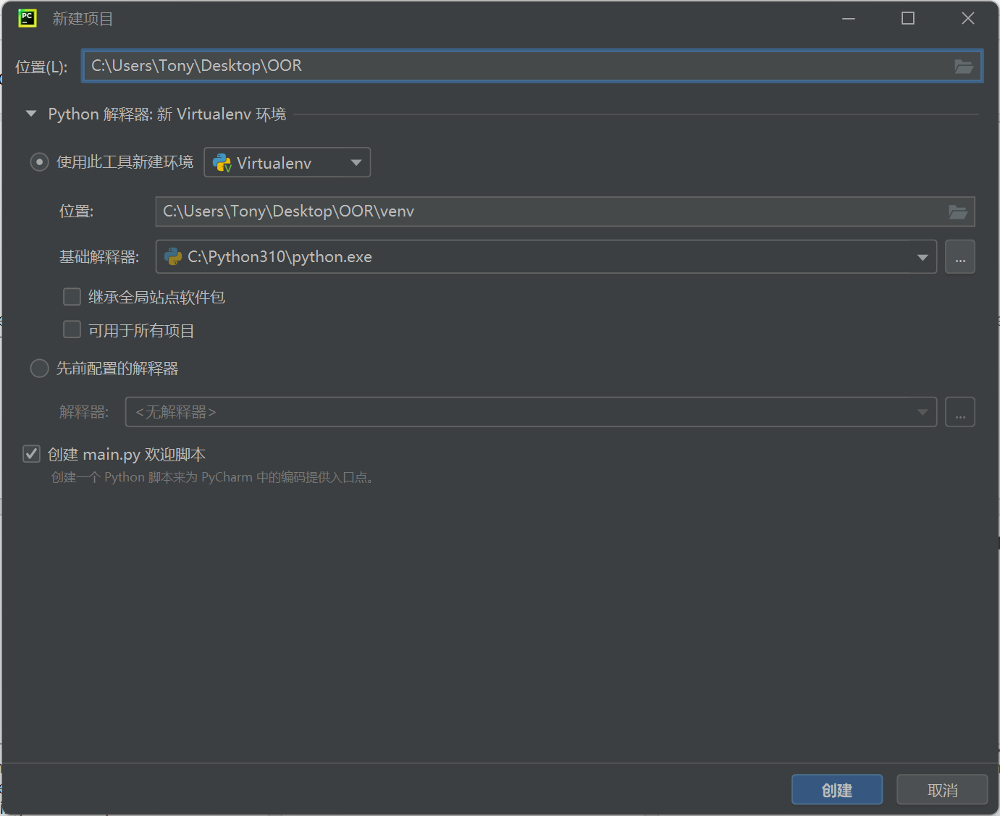

### 新建环境

- Virtuallenv: Pycharm的虚拟环境，项目之间默认不通用，也就是说每新建一个项目都要新开一个虚拟环境，较为占用空间。
- Conda：Anaconda环境，也可在anaconda的environment可视化界面下添加环境，如图所示：

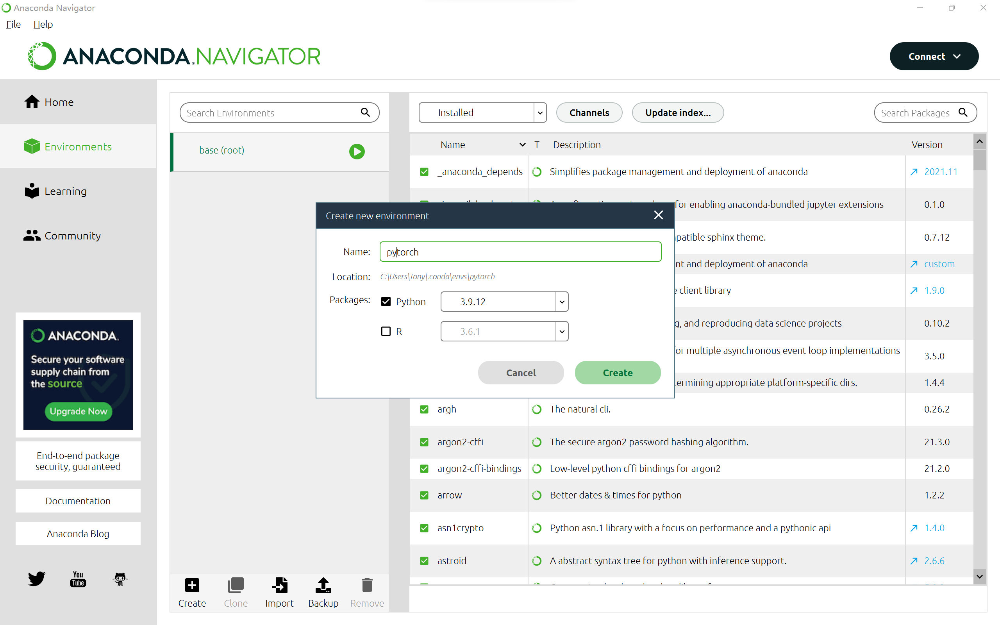

我们可以将Anaconda的environment理解为环境管理工具，也可以在prompt中使用命令添加或删除环境。

### 先前配置的环境

选择Conda环境，解释器的位置为Anaconda的安装目录根目录，下面有个Python.exe，选择此目录（如果没有ProgramData目录，则手动打上去，就有了），此环境为anaconda的base目录。

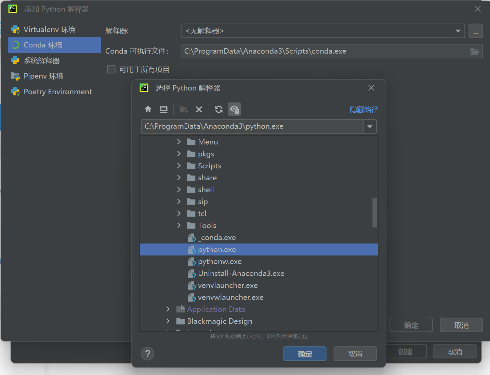

如果选择其它目录，则在Python解释器中更改为指定的解释器目录。

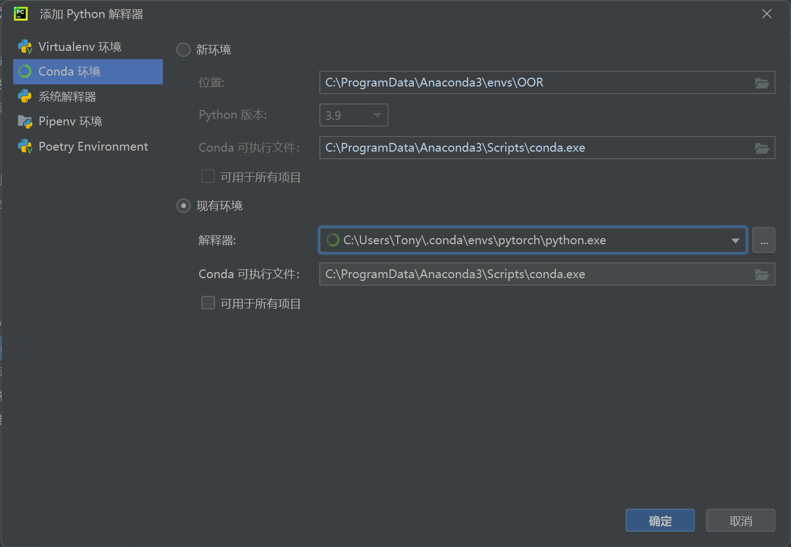
