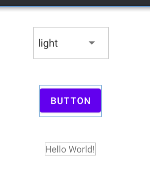
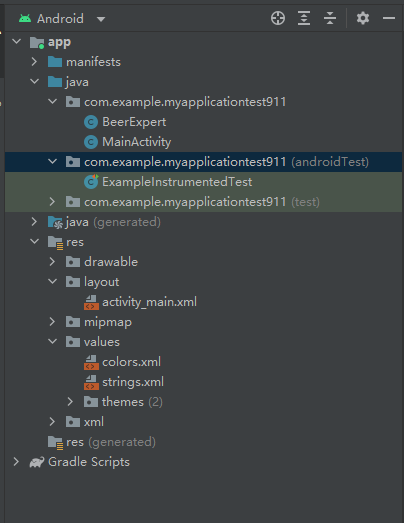
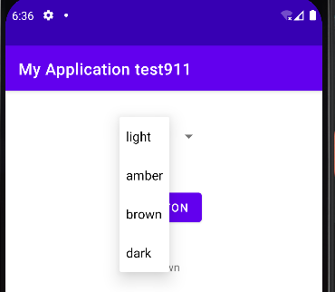
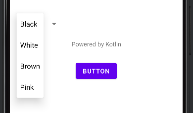

## 任务目标

在Spinner中提供四个可选项，当点击BUTTON按钮时，下方文字显示对应的选项。



## 项目管理



该项目中我们主要用到以下四个文件：

- MainActivity.java
- BeerExport.java
- activity_main.xml
- strings.xml

其中，MainActivity.java是核心的java文件，BeerExport.java是用来定义新的class的java文件，需要手动创建。Activity_main.xml是定义主界面控件的文件，strings.xml是用来定义特定字符串的文件。

## 界面编辑

```xml
<!---Activity_main.xml--->
<?xml version="1.0" encoding="utf-8"?>
<LinearLayout
    xmlns:app="http://schemas.android.com/apk/res-auto"
    xmlns:android="http://schemas.android.com/apk/res/android"
    xmlns:tools="http://schemas.android.com/tools"
    android:layout_width="match_parent"
    android:layout_height="match_parent"
    android:padding="16dp"
    android:orientation="vertical"
    tools:context=".MainActivity" >

    <Spinner
        android:id="@+id/color"
        android:layout_width="wrap_content"
        android:layout_height="wrap_content"
        android:layout_gravity="center"
        android:layout_margin="16dp"
        android:layout_marginTop="40dp"
        android:entries="@array/beer_color"
        android:minHeight="48dp" />

    <Button
        android:id="@+id/find_beer"
        android:layout_width="wrap_content"
        android:layout_height="wrap_content"
        android:layout_gravity="center"
        android:layout_margin="24dp"
        android:text="button"
        android:onClick="onClickFindBeer"/>
    <TextView
        android:id="@+id/brands"
        android:layout_width="wrap_content"
        android:layout_height="wrap_content"
        android:text="Hello World!"
        android:layout_gravity="center"
        android:layout_margin="16dp" />

</LinearLayout>
```

我们分别定义了三个主要的控件，其中Spinner的名字是color，Button的名字是find_beer，TextView的名字是brands.

需要注意的是，spinner控件中定义了名为beer_color的entries，而我们可以在strings.xml中定义一个字符串数组来储存这些选项。

```xml
<!---strings.xml--->
<resources>
    <string name="app_name">My Application test911</string>
    <string-array name="beer_color">
        <item>light</item>
        <item>amber</item>
        <item>brown</item>
        <item>dark</item>
    </string-array>
</resources>
```

## Java逻辑编辑

注意到在activity_main.xml的Button控件中，我们定义了一个Onclick功能，每次按下按钮时，都会执行该功能。因此我们需要在MainActivity.java中定义该函数。

```java
public class MainActivity extends AppCompatActivity
{
    private final BeerExpert expert = new BeerExpert();

    public void onClickFindBeer(View view)
    {
        TextView brands = findViewById(R.id.brands);
        Spinner color = findViewById(R.id.color);
        String beerType = String.valueOf(color.getSelectedItemId());
        brands.setText(beerType); //0-3

        List<String> brandlist = expert.getBrands(beerType);
        StringBuilder brandFormatted = new StringBuilder();
        for (String brand:brandlist)
        {
            brandFormatted.append(brand).append("\n");
        }
        brands.setText(brandFormatted);
    }

    @SuppressLint("SetTextI18n")
    @Override
    protected void onCreate(Bundle savedInstanceState) 
    {
        super.onCreate(savedInstanceState);
        setContentView(R.layout.activity_main);
        TextView Brands = findViewById(R.id.brands);
        Brands.setText("This is the initial TEXT");
    }
}
```

而BeerExpert.java中的函数则是判断Spinner中选中了哪个选项，并返回相应的文字。然后将文字打印到下方的文字框中。对于这个程序，其实完全可以在MainActivity中定义一个函数，我们这里选择新建一个Class的原因是为了体现面向对象的编程。

```java
public class BeerExpert
{
    public BeerExpert()
    {

    }
    List<String> getBrands(String color)
    {
        List<String> bands = new ArrayList<>();
        if(color.equals("1"))
        {
            bands.add("Amber");
        }
        else if(color.equals("0"))
        {
            bands.add("Light");
        }
        else if(color.equals("2"))
        {
            bands.add("Brown");
        }
        else if(color.equals("3"))
        {
            bands.add("Dark");
        }
        else
        {
            bands.add("Error!!!");
        }
        return bands;
    }
}
```

## 程序运行



## Kotlin语言

```kotlin
package com.example.kotlin_test

import android.os.Bundle
import android.view.View
import android.widget.Spinner
import android.widget.TextView
import androidx.appcompat.app.AppCompatActivity

class MainActivity : AppCompatActivity()
{
    fun getBrands(color: String): MutableList<String>
    {
        val bands: MutableList<String> = ArrayList()
        if (color == "0") 
            bands.add("Black")
        else if (color == "1") 
            bands.add("White")
        else if (color == "2") 
            bands.add("Brown")
        else if (color == "3")
            bands.add("Pink")
        else
            bands.add("Error!!!")
        return bands
    }
    fun onClickButton(view: View)
    {
        val brands = findViewById<TextView>(R.id.textView)
        val color = findViewById<Spinner>(R.id.spinner)
        val beerType = color.selectedItemId.toString()
        brands.text = beerType //0-3


        val brandlist: List<String> = getBrands(beerType)
        val brandFormatted = StringBuilder()
        for (brand in brandlist)
        {
            brandFormatted.append(brand).append("\n")
        }
        brands.text = brandFormatted
    }
    override fun onCreate(savedInstanceState: Bundle?)
    {
        super.onCreate(savedInstanceState)
        setContentView(R.layout.activity_main)
        var Text = findViewById<TextView>(R.id.textView)
        Text.text = "Powered by Kotlin"
    }
}
```



---

下一篇：[Android Studio开发 2 | Tony](http://tonylsx.top/2022/09/27/Android-studio-2/)
