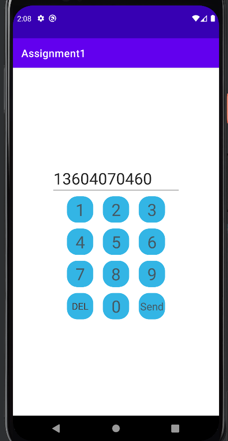
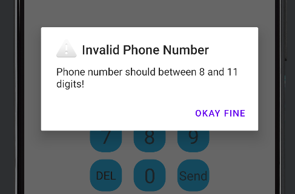
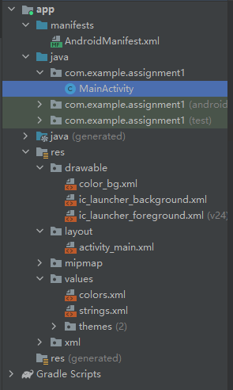
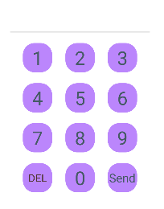
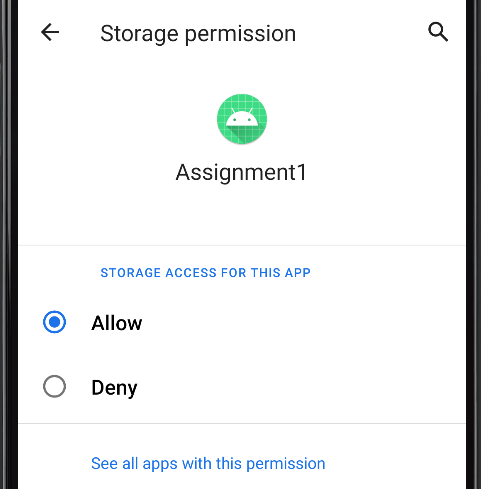
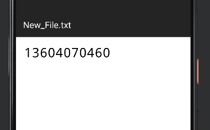

## 任务目标

用按钮设计一个输入电话号码的拨号盘，上面可以显示输入的电话号码。

设计一个发送按钮和删除按钮，点击删除按钮可以撤销输入的号码，点击发送按钮需要判断电话号码是否少于8位或大于11位，如果不满足要求需要提示用户输入的格式不正确，满足要求则需要将号码存放到手机外部储存的txt文件中。





## 项目管理



该项目中我们主要用到以下四个文件：

- MainActivity.java
- MainActivity.xml
- AndroidManifest.xml
- color_bg.xml

其中，color_bg.xml需要在drawable文件夹下手动创建，其目的是更改号码按钮的背景颜色和背景图案。

AndroidManifest.xml文件需要添加几行代码，其作用是允许程序读取和写入手机内部储存，后面会详细说明。

## 界面编辑

拨号盘界面定义了12个TextView类型的控件，由于代码过于冗余且控件定义方式一模一样，这里以数字5的控件为例，其它数字控件的定义均省略。

```xml
<?xml version="1.0" encoding="utf-8"?>
<androidx.constraintlayout.widget.ConstraintLayout xmlns:android="http://schemas.android.com/apk/res/android"
    xmlns:app="http://schemas.android.com/apk/res-auto"
    xmlns:tools="http://schemas.android.com/tools"
    android:layout_width="match_parent"
    android:layout_height="match_parent"
    tools:context=".MainActivity">

    <TextView
        android:id="@+id/textView5"
        android:layout_width="50dp"
        android:layout_height="50dp"
        android:background="@drawable/color_bg"
        android:gravity="center"
        android:onClick="onClickNumber"
        android:text="@string/number_5"
        android:textColor="#455A64"
        android:textSize="32sp"
        app:layout_constraintBottom_toBottomOf="parent"
        app:layout_constraintEnd_toEndOf="parent"
        app:layout_constraintStart_toStartOf="parent"
        app:layout_constraintTop_toTopOf="parent" />

    <TextView .../>
    
    <TextView
        android:id="@+id/textView_del"
        android:layout_width="50dp"
        android:layout_height="50dp"
        android:background="@drawable/color_bg"
        android:gravity="center"
        android:onClick="onClickDelete"
        android:text="@string/del"
        android:textColor="#4E342E"
        android:textSize="18sp"
        app:layout_constraintBottom_toBottomOf="parent"
        app:layout_constraintEnd_toEndOf="parent"
        app:layout_constraintHorizontal_bias="0.3"
        app:layout_constraintStart_toStartOf="parent"
        app:layout_constraintTop_toTopOf="parent"
        app:layout_constraintVertical_bias="0.7" />

    <TextView
        android:id="@+id/textView_Send"
        android:layout_width="50dp"
        android:layout_height="50dp"
        android:background="@drawable/color_bg"
        android:gravity="center"
        android:onClick="onClickSend"
        android:text="@string/send"
        android:textColor="#455A64"
        android:textSize="20sp"
        app:layout_constraintBottom_toBottomOf="parent"
        app:layout_constraintEnd_toEndOf="parent"
        app:layout_constraintHorizontal_bias="0.7"
        app:layout_constraintStart_toStartOf="parent"
        app:layout_constraintTop_toTopOf="parent"
        app:layout_constraintVertical_bias="0.7" />

    <EditText
        android:id="@+id/editTextPhone"
        android:layout_width="wrap_content"
        android:layout_height="wrap_content"
        android:ems="7"
        android:inputType="phone"
        android:textSize="30sp"
        app:layout_constraintBottom_toBottomOf="parent"
        app:layout_constraintEnd_toEndOf="parent"
        app:layout_constraintStart_toStartOf="parent"
        app:layout_constraintTop_toTopOf="parent"
        app:layout_constraintVertical_bias="0.3"
        android:autofillHints="Press Phone Number" />
</androidx.constraintlayout.widget.ConstraintLayout>
```

另外，`background="@drawable/color_bg"`代码是用来对控件进行背景美化和边缘棱角处理的方法，具体代码如下：

```xml
<?xml version="1.0" encoding="utf-8"?>
<shape xmlns:android="http://schemas.android.com/apk/res/android">
    <corners
        android:radius="20dp"/>
    <solid
        android:color="@android:color/holo_blue_light"/>
</shape>
```

最终样式如下：



## Java逻辑编辑

首先，我们需要定义一个String类型字符串用来储存电话号码，然后我们需要对每个控件进行对应的按钮进行函数编辑，根据[Andriod Studio开发1 | Tony (tonylsx.top)](http://tonylsx.top/2022/09/17/Andriod-Studio-1/)，我们可以很容易的在MainActivity类中写出每个按钮需要进行的操作。

```java
public class MainActivity extends AppCompatActivity
{
	String PhoneNumber = "";
    
    public void onClickNumber0(View view)
    {
        EditText number = findViewById(R.id.editTextPhone);
        PhoneNumber += "0";
        number.setText(PhoneNumber);
    }
    
    //省略1-9的OnClickNumber()函数...
    
    public void onClickDelete(View view)
    {
        EditText number = findViewById(R.id.editTextPhone);
        if(PhoneNumber.length() > 0)
            PhoneNumber = PhoneNumber.substring(0, PhoneNumber.length()-1);
        number.setText(PhoneNumber);
    }
    
    public void onClickSend(View view)
    {
        EditText number = findViewById(R.id.editTextPhone);
        if(PhoneNumber.length() > 11 || PhoneNumber.length() < 8)
        {
            new AlertDialog.Builder(MainActivity.this)
                    .setIcon(android.R.drawable.ic_dialog_alert)
                    .setTitle("Invalid Phone Number")
                    .setMessage("Phone number should between 8 and 11 digits!")
                    .setPositiveButton("Okay fine", (dialogInterface, i) -> {}).create().show();
        }
        else //Print to a txt file
            Save_to_txt(PhoneNumber);
        PhoneNumber = "";
        number.setText(PhoneNumber);
    }
}
```

首先我们需要关注`onClickDelete()`函数，需要注意的是`if`语句的重要性，如果没有写`if`的话，当`PhoneNumber`为空时再次删除最后一个元素时，即调用`substring()`函数时就会出现错误，导致程序崩溃！

然后，这里面需要关注的是`OnClickSend()`函数，当数字长度不满足要求时，Android会弹出警告，提示有误并将`PhoneNumber`清空让用户重新输入，如果没有问题的话执行`Save_to_txt(PhoneNumber);`该函数的作用是在手机的根目录下创建一个新的文件夹，并在该文件夹下创建一个新的TXT文件，并将`PhoneNumber`存放到该TXT文件中。其详细代码如下：

```java
public void Save_to_txt(String number)
    {
        String path = Environment.getExternalStorageDirectory().getAbsolutePath() + File.separator + "Tony";

        File folder = new File(path);
        if(!folder.exists())
            folder.mkdirs();
        try
        {
            File file = new File(path + File.separator + "New_File.txt");
            System.out.println(path + File.separator + "New_File.txt");
            file.createNewFile();
            FileWriter fw = new FileWriter(file);
            fw.write(number);
            fw.close();
        }
        catch (Exception e)
        {
            e.printStackTrace();
        }
    }
```

其中，`Environment.getExternalStorageDirectory()`代表的是手机的内部存储根目录，也即`/storage/emulated/0`（`/storage/emulated/1`代表的是手机外部存储根目录）；`File.separator`代表的是`/`，对，就是斜杠。

此外，如果需要写入手机外部存储（即SD卡），需要在`AndroidManifest.xml`中加入以下内容，作用是申请程序的外部存储读取权限。

```xml
    <uses-permission android:name="android.permission.WRITE_EXTERNAL_STORAGE"/>
    <uses-permission android:name="android.permission.READ_EXTERNAL_STORAGE"/>
    <application
        android:requestLegacyExternalStorage="true"
        ...
```

当然，上面的代码是存储到手机的内存中去，因此需要在手机APP权限中手动开启存储权限，如下图所示。否则将无法创建文件夹和对应的文件，并会像下面这样报错：

```http
W/System.err: java.io.FileNotFoundException: /storage/emulated/0/NewFolder/New_File.txt: open failed: EACCES (Permission denied)
W/System.err:     at libcore.io.IoBridge.open(IoBridge.java:496)
W/System.err:     at java.io.FileOutputStream.<init>(FileOutputStream.java:235)
W/System.err:     at java.io.FileOutputStream.<init>(FileOutputStream.java:186)
W/System.err:     at java.io.FileWriter.<init>(FileWriter.java:90)
W/System.err:     at com.example.assignment1.MainActivity.Save_to_txt(MainActivity.java:166)
W/System.err:     at com.example.assignment1.MainActivity.onClickSend(MainActivity.java:148)
W/System.err:     at java.lang.reflect.Method.invoke(Native Method)
```




## 针对按钮响应函数的一些优化

为什么要对`OnClickNumberX()`函数进行优化呢，因为这些函数的功能一毛一样，那为什么不写成一个函数呢，在调用的时候多个按钮都可以调用同一个函数，不是更加简洁嘛？在Java中我们可以使用`switch-case`函数进行编辑，具体代码如下：

```java
public void onClickNumber(View view)
    {
        EditText number = findViewById(R.id.editTextPhone);
        switch(view.getId())
        {
            case R.id.textView0:
                PhoneNumber += "0";
                break;
            case R.id.textView1:
                PhoneNumber += "1";
                break;
            case ...
        }
        number.setText(PhoneNumber);
    }
```

## Kotlin逻辑编辑

不做解释了，直接看代码（还是Kotlin简洁啊！）

```kotlin
class MainActivity : AppCompatActivity() 
{
    private var PhoneNumber = ""
    
    fun onClickNumber(view: View)
    {
        val number = findViewById<EditText>(R.id.editTextPhone)
        when (view.id)
        {
            R.id.textView0 -> PhoneNumber += "0"
            R.id.textView1 -> PhoneNumber += "1"
            R.id.textView2 -> PhoneNumber += "2"
            R.id.textView3 -> PhoneNumber += "3"
            R.id.textView4 -> PhoneNumber += "4"
            R.id.textView5 -> PhoneNumber += "5"
            R.id.textView6 -> PhoneNumber += "6"
            R.id.textView7 -> PhoneNumber += "7"
            R.id.textView8 -> PhoneNumber += "8"
            R.id.textView9 -> PhoneNumber += "9"
        }
        number.setText(PhoneNumber)
    }

    fun onClickDelete(view: View)
    {
        val number = findViewById<EditText>(R.id.editTextPhone)
        if (PhoneNumber.isNotEmpty())
            PhoneNumber = PhoneNumber.substring(0, PhoneNumber.length - 1)
        number.setText(PhoneNumber)
    }

    fun onClickSend(view: View)
    {
        val number = findViewById<EditText>(R.id.editTextPhone)
        if (PhoneNumber.length > 11 || PhoneNumber.length < 8) {
            AlertDialog.Builder(this@MainActivity)
                .setIcon(android.R.drawable.ic_dialog_alert)
                .setTitle("Invalid Phone Number")
                .setMessage("Phone number should between 8 and 11 digits!")
                .setPositiveButton(
                    "Okay fine"
                ) { _: DialogInterface?, _: Int -> }.create().show()
        }
        else  //Print to a txt file
        {
            Save_to_txt(PhoneNumber)
        }
        PhoneNumber = ""
        number.setText(PhoneNumber)
    }

    private fun Save_to_txt(number: String?) 
    {
        val path = Environment.getExternalStorageDirectory().absolutePath + File.separator + "NewFolder"
        val folder = File(path)
        if (!folder.exists()) 
            folder.mkdirs()
        try 
        {
            val file = File(path + File.separator + "New_File.txt")
            println(path + File.separator + "New_File.txt")
            file.createNewFile()
            val fw = FileWriter(file)
            fw.write(number)
            fw.close()
        } 
        catch (e: Exception) 
        {
            e.printStackTrace()
        }
    }

    override fun onCreate(savedInstanceState: Bundle?) 
    {
        super.onCreate(savedInstanceState)
        setContentView(R.layout.activity_main)
    }
}
```

## 效果展示



---

上一篇：[Android Studio开发 2 | Tony](http://tonylsx.top/2022/09/27/Android-studio-2/)

下一篇：[Android-Studio开发 4 | Tony](http://tonylsx.top/2022/10/11/Android-Studio-4/)
