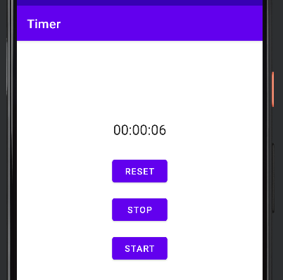

## 任务目标

制作一个简易计时器（秒表），实现Start, Stop, Restart三个按钮的功能。

在此基础上，实现当屏幕旋转后依旧可以继续计时，且当程序在后台运行时（如返回桌面或打开其它软件）暂停计时，并在返回该程序时继续计时。



## 界面编辑

```xml
<?xml version="1.0" encoding="utf-8"?>
<androidx.constraintlayout.widget.ConstraintLayout xmlns:android="http://schemas.android.com/apk/res/android"
    xmlns:app="http://schemas.android.com/apk/res-auto"
    xmlns:tools="http://schemas.android.com/tools"
    android:layout_width="match_parent"
    android:layout_height="match_parent"
    tools:context=".MainActivity">

    <TextView
        android:id="@+id/time_view"
        android:layout_width="wrap_content"
        android:layout_height="wrap_content"
        android:text="00：00：00"
        android:textAppearance="@android:style/TextAppearance.Large"
        app:layout_constraintBottom_toBottomOf="parent"
        app:layout_constraintEnd_toEndOf="parent"
        app:layout_constraintStart_toStartOf="parent"
        app:layout_constraintTop_toTopOf="parent"
        app:layout_constraintVertical_bias="0.2" />

    <Button
        android:id="@+id/button_start"
        android:layout_width="wrap_content"
        android:layout_height="wrap_content"
        android:text="Start"
        android:onClick="onClickStart"
        app:layout_constraintBottom_toBottomOf="parent"
        app:layout_constraintEnd_toEndOf="parent"
        app:layout_constraintStart_toStartOf="parent"
        app:layout_constraintTop_toTopOf="parent" />

    <Button
        android:id="@+id/button_stop"
        android:layout_width="wrap_content"
        android:layout_height="wrap_content"
        android:text="Stop"
        android:onClick="onClickStop"
        app:layout_constraintBottom_toBottomOf="parent"
        app:layout_constraintEnd_toEndOf="parent"
        app:layout_constraintStart_toStartOf="parent"
        app:layout_constraintTop_toTopOf="parent"
        app:layout_constraintVertical_bias="0.4" />

    <Button
        android:id="@+id/button_Reset"
        android:layout_width="wrap_content"
        android:layout_height="wrap_content"
        android:text="Reset"
        android:onClick="onClickReset"
        app:layout_constraintBottom_toBottomOf="parent"
        app:layout_constraintEnd_toEndOf="parent"
        app:layout_constraintStart_toStartOf="parent"
        app:layout_constraintTop_toTopOf="parent"
        app:layout_constraintVertical_bias="0.3" />


</androidx.constraintlayout.widget.ConstraintLayout>
```

## Java编程逻辑

我们通过`Handler.post(Runnable())`来更新UI界面，`Runnable`会调用重写的`run()`函数，然后通过`handler.postDelayed()`函数控制每次更新UI的延迟时间。具体原理还挺复杂的哈，希望深入了解handler机制和runnable函数的原理可以自行查阅资料或参考[你不知道的Runnable接口，深度解析Runnable接口_程序员七哥的博客-CSDN博客_runnable](https://blog.csdn.net/zxw136511485/article/details/53032658)

```java
public class MainActivity extends AppCompatActivity
{
    private int seconds = 0;
    private boolean running;

    public void onClickStart(View view)
    {
        running = true;
    }
    public void onClickStop(View view)
    {
        running = false;
    }

    public void onClickReset(View view)
    {
        running = false;
        seconds = 0;
        //下面这两行是为了防止点击Reset按钮后有1s的延迟
        final TextView timeView = findViewById(R.id.time_view);
        timeView.setText("00:00:00");
    }

    private void runTimer()
    {
        final TextView timeView = findViewById(R.id.time_view);
        final Handler handler = new Handler();
        handler.post(new Runnable()
        {
            @Override
            public void run()
            {
                if (running)
                    seconds++;
                int hours = seconds / 3600;
                int minutes = seconds % 3600 / 60;
                int secs = seconds % 3600 % 60;
                String time = String.format(Locale.getDefault(), "%02d:%02d:%02d", hours, minutes, secs);
                timeView.setText(time);
                handler.postDelayed(this, 1000);
            }
        });
    }
    @Override
    protected void onCreate(Bundle savedInstanceState) {
        super.onCreate(savedInstanceState);
        setContentView(R.layout.activity_main);
        runTimer();
    }
}
```

以上，我们仅仅实现了最基本的计时器功能，如何实现在屏幕旋转后仍然计时呢？我们需要通过`Bundle`来暂时储存一些变量，在程序在后台运行或程序自动刷新时通过`bundle.getInt()`即使保存这些变量，然后在适当的时间通过`bundle.putInt()`释放这些保存的变量。这里我们要重写`onCreate(), onStop(), onStart()`等函数来完成目标任务，具体逻辑如下不做过多解释，代码如下：

```java
    private boolean wasRunning;
    @Override
    protected void onCreate(Bundle bundle) 
    {
        super.onCreate(bundle);
        setContentView(R.layout.activity_main);
        if(bundle != null)
        {
            seconds = bundle.getInt("seconds");
            running = bundle.getBoolean("running");
            wasRunning = bundle.getBoolean("wasRunning");
        }
        runTimer();
    }
    @Override
    public void onSaveInstanceState(Bundle bundle)
    {
        super.onSaveInstanceState(bundle);
        bundle.putInt("seconds", seconds);
        bundle.putBoolean("running", running);
        bundle.putBoolean("wasRunning", wasRunning);
    }
    @Override
    protected void onStop()
    {
        super.onStop();
        wasRunning = running;
        running = false;
    }
    @Override
    protected void onStart()
    {
        super.onStart();
        if(wasRunning)
            running = true;
    }
```

## Kotlin编程逻辑

```kotlin
class MainActivity : AppCompatActivity()
{
    private var seconds = 0
    private var running = false
    fun onClickStart(view: View?)
    {
        running = true
    }

    fun onClickStop(view: View?)
    {
        running = false
    }

    @SuppressLint("SetTextI18n")
    fun onClickReset(view: View?)
    {
        running = false
        seconds = 0
        val timeView = findViewById<TextView>(R.id.time_view)
        timeView.text = "00:00:00"
    }

    private fun runTimer()
    {
        val timeView = findViewById<TextView>(R.id.time_view)
        val handler = Handler()
        handler.post(object : Runnable
        {
            override fun run() 
            {
                if (running) seconds++
                val hours = seconds / 3600
                val minutes = seconds % 3600 / 60
                val secs = seconds % 3600 % 60
                val time =
                    String.format(Locale.getDefault(), "%02d:%02d:%02d", hours, minutes, secs)
                timeView.text = time
                handler.postDelayed(this, 1000)
            }
        })
    }

    private var wasRunning = false
    override fun onCreate(bundle: Bundle?)
    {
        super.onCreate(bundle)
        setContentView(R.layout.activity_main)
        if (bundle != null)
        {
            seconds = bundle.getInt("seconds")
            running = bundle.getBoolean("running")
            wasRunning = bundle.getBoolean("wasRunning")
        }
        runTimer()
    }

    public override fun onSaveInstanceState(bundle: Bundle)
    {
        super.onSaveInstanceState(bundle)
        bundle.putInt("seconds", seconds)
        bundle.putBoolean("running", running)
        bundle.putBoolean("wasRunning", wasRunning)
    }

    override fun onStop()
    {
        super.onStop()
        wasRunning = running
        running = false
    }

    override fun onStart()
    {
        super.onStart()
        if (wasRunning) running = true
    }
}
```

---

上一篇：[Android-Studio开发3 | Tony](http://tonylsx.top/2022/10/10/Android-Studio-3/)

下一篇：还没写好...
