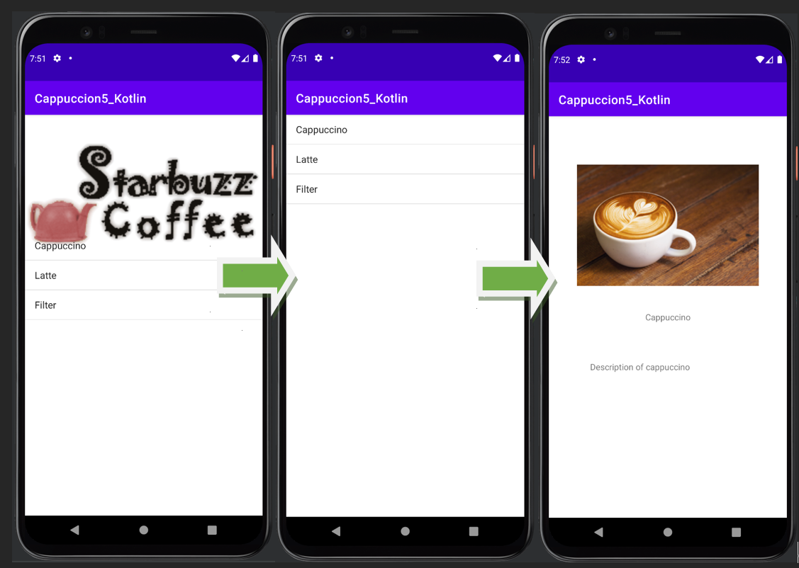
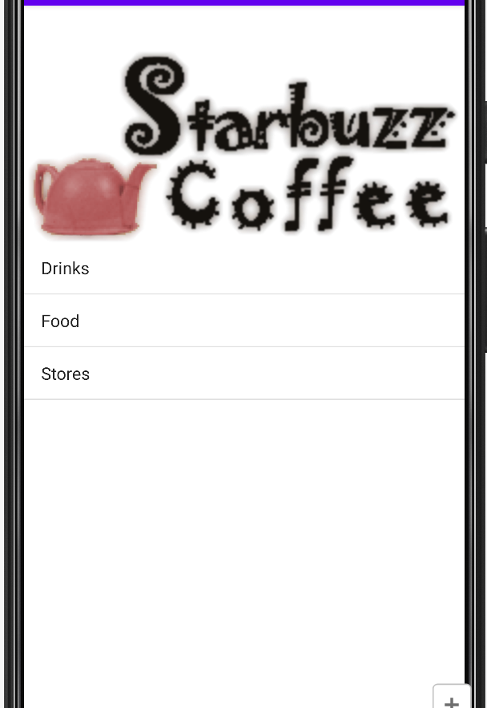
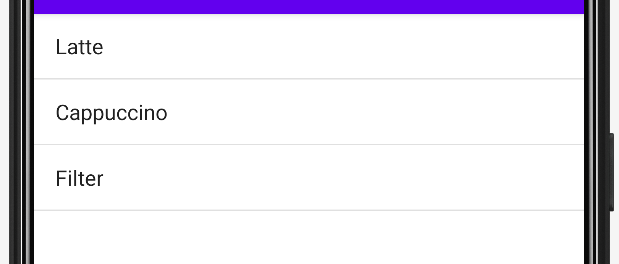
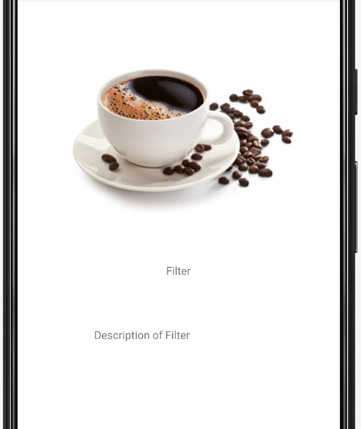

## 任务目标

实现一个简单的饮品搜索应用，用户可以查看不同饮品的图片、名字和简介。



## 界面编辑

这里需要三个界面，分别是**主界面，饮品选择界面和饮品界面**。

#### Activity_main Code

```xml
<!-- activity_main.xml -->
<?xml version="1.0" encoding="utf-8"?>
<androidx.constraintlayout.widget.ConstraintLayout xmlns:android="http://schemas.android.com/apk/res/android"
    xmlns:app="http://schemas.android.com/apk/res-auto"
    xmlns:tools="http://schemas.android.com/tools"
    android:layout_width="match_parent"
    android:layout_height="match_parent"
    tools:context=".MainActivity">

    <ImageView
        android:id="@+id/imageView"
        android:layout_width="wrap_content"
        android:layout_height="wrap_content"
        app:layout_constraintStart_toStartOf="@+id/list_options"
        app:layout_constraintTop_toTopOf="parent"
        app:srcCompat="@drawable/starbuzz_logo" />

    <ListView
        android:id="@+id/list_options"
        android:layout_width="0dp"
        android:layout_height="471dp"
        android:layout_marginBottom="1dp"
        android:entries="@array/options"
        app:layout_constraintBottom_toBottomOf="parent"
        app:layout_constraintEnd_toEndOf="parent"
        app:layout_constraintStart_toStartOf="parent" />

</androidx.constraintlayout.widget.ConstraintLayout>
```

#### Activity_main Sample



#### Activity_drink_category Code

```xml
<!-- activity_drink_category.xml -->
<?xml version="1.0" encoding="utf-8"?>
<androidx.constraintlayout.widget.ConstraintLayout xmlns:android="http://schemas.android.com/apk/res/android"
    xmlns:app="http://schemas.android.com/apk/res-auto"
    xmlns:tools="http://schemas.android.com/tools"
    android:layout_width="match_parent"
    android:layout_height="match_parent"
    tools:context=".DrinkCategoryActivity">

    <ListView
        android:id="@+id/list_drinks"
        android:layout_width="0dp"
        android:layout_height="0dp"
        app:layout_constraintBottom_toBottomOf="parent"
        app:layout_constraintEnd_toEndOf="parent"
        app:layout_constraintStart_toStartOf="parent"
        app:layout_constraintTop_toTopOf="parent" />
</androidx.constraintlayout.widget.ConstraintLayout>
```

#### Activity_drink_category Sample



#### Activity_drink Code

```xml
<!-- activity_drink.xml -->
<?xml version="1.0" encoding="utf-8"?>
<androidx.constraintlayout.widget.ConstraintLayout xmlns:android="http://schemas.android.com/apk/res/android"
    xmlns:app="http://schemas.android.com/apk/res-auto"
    xmlns:tools="http://schemas.android.com/tools"
    android:layout_width="match_parent"
    android:layout_height="match_parent"
    tools:context=".DrinkActivity">

    <TextView
        android:id="@+id/name"
        android:layout_width="wrap_content"
        android:layout_height="wrap_content"
        android:text="TextView"
        app:layout_constraintBottom_toBottomOf="parent"
        app:layout_constraintEnd_toEndOf="parent"
        app:layout_constraintStart_toStartOf="parent"
        app:layout_constraintTop_toTopOf="parent" />

    <ImageView
        android:id="@+id/photo"
        android:layout_width="wrap_content"
        android:layout_height="wrap_content"
        android:layout_marginTop="80dp"
        app:layout_constraintEnd_toEndOf="parent"
        app:layout_constraintStart_toStartOf="parent"
        app:layout_constraintTop_toTopOf="parent" />

    <TextView
        android:id="@+id/description"
        android:layout_width="wrap_content"
        android:layout_height="wrap_content"
        android:layout_marginTop="63dp"
        android:layout_marginEnd="1dp"
        android:text="TextView"
        app:layout_constraintEnd_toEndOf="@+id/name"
        app:layout_constraintTop_toBottomOf="@+id/name" />
</androidx.constraintlayout.widget.ConstraintLayout>
```

#### Activity_drink Sample



## Java 逻辑编辑

单独创建一个`Drink.java`文件来编写`Drink`类。

```java
public class Drink
{
    private String name;
    private String description;
    private int imageResourceID;
    public static final Drink[] drinks = {
            new Drink("Latte", "Description of latte", R.drawable.latte),
            new Drink("Cappuccino", "Description of cappuccino", R.drawable.cappuccino),
            new Drink("Filter", "Description of Filter", R.drawable.filter)
    };
    private Drink(String name, String description, int imageResourceID)
    {
        this.name = name;
        this.description = description;
        this.imageResourceID = imageResourceID;
    }
    public String getDescription()
    {
        return description;
    }
    public String getName()
    {
        return name;
    }
    public int getImageResourceID()
    {
        return imageResourceID;
    }
    public String toString()
    {
        return this.name;
    }
}

```

主界面Java中，值得注意的是，这里使用了`OnItemClickLister()`对`ListView`进行监听，比起只能对按钮进行操作的`OnClick()`函数，这种监听方式更加安全，难以被恶意攻击，且监听时Android能够更好的利用内存和进程，此外，`OnItemClickLister()`比`OnClick()`拥有更多的参数可供调用。

```java
public class MainActivity extends AppCompatActivity {

    @Override
    protected void onCreate(Bundle savedInstanceState) {
        super.onCreate(savedInstanceState);
        setContentView(R.layout.activity_main);
        AdapterView.OnItemClickListener itemClickListener = new AdapterView.OnItemClickListener() {
            @Override
            public void onItemClick(AdapterView<?> parent, View view, int position, long id) {
                if(position == 0)
                {
                    Intent intent = new Intent(MainActivity.this, DrinkCategoryActivity.class);
                    startActivity(intent);
                }
            }
        };
        ListView listView = findViewById(R.id.list_options);
        listView.setOnItemClickListener(itemClickListener);
    }
}
```

接下来是饮品选择界面，同理使用`OnClickListener()`函数进行点击的监听，并将监听到的用户选择的参数`(id)`通过`intent.putExtra()`函数传入下一个界面中。值得注意的是，界面里面的`list_drinks(ListView)`是以软连接的方式来获取名字的，具体的实现方式在`Drink.java`中定义。

```java
public class DrinkCategoryActivity extends AppCompatActivity {

    @Override
    protected void onCreate(Bundle savedInstanceState) {
        super.onCreate(savedInstanceState);
        setContentView(R.layout.activity_drink_category);
        ArrayAdapter<Drink> listAdapter = new ArrayAdapter<>(this, android.R.layout.simple_list_item_1, Drink.drinks);
        ListView listDrinks = findViewById(R.id.list_drinks);
        listDrinks.setAdapter(listAdapter);

        //Create the listener
        AdapterView.OnItemClickListener itemClickListener = new AdapterView.OnItemClickListener() {
            @Override
            public void onItemClick(AdapterView<?> parent, View view, int position, long id) {
                Intent intent = new Intent(DrinkCategoryActivity.this, DrinkActivity.class);
                intent.putExtra(DrinkActivity.EXTRA_DRINKID, (int) id);//(int) is a must
                startActivity(intent);
            }
        };
        listDrinks.setOnItemClickListener(itemClickListener);
    }
}
```

最后便是各种饮品的详情页面了，这里需要注意的是，代码中使用了一个`EXTRA_DRINKID`的全局变量进行参数的传递，将`DrinkCategoryActivity`中的`id`值传入`DrinkActivity`的全局变量中。

```java
public class DrinkActivity extends AppCompatActivity {
    public static final String EXTRA_DRINKID = "";
    @Override
    protected void onCreate(Bundle savedInstanceState) {
        super.onCreate(savedInstanceState);
        setContentView(R.layout.activity_drink);
        int drinkID = (Integer) getIntent().getExtras().get(EXTRA_DRINKID);
        Drink drink = Drink.drinks[drinkID];

        TextView name = findViewById(R.id.name);
        name.setText(drink.getName());
        TextView description = findViewById(R.id.description);
        description.setText(drink.getDescription());
        ImageView photo = findViewById(R.id.photo);
        photo.setImageResource(drink.getImageResourceID());
        photo.setContentDescription(drink.getName());
    }
}
```

## Kotlin逻辑编辑

```kotlin
//Drink.kt

class Drink private constructor(val name: String, val description: String, val imageResourceID: Int) {

    override fun toString(): String { return name }
    @JvmName("GetDescription")
    fun getDescription(): String? { return description }

    @JvmName("GetName")
    fun getName(): String? { return name }

    @JvmName("GetImageResourceID")
    fun getImageResourceID(): Int { return imageResourceID }

    companion object {
        val drinks = arrayOf(
            Drink("Cappuccino", "Description of cappuccino", R.drawable.cappuccino),
            Drink("Latte", "Description of latte", R.drawable.latte),
            Drink("Filter", "Description of Filter", R.drawable.filter)
        )
    }
}
```

```kotlin
//MainActivity.kt

class MainActivity : AppCompatActivity() {
    override fun onCreate(savedInstanceState: Bundle?) {
        super.onCreate(savedInstanceState)
        setContentView(R.layout.activity_main)
        val itemClickListener =
            OnItemClickListener { parent, view, position, id ->
                if (position == 0) {
                    val intent = Intent(this@MainActivity, DrinkCategoryActivity::class.java)
                    startActivity(intent)
                }
            }
        val listView = findViewById<ListView>(R.id.list_options)
        listView.onItemClickListener = itemClickListener
    }
}
```

```kotlin
//DrinkCategoryActivity.kt

class DrinkCategoryActivity : AppCompatActivity() {
    override fun onCreate(savedInstanceState: Bundle?) {
        super.onCreate(savedInstanceState)
        setContentView(R.layout.activity_drink_category)
        val listAdapter: ArrayAdapter<Drink?> =
            ArrayAdapter<Drink?>(this, android.R.layout.simple_list_item_1, Drink.drinks)
        val listDrinks = findViewById<ListView>(R.id.list_drinks)
        listDrinks.adapter = listAdapter

        //Create the listener
        val itemClickListener =
            OnItemClickListener { parent, view, position, id ->
                val intent = Intent(this@DrinkCategoryActivity, DrinkActivity::class.java)
                intent.putExtra(DrinkActivity.EXTRA_DRINKID, id.toInt())// .toInt() is a must
                startActivity(intent)
            }
        listDrinks.onItemClickListener = itemClickListener
    }
}
```

```kotlin
//DrinkActivity.kt

class DrinkActivity : AppCompatActivity() {
    override fun onCreate(savedInstanceState: Bundle?) {
        super.onCreate(savedInstanceState)
        setContentView(R.layout.activity_drink)
        val drinkID = intent.extras!![EXTRA_DRINKID] as Int
        val drink = Drink.drinks[drinkID]
        val name = findViewById<TextView>(R.id.name)
        name.setText(drink.getName())
        val description = findViewById<TextView>(R.id.description)
        description.setText(drink.getDescription())
        val photo = findViewById<ImageView>(R.id.photo)
        photo.setImageResource(drink.getImageResourceID())
        photo.contentDescription = drink.getName()
    }

    companion object {
        const val EXTRA_DRINKID = ""
    }
}
```

还是Kotlin简洁啊!


---

上一篇：[Android Studio开发 4 | Tony ](http://tonylsx.top/2022/10/11/Android-Studio-4/)

下一篇：马上就好了...
