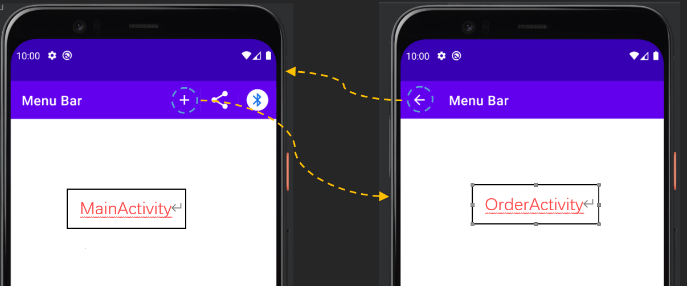
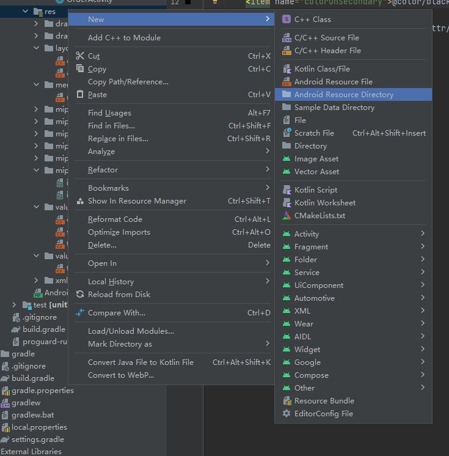
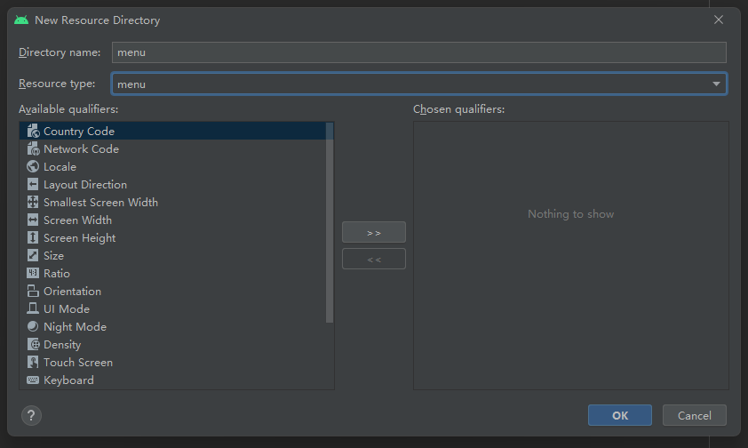
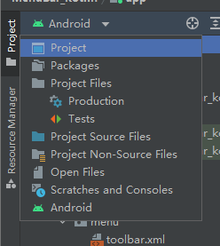
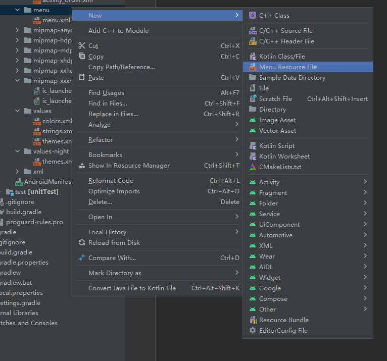
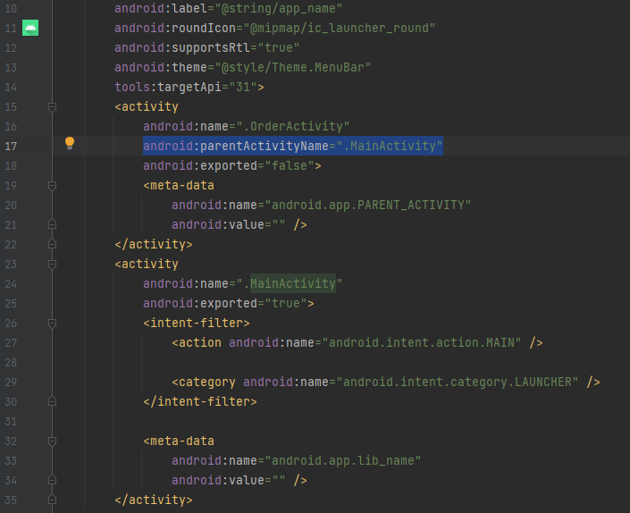

## 任务目标

​	点击菜单栏右上角的“+号”按钮即可进入新的页面，在新的页面中点击菜单栏左上角“返回”按钮即可返回主界面。



## Menu Bar设置步骤

##### 1. 删除自带的basic app bar

在`res->values->themes.xml`下，将`parent`值中的`DarkActionBar`改为`NoActionBar`.

```xml
<resources xmlns:tools="http://schemas.android.com/tools">
    <!-- Base application theme. -->
    <style name="Theme.MenuBar"
        parent="Theme.MaterialComponents.DayNight.NoActionBar">
        <!-- Primary brand color. -->
        <...>
        </...>
    </style>
</resources>
```

##### 2. 创建自己的Tool Bar

在`res`文件夹下新建`Android Resource Directory`，将`Resource type`选定为`menu`类型，文件夹名字随意。





Android Studio有可能不显示用户自行创建的文件夹，请将左上角的Android目录列表转换为工程目录列表即可。



创建好文件夹之后，在该`menu`类型的文件夹下创建一个`Menu Resource File`文件，名字随意。



##### 3. 添加Toolbar到layout

可以根据需要高度自行定制Toolbar的颜色、样式、大小等。

```xml
<!-- activity_main.xml -->
<?xml version="1.0" encoding="utf-8"?>
<androidx.constraintlayout.widget.ConstraintLayout
    xmlns:android="http://schemas.android.com/apk/res/android"
    xmlns:app="http://schemas.android.com/apk/res-auto"
    xmlns:tools="http://schemas.android.com/tools"
    android:layout_width="match_parent"
    android:layout_height="match_parent"
    tools:context=".MainActivity">

    <androidx.appcompat.widget.Toolbar
        android:id="@+id/toolbar"
        android:layout_width="0dp"
        android:layout_height="?attr/actionBarSize"
        android:background="?attr/colorPrimary"
        android:theme="@style/ThemeOverlay.AppCompat.Dark.ActionBar"
        app:layout_constraintEnd_toEndOf="parent"
        app:layout_constraintStart_toStartOf="parent"
        app:layout_constraintTop_toTopOf="parent" />


</androidx.constraintlayout.widget.ConstraintLayout>
```

在`activity_order.xml`中，添加`include`的方法，可以实现对`layout`的覆用。这样可以省去重写一遍`ToolBar`的参数喽。

```xml
<!-- activity_order.xml -->
<?xml version="1.0" encoding="utf-8"?>
<androidx.constraintlayout.widget.ConstraintLayout
    xmlns:android="http://schemas.android.com/apk/res/android"
    xmlns:tools="http://schemas.android.com/tools"
    android:layout_width="match_parent"
    android:layout_height="match_parent"
    tools:context=".OrderActivity">
    <include layout="@layout/activity_main"/>
</androidx.constraintlayout.widget.ConstraintLayout>
```

##### 4. 配置自己的Tool Bar

在`toolbar.xml`文件中(文件名或许与我不同)配置自己希望的Actions，如返回按钮和添加按钮。

```xml
<!-- toolbar.xml -->
<?xml version="1.0" encoding="utf-8"?>
<menu xmlns:android="http://schemas.android.com/apk/res/android"
    xmlns:app="http://schemas.android.com/apk/res-auto">
    <!-- 这个item是右上角的“+”按钮 -->
    <item android:id="@+id/action_create_order"
        android:title="@string/create_order_title"
        android:icon="@drawable/ic_add_white_24dp"
        android:orderInCategory="1"
        app:showAsAction="ifRoom"/>
    <!-- 这个item是右上角的“share”按钮 -->
    <item
        android:id="@+id/action_share"
        android:title="@string/action_share"
        android:orderInCategory="2"
        app:showAsAction="ifRoom"
        app:actionProviderClass="androidx.appcompat.widget.ShareActionProvider" />
</menu>
```

## Java逻辑编辑

```java
//MainActivity.java
public class MainActivity extends AppCompatActivity {

    private ShareActionProvider shareActionProvider;
    @Override
    protected void onCreate(Bundle savedInstanceState) {
        super.onCreate(savedInstanceState);
        setContentView(R.layout.activity_main);
        
        Toolbar toolbar = findViewById(R.id.toolbar);
        toolbar.setTitle("Main menu");
        setSupportActionBar(toolbar);
    }
    @Override
    public boolean onCreateOptionsMenu(Menu menu) {
        getMenuInflater().inflate(R.menu.toolbar, menu);
        MenuItem menuItem = menu.findItem(R.id.action_share);
        shareActionProvider = (ShareActionProvider) MenuItemCompat.getActionProvider(menuItem);
        setShareActionIntent("Tony");
        return super.onCreateOptionsMenu(menu);
    }

    private void setShareActionIntent(String text) {
        Intent intent = new Intent(Intent.ACTION_SEND);
        intent.setType("text/plain");
        intent.putExtra(Intent.EXTRA_TEXT, text);
        shareActionProvider.setShareIntent(intent);
    }

    @Override
    public boolean onOptionsItemSelected(MenuItem item) {
        switch (item.getItemId()) {
            case R.id.action_create_order:
                //Code to run when the Create Order item is clicked
                Intent intent = new Intent(this, OrderActivity.class);
                startActivity(intent);
                return true;
            default:
                return super.onOptionsItemSelected(item);
        }
    }
}
```


```java
//OrderActivity.java
public class OrderActivity extends AppCompatActivity {

    @Override
    protected void onCreate(Bundle savedInstanceState) {
        super.onCreate(savedInstanceState);
        setContentView(R.layout.activity_order);
        
        Toolbar toolbar = findViewById(R.id.toolbar);
        toolbar.setTitle("Order Menu");
        setSupportActionBar(toolbar);
        
        //Add return key <-
        ActionBar actionBar = getSupportActionBar();
        actionBar.setDisplayHomeAsUpEnabled(true);
    }
}
```

在`AndroidMainfest.xml`中应当添加`parentActivityName`变量，应在子Activity中加入父Activity的名字，如下图所示，如果不添加则无法通过单机返回键返回父页面。



## Kotlin 逻辑编辑

```kotlin
//MainActivity.kt
class MainActivity : AppCompatActivity() {
    private var shareActionProvider: ShareActionProvider? = null

    override fun onCreate(savedInstanceState: Bundle?) {
        super.onCreate(savedInstanceState)
        setContentView(R.layout.activity_main)
        val toolbar = findViewById<Toolbar>(R.id.toolbar)
        toolbar.title = "Main menu"
        setSupportActionBar(toolbar)
    }

    override fun onCreateOptionsMenu(menu: Menu): Boolean {
        menuInflater.inflate(R.menu.toolbar, menu)
        val menuItem = menu.findItem(R.id.action_share)
        shareActionProvider = MenuItemCompat.getActionProvider(menuItem) as ShareActionProvider?
        setShareActionIntent("Tony")
        return super.onCreateOptionsMenu(menu)
    }

    private fun setShareActionIntent(text: String) {
        val intent = Intent(Intent.ACTION_SEND)
        intent.type = "text/plain"
        intent.putExtra(Intent.EXTRA_TEXT, text)
        shareActionProvider?.setShareIntent(intent)
    }

    override fun onOptionsItemSelected(item: MenuItem): Boolean {
        return when (item.itemId) {
            R.id.action_create_order -> {
                //Code to run when the Create Order item is clicked
                val intent = Intent(this, OrderActivity::class.java)
                startActivity(intent)
                true
            }
            else -> super.onOptionsItemSelected(item)
        }
    }
}
```

```kotlin
class OrderActivity : AppCompatActivity() {
    override fun onCreate(savedInstanceState: Bundle?) {
        super.onCreate(savedInstanceState)
        setContentView(R.layout.activity_order)
        val toolbar = findViewById<Toolbar>(R.id.toolbar)
        toolbar.title = "Order Menu"
        setSupportActionBar(toolbar)

        //return key <-
        val actionBar = supportActionBar
        actionBar!!.setDisplayHomeAsUpEnabled(true)
    }
}
```

同理，仍然需在`AndroidMainfest`中添加以下代码：

```xml
<activity
    android:name=".OrderActivity"
    android:parentActivityName=".MainActivity"
    android:exported="false">
    <meta-data
        android:name="android.app.lib_name"
        android:value="" />
</activity>
```

---

上一篇：[Android Studio开发 5 | Tony ](http://tonylsx.top/2022/10/11/Android-Studio-4/)

下一篇：马上就好了...
