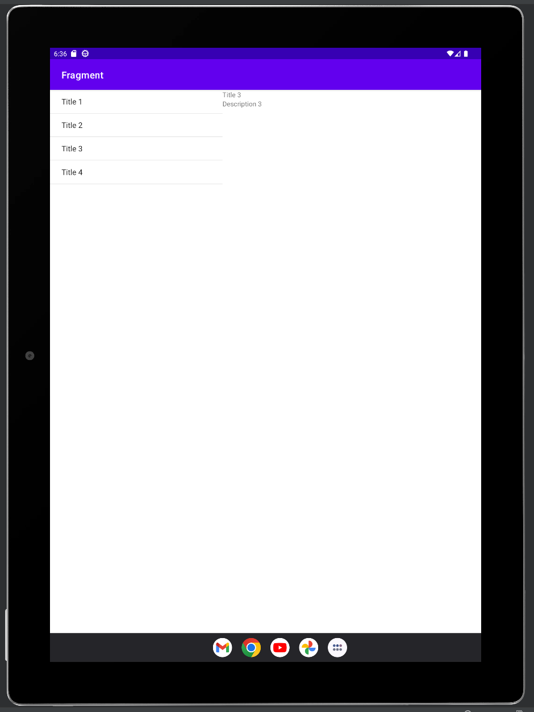
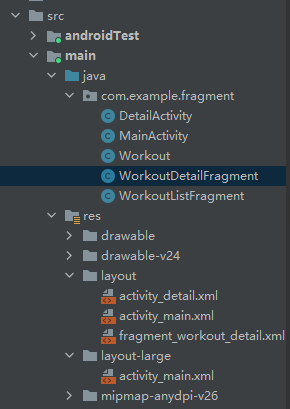
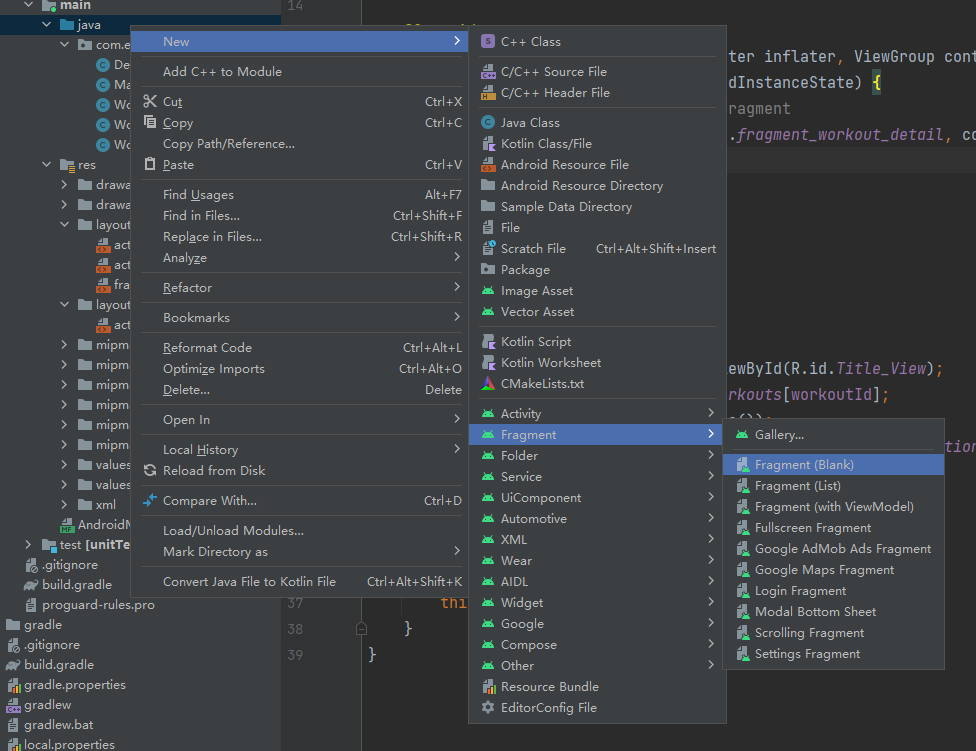

## 任务目标

实现针对Tablets平板设备的大屏适配，一个屏幕下显示更多信息。实现方式为Fragments。



## 项目管理



项目需要创建以上文件，包括创建两个Activities，分别是创建工程时自动创建的`MainActivity`和手动创建的`DetailActivity`；以及一个Fragment需要手动创建，为`WorkoutDetailFragment`（Fragment的创建方式如下如）；以及两个Java Class文件，分别是`Workout`和`WorkoutListFragment`。另外，需要在`res`文件夹下手动创建`layout-large`文件夹，用来适配Tablet的Layout文件；在该文件夹下手动创建`activity_main.xml`即可。



## 界面编辑

```xml
<!-- activity_main.xml -->
<?xml version="1.0" encoding="utf-8"?>
<androidx.appcompat.widget.LinearLayoutCompat
    xmlns:android="http://schemas.android.com/apk/res/android"
    android:layout_width="match_parent"
    android:layout_height="match_parent"
    android:orientation="horizontal">

    <fragment
        xmlns:android="http://schemas.android.com/apk/res/android"
        android:id="@+id/list_fragment"
        android:name="com.example.fragment.WorkoutListFragment"
        android:layout_width="match_parent"
        android:layout_height="match_parent"
        />

</androidx.appcompat.widget.LinearLayoutCompat>
```

```xml
<!-- activity_detail.xml -->
<?xml version="1.0" encoding="utf-8"?>
<androidx.appcompat.widget.LinearLayoutCompat
    xmlns:android="http://schemas.android.com/apk/res/android"
    xmlns:tools="http://schemas.android.com/tools"
    android:layout_width="match_parent"
    android:layout_height="match_parent"
    tools:context=".DetailActivity">

    <androidx.fragment.app.FragmentContainerView
        android:layout_width="match_parent"
        android:layout_height="match_parent"
        android:id="@+id/fragment_workout"
        android:name="com.example.fragment.WorkoutDetailFragment"
        />

</androidx.appcompat.widget.LinearLayoutCompat>
```

```xml
<!-- fragment_workout_detail.xml -->
<?xml version="1.0" encoding="utf-8"?>
<androidx.constraintlayout.widget.ConstraintLayout
    xmlns:android="http://schemas.android.com/apk/res/android"
    xmlns:app="http://schemas.android.com/apk/res-auto"
    android:layout_width="match_parent"
    android:layout_height="match_parent">

    <!-- TODO: Update blank fragment layout -->

    <TextView
        android:id="@+id/Title_View"
        android:layout_width="wrap_content"
        android:layout_height="wrap_content"
        android:layout_marginStart="16dp"
        android:layout_marginTop="42dp"
        android:textSize="34dp"
        app:layout_constraintStart_toStartOf="parent"
        app:layout_constraintTop_toTopOf="parent" />

    <TextView
        android:id="@+id/Description_View"
        android:layout_width="wrap_content"
        android:layout_height="wrap_content"
        android:layout_marginStart="16dp"
        android:layout_marginTop="19dp"
        android:text="26dp"
        app:layout_constraintStart_toStartOf="parent"
        app:layout_constraintTop_toBottomOf="@+id/Title_View" />

</androidx.constraintlayout.widget.ConstraintLayout>
```

```xml
<!-- layout-large/activity_main.xml -->
<?xml version="1.0" encoding="utf-8"?>
<androidx.appcompat.widget.LinearLayoutCompat
    xmlns:android="http://schemas.android.com/apk/res/android"
    android:layout_width="match_parent"
    android:layout_height="match_parent"
    android:orientation="horizontal">

    <fragment
        xmlns:android="http://schemas.android.com/apk/res/android"
        android:id="@+id/list_frag"
        android:name="com.example.fragment.WorkoutListFragment"
        android:layout_weight="2"
              <!-- 这个fragment在屏幕上占的比例2:3 -->
        android:layout_width="0dp"
        android:layout_height="match_parent"
        />

    <FrameLayout
        android:id="@+id/fragment_container"
        android:name="com.example.fragment.WorkoutDetailFragment"
        android:layout_weight="3"
                 <!-- 这个fragment在屏幕上占的比例2:3 -->
        android:layout_width="0dp"
        android:layout_height="match_parent"
        />

</androidx.appcompat.widget.LinearLayoutCompat>
```

## Java 逻辑编辑

```java
//MainActivity.java

public class MainActivity extends AppCompatActivity implements WorkoutListFragment.Listener{

    @Override
    protected void onCreate(Bundle savedInstanceState) {
        super.onCreate(savedInstanceState);
        setContentView(R.layout.activity_main);
    }

    @Override
    public void itemClicked(long id) {
        View fragmentContainer = findViewById(R.id.fragment_container);
        if(fragmentContainer != null) {
            //fragmentContainer是为了适配fragment的容器
            WorkoutDetailFragment details = new WorkoutDetailFragment();
            FragmentTransaction ft = getSupportFragmentManager().beginTransaction();
            details.setWorkoutId((int)id);//?
            ft.replace(R.id.fragment_container, details);
            ft.setTransition(FragmentTransaction.TRANSIT_FRAGMENT_FADE);
            ft.addToBackStack(null);
            ft.commit();
        }
        else {
            //如果是手机的话，正常情况下就只有这三句话
            Intent intent = new Intent(this, DetailActivity.class);
            intent.putExtra(DetailActivity.EXTRA_WORKOUT_ID, (int) id);
            startActivity(intent);
        }
    }
}
```

```java
//DetailActivity.java

public class DetailActivity extends AppCompatActivity {
    public static final String EXTRA_WORKOUT_ID = "id";

    @Override
    protected void onCreate(Bundle savedInstanceState) {
        super.onCreate(savedInstanceState);
        setContentView(R.layout.activity_detail);
        WorkoutDetailFragment frag = (WorkoutDetailFragment) getSupportFragmentManager().findFragmentById(R.id.fragment_workout);
        int workoutID = (int) getIntent().getExtras().get(EXTRA_WORKOUT_ID);
        frag.setWorkoutId(workoutID);
    }
}
```

```java
//Detail.java

public class Workout {
    private String name;
    private String description;
    public static final Workout[] workouts = {
            new Workout("Title 1", "Description 1"),
            new Workout("Title 2", "Description 2"),
            new Workout("Title 3", "Description 3"),
            new Workout("Title 4", "Description 4")
    };
    private Workout(String name, String description){
        this.name = name;
        this.description = description;
    }
    public String getDescription(){
        return description;
    }
    public String getName(){
        return name;
    }
    public String toString()
    {
        return this.name;
    }
}
```

```java
//WorkoutDetailFragment.java

public class WorkoutDetailFragment extends Fragment {
    private int workoutId;

    @Override
    public View onCreateView(LayoutInflater inflater, ViewGroup container,
                             Bundle savedInstanceState) {
        // Inflate the layout for this fragment
        return inflater.inflate(R.layout.fragment_workout_detail, container, false);
    }

    @Override
    public void onStart() {
        super.onStart();
        View view = getView();
        if(view!=null)
        {
            TextView title = view.findViewById(R.id.Title_View);
            Workout workout = Workout.workouts[workoutId];
            title.setText(workout.getName());
            TextView description= view.findViewById(R.id.Description_View);
            description.setText(workout.getDescription());

        }
    }
    public void setWorkoutId(int i) {
        this.workoutId = i;
    }
}
```

```java
//WorkoutListFragment.java

public class WorkoutListFragment extends ListFragment {
    static interface Listener {
        void itemClicked(long id);
    }
    private Listener listener;

    @Override
    public View onCreateView(LayoutInflater inflater, ViewGroup container, Bundle savedInstanceState) {
        String[] names = new String[Workout.workouts.length];
        for(int i = 0; i < names.length; i++) {
            names[i] = Workout.workouts[i].getName();
        }

        ArrayAdapter<String> adapter = new ArrayAdapter<>(inflater.getContext(), android.R.layout.simple_list_item_1, names);
        setListAdapter(adapter);

        return super.onCreateView(inflater, container, savedInstanceState);
    }

    @Override
    public void onAttach(Context context) {
        super.onAttach(context);
        this.listener = (Listener) context;
    }

    @Override
    public void onListItemClick(ListView listView, View itemView, int position, long id) {
        if(listener != null) {
            listener.itemClicked(id);
        }
    }
}
```

## Kotlin 逻辑编辑

```kotlin
//MainActivity.kt

class MainActivity : AppCompatActivity(), WorkoutListFragment.Listener {
    override fun onCreate(savedInstanceState: Bundle?) {
        super.onCreate(savedInstanceState)
        setContentView(R.layout.activity_main)
    }

    override fun itemClicked(id: Long) {
        val fragmentContainer = findViewById<View>(R.id.fragment_container)
        if (fragmentContainer != null) {
            val details = WorkoutDetailFragment()
            val ft = supportFragmentManager.beginTransaction()
            details.setWorkoutId(id.toInt()) //?
            ft.replace(R.id.fragment_container, details)
            ft.setTransition(FragmentTransaction.TRANSIT_FRAGMENT_FADE)
            ft.addToBackStack(null)
            ft.commit()
        } else {
            val intent = Intent(this, DetailActivity::class.java)
            intent.putExtra(DetailActivity.EXTRA_WORKOUT_ID, id.toInt())
            startActivity(intent)
        }
    }
}
```

```kotlin
//DetailActivity.kt

class DetailActivity : AppCompatActivity() {
    override fun onCreate(savedInstanceState: Bundle?) {
        super.onCreate(savedInstanceState)
        setContentView(R.layout.activity_detail)
        val frag: WorkoutDetailFragment? =
            supportFragmentManager.findFragmentById(R.id.fragment_workout) as WorkoutDetailFragment?
        val workoutID = intent.extras!![EXTRA_WORKOUT_ID] as Int
        frag?.setWorkoutId(workoutID)
    }

    companion object {
        const val EXTRA_WORKOUT_ID = "id"
    }
}
```

```kotlin
//Workout.kt

class Workout private constructor(private val name: String, private val description: String) {

    override fun toString(): String {
        return name
    }

    @JvmName("GetDescription")
    fun getDescription(): String {
        return description
    }

    @JvmName("GetName")
    fun getName(): String {
        return name
    }

    companion object {
        val workouts = arrayOf(
            Workout("Title 1", "Description 1"),
            Workout("Title 2", "Description 2"),
            Workout("Title 3", "Description 3"),
            Workout("Title 4", "Description 4")
        )
    }
}
```

```kotlin
//WorkoutDetailFragment.kt

class WorkoutDetailFragment : Fragment() {
    private var workoutId = 0
    override fun onCreateView(
        inflater: LayoutInflater, container: ViewGroup?,
        savedInstanceState: Bundle?
    ): View? {
        // Inflate the layout for this fragment
        return inflater.inflate(R.layout.fragment_workout_detail, container, false)
    }

    override fun onStart() {
        super.onStart()
        val view = view
        if (view != null) {
            val title = view.findViewById<TextView>(R.id.Title_View)
            val workout: Workout = Workout.workouts[workoutId]
            title.text = workout.getName()
            val description = view.findViewById<TextView>(R.id.Description_View)
            description.text = workout.getDescription()
        }
    }

    fun setWorkoutId(i: Int) {
        workoutId = i
    }
}
```

```kotlin
//WorkoutListFragment.kt

class WorkoutListFragment : ListFragment() {
    internal interface Listener {
        fun itemClicked(id: Long)
    }

    private var listener: Listener? = null
    override fun onCreateView(
        inflater: LayoutInflater,
        container: ViewGroup?,
        savedInstanceState: Bundle?
    ): View? {
        val names = arrayOfNulls<String>(Workout.workouts.size)
        for (i in names.indices) {
            names[i] = Workout.workouts[i].getName()
        }
        val adapter = ArrayAdapter(inflater.context, R.layout.simple_list_item_1, names)
        listAdapter = adapter
        return super.onCreateView(inflater, container, savedInstanceState)
    }

    override fun onAttach(context: Context) {
        super.onAttach(context)
        listener = context as Listener
    }

    override fun onListItemClick(listView: ListView, itemView: View, position: Int, id: Long) {
        if (listener != null) {
            listener!!.itemClicked(id)
        }
    }
}
```

---

上一篇：[Android Studio 开发 6 | Tony](http://tonylsx.top/2022/11/21/Android-Studio-6/)

下一篇：马上就好了...
