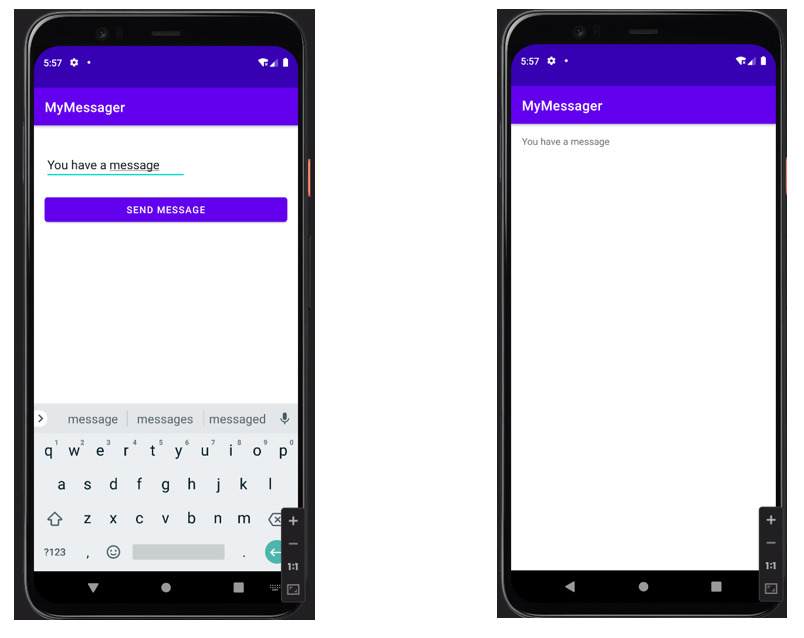
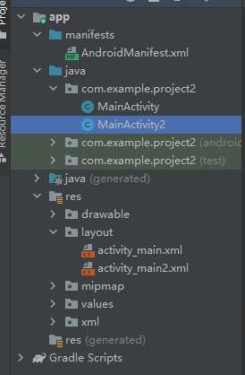
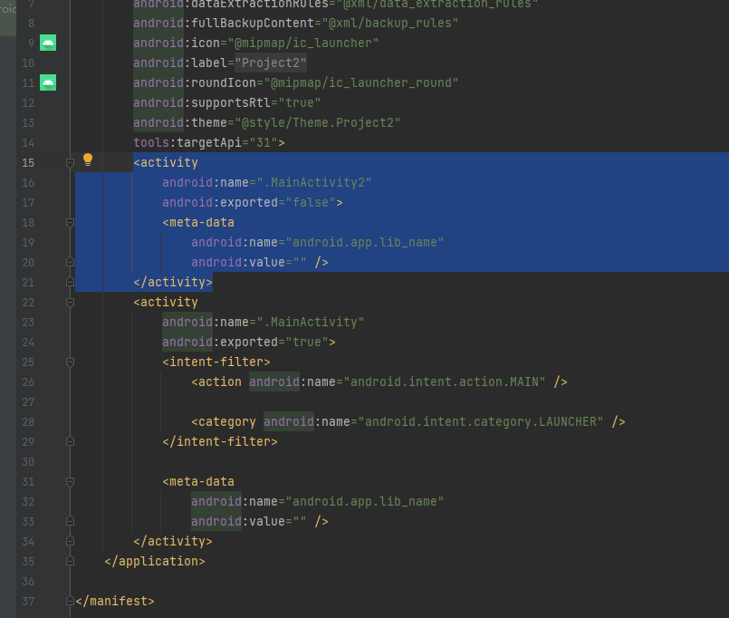
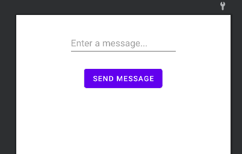
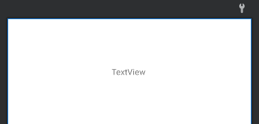
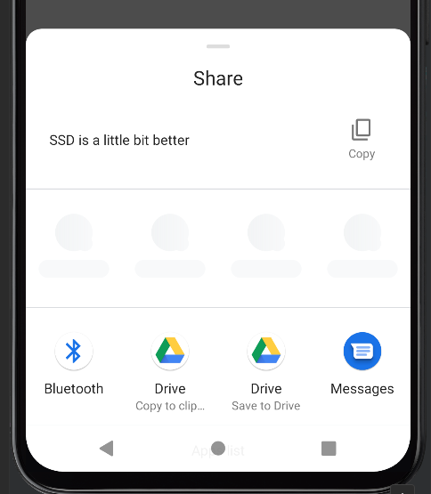
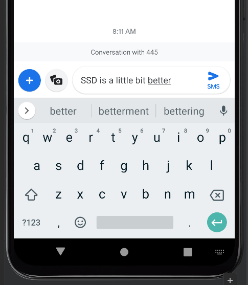

## 任务目标——显式跳转

实现两个Activities之间的文字信息传输。



## 项目管理



该项目中我们主要用到以下四个文件：

- MainActivity.java
- MainActivity.xml
- MainActivity2.java
- MainActivity2.xml

其中，MainActivity2需要手动创建。在管理栏下点击右键选择$New\to Activity\to Empty\ Activity$.创建后AndroidMainfeast.xml文件会自动生成有关MainActivity2的代码，如下图所示：



## 界面编辑

```xml
<!---activity_main.xml--->
<?xml version="1.0" encoding="utf-8"?>
<androidx.constraintlayout.widget.ConstraintLayout xmlns:android="http://schemas.android.com/apk/res/android"
    xmlns:app="http://schemas.android.com/apk/res-auto"
    xmlns:tools="http://schemas.android.com/tools"
    android:layout_width="match_parent"
    android:layout_height="match_parent"
    tools:context=".MainActivity">

    <Button
        android:id="@+id/button"
        android:layout_width="wrap_content"
        android:layout_height="wrap_content"
        android:layout_marginTop="20dp"
        android:text="Send Message"
        android:onClick="onSendMessage"
        app:layout_constraintEnd_toEndOf="parent"
        app:layout_constraintHorizontal_bias="0.498"
        app:layout_constraintStart_toStartOf="parent"
        app:layout_constraintTop_toBottomOf="@+id/message" />

    <EditText
        android:id="@+id/message"
        android:layout_width="wrap_content"
        android:layout_height="wrap_content"
        android:layout_marginTop="30dp"
        android:ems="10"
        android:hint="Enter a message..."
        android:inputType="textPersonName"
        android:minHeight="48dp"

        app:layout_constraintEnd_toEndOf="parent"
        app:layout_constraintStart_toStartOf="parent"
        app:layout_constraintTop_toTopOf="parent" />

</androidx.constraintlayout.widget.ConstraintLayout>
```



---

```xml
<!---activity_main2.xml--->
<?xml version="1.0" encoding="utf-8"?>
<androidx.constraintlayout.widget.ConstraintLayout xmlns:android="http://schemas.android.com/apk/res/android"
    xmlns:app="http://schemas.android.com/apk/res-auto"
    xmlns:tools="http://schemas.android.com/tools"
    android:layout_width="match_parent"
    android:layout_height="match_parent"
    tools:context=".MainActivity2">

    <TextView
        android:id="@+id/get_message"
        android:layout_width="wrap_content"
        android:layout_height="wrap_content"
        android:layout_marginTop="80dp"
        android:text="TextView"
        app:layout_constraintEnd_toEndOf="parent"
        app:layout_constraintHorizontal_bias="0.498"
        app:layout_constraintStart_toStartOf="parent"
        app:layout_constraintTop_toTopOf="parent" />
</androidx.constraintlayout.widget.ConstraintLayout>
```



## Java逻辑编辑

首先编辑`onSendMessage()`函数用来控制按下按钮之后的操作。其中，Intent关联新的界面，对其操作可实现特定的**意图**，编辑完成后可利用StartActivity函数进行打开新的界面。

```java
// MainActivity.java
public class MainActivity extends AppCompatActivity {

    @Override
    protected void onCreate(Bundle savedInstanceState) {
        super.onCreate(savedInstanceState);
        setContentView(R.layout.activity_main);
    }
    public void onSendMessage(View view){
        EditText messageView = findViewById(R.id.message);
        String messageText = messageView.getText().toString();
        Intent intent = new Intent(this, MainActivity2.class);
        intent.putExtra(MainActivity2.message, messageText);//传入message
        startActivity(intent);
    }
}
```

`putExtra()`函数会添加一些信息到指定的intent中，而`getIntent()`会获取之前得到的信息。这样就可以实现消息在两个activities中的传递与交互了。

```java
//MainActivity2.java
public class MainActivity2 extends AppCompatActivity {
    public static final String message = "MESSAGE!!!";
    @Override
    protected void onCreate(Bundle savedInstanceState) {
        super.onCreate(savedInstanceState);
        setContentView(R.layout.activity_main2);
        Intent intent = getIntent();//获取Message
        String messageText = intent.getStringExtra(message);
        TextView messageView = findViewById(R.id.get_message);
        messageView.setText(messageText);
    }
```

## Kotlin逻辑编辑

```kotlin
// MainActivity.kt
class MainActivity : AppCompatActivity() {
    override fun onCreate(savedInstanceState: Bundle?) {
        super.onCreate(savedInstanceState)
        setContentView(R.layout.activity_main)
    }
    fun onSendMessage(view: View)
    {
        val messageView = findViewById<EditText>(R.id.message)
        val messageText = messageView.text.toString()
        val intent = Intent(this, MainActivity2::class.java)
        intent.putExtra("msg", messageText)
        startActivity(intent)
    }
}
```

```kotlin
//MainActivity2.kt
class MainActivity2 : AppCompatActivity() {
    override fun onCreate(savedInstanceState: Bundle?) {
        super.onCreate(savedInstanceState)
        setContentView(R.layout.activity_main2)
        val messageText = intent.getStringExtra("msg")
        val messageView = findViewById<TextView>(R.id.get_message)
        messageView.text = messageText
    }
}
```

## 任务目标——隐式跳转

实现将程序中的文字发送到指定程序（如短信）。





## Java逻辑编辑

`Intent.createChooser`是打开Android默认的选择器， 如上图所示。

```java
public class MainActivity extends AppCompatActivity {

    public void onSendMessage(View view)
    {
        EditText messageView = findViewById(R.id.message);
        String messagetext = messageView.getText().toString();
        Intent intent = new Intent(Intent.ACTION_SEND);
        intent.setType("text/plain");
        intent.putExtra(Intent.EXTRA_TEXT, messagetext);
        String chooserTitle = "YZDD";
        Intent choosenIntent = Intent.createChooser(intent, chooserTitle);
        startActivity(choosenIntent);
    }


    @Override
    protected void onCreate(Bundle savedInstanceState) {
        super.onCreate(savedInstanceState);
        setContentView(R.layout.activity_main);
    }
}
```

我们也可以直接打开自己的软件或系统自带的软件，如下面的程序就是打开短信APP的方法：

```java
public void onSendMessage(View view)
    {
        EditText messageView = findViewById(R.id.message);
        String messagetext = messageView.getText().toString();

        Intent intent = new Intent(Intent.ACTION_SENDTO);
        intent.setData(Uri.parse("smsto:10086"));//使用"smsto:"可不指定联系人
        intent.putExtra("sms_body", messagetext);

        startActivity(intent);
    }
```

## Kotlin逻辑编辑

```kotlin
class MainActivity : AppCompatActivity() {
    override fun onCreate(savedInstanceState: Bundle?) {
        super.onCreate(savedInstanceState)
        setContentView(R.layout.activity_main)
    }
    fun onSendMessage(view: View)
    {
        var messageView = findViewById<EditText>(R.id.message)
        var messageText = messageView.text.toString()
        var intent = Intent(Intent.ACTION_SENDTO)
        intent.data = Uri.parse("smsto:10086")
        intent.putExtra("sms_body", messageText)
        startActivity(intent)
    }
}
```

```kotlin
class MainActivity : AppCompatActivity() {
    override fun onCreate(savedInstanceState: Bundle?) {
        super.onCreate(savedInstanceState)
        setContentView(R.layout.activity_main)
    }
    fun onSendMessage(view: View?) {
        val messageView = findViewById<EditText>(R.id.message)
        val messagetext = messageView.text.toString()
        val intent = Intent(Intent.ACTION_SEND)
        intent.type = "text/plain"
        intent.putExtra(Intent.EXTRA_TEXT, messagetext)
        val chooserTitle = "YZDD"
        val choosenIntent = Intent.createChooser(intent, chooserTitle)
        startActivity(choosenIntent)
    }
}
```

---

上一篇：[Android Studio 开发 1| Tony](http://tonylsx.top/2022/09/17/Andriod-Studio-1/)

下一篇：[Android-Studio开发 3 | Tony](http://tonylsx.top/2022/10/10/Android-Studio-3/)

