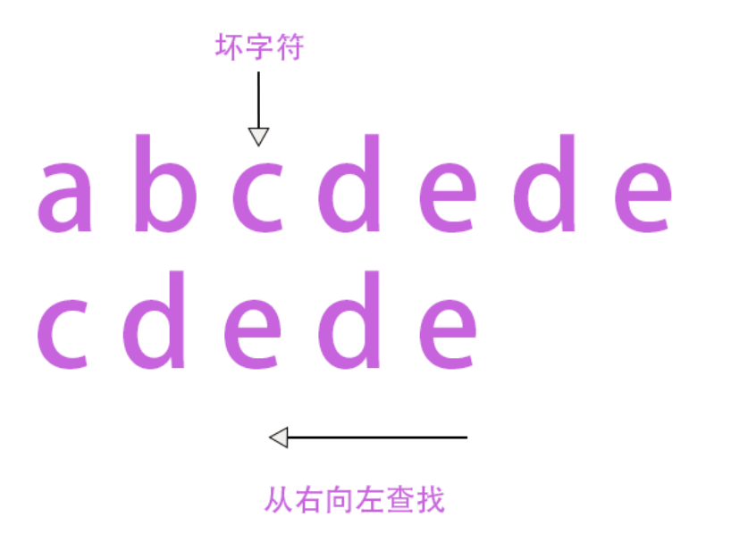
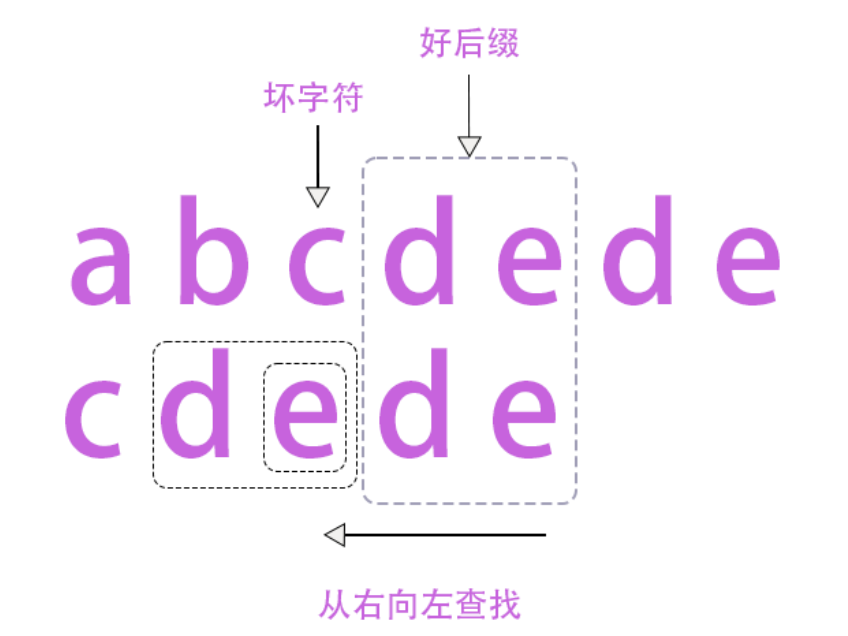
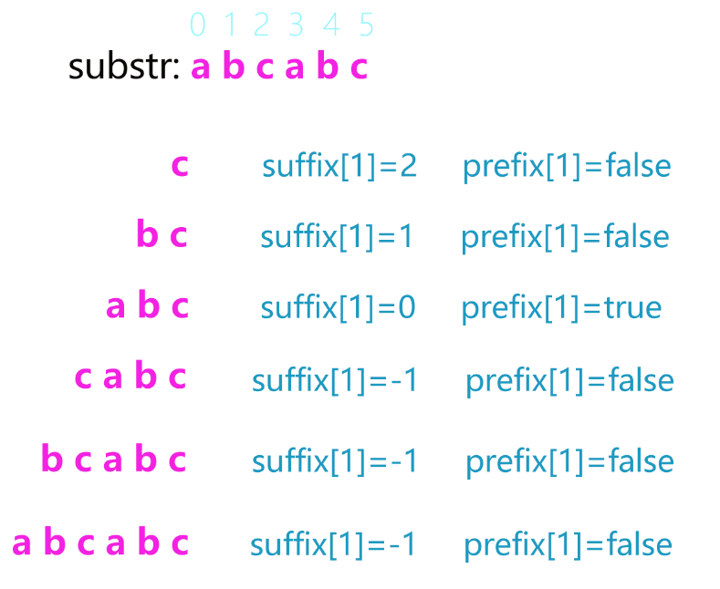

## 算法简介

BM(Boyer-Moore)算法由Bob Boyer和J Strother Moore于1977年设计，目的在于高效的查找字符串中的的子串。该算法的执行时间是线性的$(O(N))$，且往往更优于KMP算法。与KMP算法一样的是，都是需要且只需要对目标字符串进行预处理，而非被搜索的字符串；与KMP有所不同的是，BM算法是从后向前查找匹配，先从关键字的最后一个字符开始向前对应。

如果想了解KMP算法，请参看我的另一篇文章：

## BM算法原理

BM算法本质上只说明了两个规则：

1. 坏字符规则
2. 好后缀规则

下面详细讲解一下这两个规则；在此之前我们约定，下文中提到的所有目标字符串（Key）统称为**substr**， 而需要被查找的字符串（较长的那个）统称为**str**。

### 坏字符规则

当substr中某个字符与str不匹配时，这个(str中的)字符就称为坏字符。找到坏字符后，substr就要向后移动，**移动的位数**$move\_num=\lambda_1-\lambda_2$ ，其中$\lambda_1$为**坏字符在substr中的位置**，$\lambda_2$为**坏字符在substr中最后出现的位置**。如果substr中并没有坏字符，那么$\lambda_2=-1$，也就是说，整体向右移动一个substr的长度。

看到这里是不是很懵，没关系，我们来看一个例子：



首先从右向左查找字符，`e`和`d`是匹配的，到第三个元素`c`不匹配，因此`c`就是坏字符。找到了坏字符后我们就可以确定$\lambda_1=2$(从0开始算起)；然后寻找坏字符`c`在substr中最后出现的位置，也就是是从右向左的第一个坏字符，我们得到$\lambda_2=0$，因此我们应该向右移动两位，也就是将上下的两个`c`对齐的位置。

### 好后缀规则

当我们从后向前匹配时出现相同的字符串时（也就是说至少有一个字符是对应的），我们就称这个字符串以及该字符串的子串为好后缀$^{[1]}$。找到好后缀之后，substr就要向后移动，**移动的位数**$move\_num=\lambda_3-\lambda_4$ ，其中$\lambda_3$为**好后缀在substr中的位置**，$\lambda_4$为**好后缀在substr中（上一次）最后出现的位置**。如果substr中再没有好后缀，那么$\lambda_4=-1$，也就是说，整体向右移动一个substr的长度。

我们发现，坏字符规则和好后缀规则的描述十分相似，如果你可以理解坏字符规则，那么好后缀规则也很容易理解，当然，需要注意的是每次判断时坏字符只有一个，好后缀却有很多。（好后缀的个数等于好后缀的长度）

[1]: 这里解释一下，比如这个好后缀为abcd，那么bcd，cd，d也为好后缀。

我们还是用一个例子来说明好字符规则：



根据好后缀规则，我们首先很容易找到最长的好后缀是`de`，那么`e`也是好后缀（因为`e`是好后缀的后缀子串）。那么下面我们要做的事情就是在substr中查找最长的能跟这些好后缀（`e,de`)匹配的子串。首先我们查找`e`这个好后缀，发现`substr[2]`与之匹配；然后查找好后缀`de`，发现`substr[1]`与之匹配。那么我们选择最长的那个子串，也就是`substr[1]`，因此$\lambda_3=3,\lambda_4=1，move\_num=2$，即向右移动两位。


## BM的实现

### 建立坏字符的hash table

为了节省时间，我们将所有待匹配的字符都建立一个映射，这样在找到坏字符的时候就可以以$O(1)$的时间知道substr应该向右移动多少。其实就是用一个最简单的hash table来寻找$\lambda_2$的值。

我们这里为了简单起见，只适配了256个ASCII字符，如果想加入中文，那么这个hash table将变得大一些。按照规则，如果substr没有出现的字符一律设置成$\lambda_2=-1$，因此我们将hash table初始化成$-1$。

```c
void generate_bad_char_table(string str)
{
    bad_char_table = new int [256];
    for(int i=0;i<256;i++)
        bad_char_table[i]=-1;
    for(int i=0;i<str.length();i++)
    {
        int ASCII=str[i];
        bad_char_table[ASCII]=i;
    }
}
```

### 好后缀的预处理

根据好后缀规则，我们完全可以暴力求解$\lambda _3$和$\lambda _4$的值，但是这样的效率显然不是最佳的，如果substr的长度比较大，那么每次判断好后缀的右移长度将浪费很多不必要的时间。因此我们可以对substr的所有好后缀进行预处理。建立两个长度与substr相等的数组，分别为`suffix[]`和`prefix[]`**，前者记录了substr中与好后缀匹配的最后一个字串的位置**（即$\lambda _4$)**，后者记录了与好后缀匹配的前缀子串**（不过目前鄙人认为没啥用）。

听起来很懵，看一个例子：



这样我们就可以知道所有好后缀的$\lambda _4$的值，当我们找到str中的好后缀（也即$\lambda_3$），就可以用$O(1)$的时间知道向右移动的长度。

```c
void generate_suffix_prefix(string str)
{
    int len=str.length();
    suffix= new int [len];
    prefix = new bool [len];
    for(int i=0;i<len;i++)
    {
        prefix[i]= false;
        suffix[i]= -1;
    }
    for(int i=0;i<len-1;i++)
    {
        int j=i;
        int k=0;
        while(j>=0 && str[j]==str[len-1-k])//inverse search
        {
            j--;
            k++;
            suffix[k]=j+1;
        }
        if(j==-1)//如果找到了开头
            prefix[k]=true;
    }
}
```


## 完整代码

```c
#include <iostream>
#include <string>
#include <algorithm>
using namespace std;

int* bad_char_table;
int* suffix;
bool* prefix;
int move_by_GS(int ptr,int str_len);//判断好后缀移动距离
int BM(string str, string substr);//BM实现
void generate_bad_char_table(string str);//建立坏字符hash table
void generate_suffix_prefix(string str);//建立好后缀数组

int main()
{
    string str,substr;
    str="abcdefgagabgag";
    substr="abg";
    cout<<BM(str,substr)<<endl;
    return 0;
}

void generate_bad_char_table(string str)
{
    bad_char_table = new int [256];
    for(int i=0;i<256;i++)
        bad_char_table[i]=-1;
    for(int i=0;i<str.length();i++)
    {
        int ASCII=str[i];
        bad_char_table[ASCII]=i;
    }
}

void generate_suffix_prefix(string str)
{
    int len=str.length();
    suffix= new int [len];
    prefix = new bool [len];
    for(int i=0;i<len;i++)
    {
        prefix[i]= false;
        suffix[i]= -1;
    }
    for(int i=0;i<len-1;i++)
    {
        int j=i;
        int k=0;
        while(j>=0 && str[j]==str[len-1-k])//inverse search
        {
            j--;
            k++;
            suffix[k]=j+1;
        }
        if(j==-1)//如果找到了开头
            prefix[k]=true;
    }
}

int move_by_GS(int ptr, int str_len)
{
    int len=str_len-1-ptr;
    if(suffix[len]!= -1)
        return ptr-suffix[len]+1;
    for(int i=ptr+2;i<str_len;i++)
        if(prefix[str_len-i])
            return i;
    return str_len;
}

int BM(string str, string substr)
{
    generate_bad_char_table(substr);
    generate_suffix_prefix(substr);
    int move_step,bad_char;
    for(int i=0;i<str.length()-substr.length()+1;i+=move_step)//从头到尾遍历
    {
        for(int j=substr.length()-1;j>=0;j--)//从后网线查找
        {
            if(str[i+j]!=substr[j])//找到坏字符
            {
                bad_char=str[i+j];
                move_step=j-bad_char_table[bad_char];
                break;
            }
            if(j==0)//找到substr
            {
                delete [] bad_char_table;
                delete [] suffix;
                delete [] prefix;
                return i;
            }
            if(j<str.length()-1)//找到好后缀
                move_step=max(move_step, move_by_GS(j, str.length()));
        }
    }
    delete [] bad_char_table;
    delete [] suffix;
    delete [] prefix;
    return -1;
}

```

