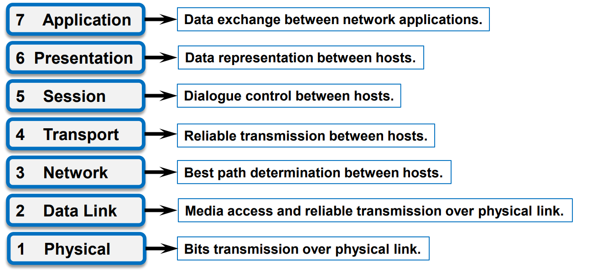
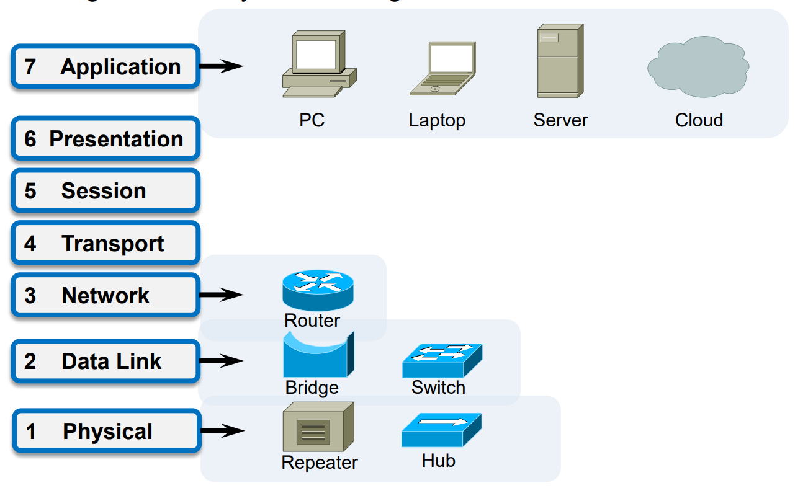
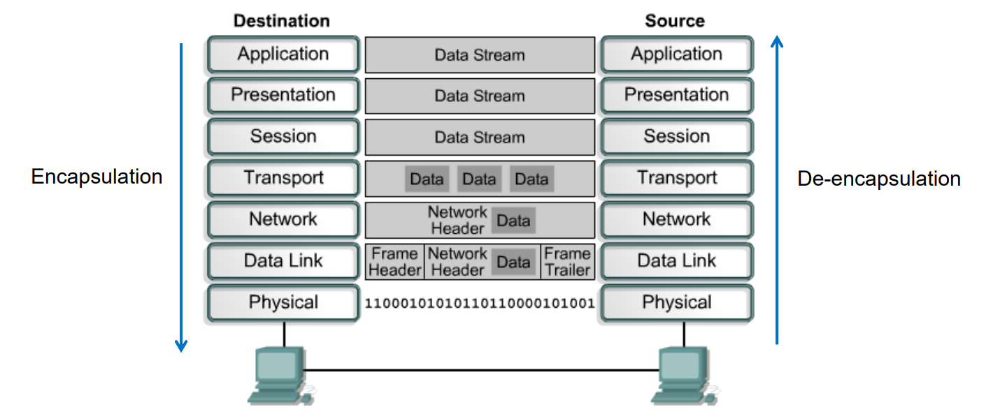

### Networking basics

Q: What are the differences between data networks and voice networks?

Data network -> Digital transmission

Voice network -> Analog transmission

Q: How many types of computer networks when it is classified by their scale?

Personal Area Networks(PAN), Local Area Networks(LAN), Metropolitan Area Networks(MAN), and Wide Area Networks(WAN).

### Network architecture

Q: What are the definitions of layers, protocols, and services in network architecture?

A layer is a level of abstraction which has a well defined function.

Protocols are executives of the functions.

Services are functions provided through protocols.

Q: What are the famous reference models used in computer networks?

==OSI reference model== and ==TCP/IP reference model==

Q: What are the differences between OSI and TCP/IP reference model?

### Functions and technologies in OSI and TCP/IP reference model

Q: What are the names of seven layers in OSI and TCP/IP reference model?

Physical layer, Data Link layer, Network layer, Transport layer, Session layer, Presentation layer, Application layer.

Q: What functions are defined in each layer?

Q: What protocols are defined in each layer?

Some common protocols specified by the TCP/IP reference model layers. 

1. The **application layer** protocols include: 
   - Domain Name System (DNS) 
   - Hypertext Transfer Protocol (HTTP) 
   - File Transfer Protocol (FTP) 
   - Simple Mail Transfer Protocol (SMTP)
   - Trivial File Transfer Protocol (TFTP)  
2. The **transport layer** protocols include:
   - Transport Control Protocol (TCP)
   - User Datagram Protocol (UDP)  
3. The **Internet layer** protocols include: 
   - Internet Protocol (IP)  
4. The **network access** layer refers to any particular technology used on a specific network (Ethernet).

Q: What addresses are defined in each layer?

MAC address — Layer 2

IP address — Layer 3

Domain name — Layer 7

Subnet mask — Layer 3

Q: What network devices are operating at each layer?

Q: The technologies of LANs and WANs are usually designed in which layers?

Both layer1 and layer 2.

### Data encapsulation

Q: What is the process of data encapsulation?

From Top layer to the bottom layer.

Q: What PDUs are used in each layers?

1. **Data** - Build the data at layer 7, 6 and 5.
2. **Segments** - Package the data for end-to-end transport at layer 4.  
3. **Packets** - Append the network address (e.g. IP Address) to the network header at layer 3.  
4. **Frames** - Append the local address (e.g. MAC Address) to the data link header at layer 2.
5. **Bits** - Convert to bits for transmission on a physical link at layer 1.

Q: What are the header format of common used PDUs in each layer?

 It usually contains the **address information** and control  information likes sequence numbers, and so on.

### Network topology and terminologies

Q: What are the differences of physical and logical network topologies? List some common used physical and logical network topologies.

Physical topology, which is the actual layout of the wire (media).

Logical topology, which defines how the media is accessed by the hosts.

The physical topologies that are commonly used are the ==P2P Topology, Bus Topology, Ring Topology, Star Topology, Extended Star Topology, Hierarchical Topology, Tree Topology, Hybrid Topology and Mesh Topology==.

The ethernet protocol is the most common protocol used for logical topology. The physical topologies that are commonly used are the ==Ring Topology and Bus Topology==.

See more for: 

- [Physical Topology | Learn Top 7 Useful Types Of Physical Topology (educba.com)](https://www.educba.com/physical-topology/)
- [Logical Topology | Know Why Do We Use Logical Topology in Networking? (educba.com)](https://www.educba.com/logical-topology/)

Q: What is the unit of digital bandwidth and analog bandwidth?

In analog systems, the basic unit of analog bandwidth is ==hertz (Hz)==, or cycles per second.

In digital systems, the basic unit of bandwidth is ==bits per second (bps)==.

Q: What is the definition of bandwidth and throughput, and baud? What is the relationship among bandwidth, throughput, and baud?

Throughput ≤ Bandwidth

Throughput is the real life bandwidth.

$Bandwidth= log_2L\times buad$ where L is the base info.

See more for: [Bits, Bauds and Bandwidth (technologyuk.net)](https://www.technologyuk.net/telecommunications/telecom-principles/bits-bauds-and-bandwidth.shtml) 

Q:  What is the difference between the transmission delay and propagation delay?

**Propagation delay** is a simple measurement of how long it takes for a signal to travel along the cable being tested.(**single**)

**Transmission delay** is the time needed to push all the packet bits on the transmission link.(**total**)
$$
Propagation\ delay = \frac{length\ of \ cable}{speed\ of \ signal(3\times 10^8)}\\
Transmission\ delay= \frac{size\ of \ signal}{speed\ of\ transmission}\\
$$

See more for: [Propagation Delay vs Transmission Delay | Baeldung on Computer Science](https://www.baeldung.com/cs/propagation-vs-transmission-delay)

