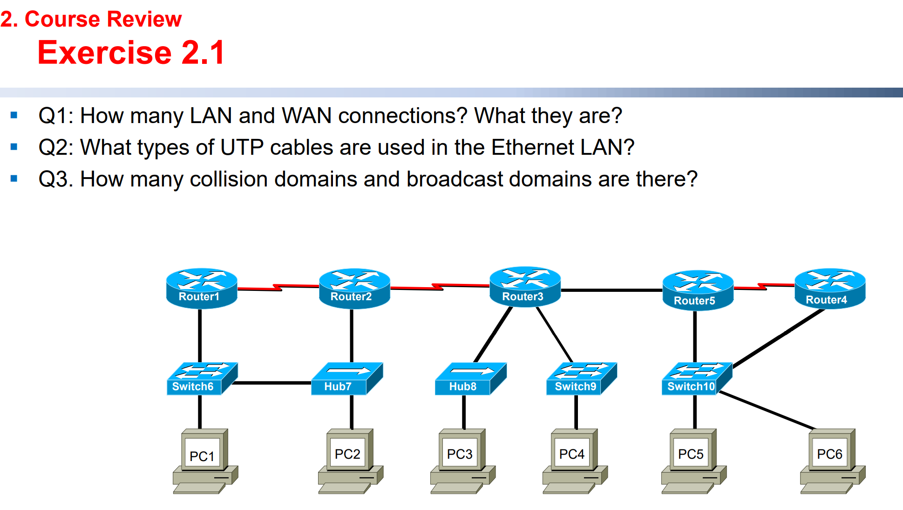
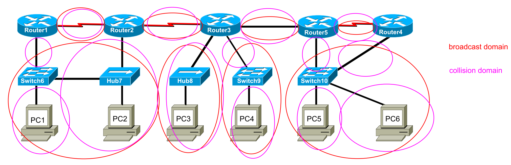
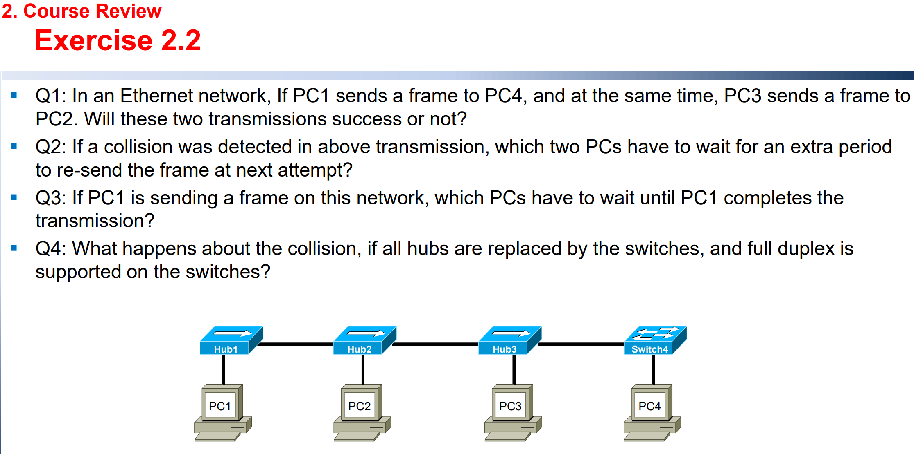
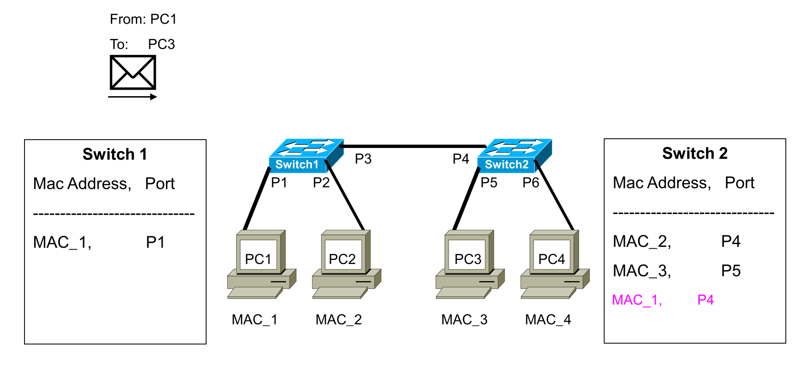

## Layer 1 Technologies

### Network media

Q:  What carrier signals are used in the network media of copper, optical fiber and wireless?

​		Electrical signals are transferring in copper;

​		Light signals are transferring in optical fiber;

​		Electromagnetic waves are transferring in the air to communicate wireless network media(WIFI).

Q: What is the purpose of encoding and modulation?

​		**Encoding** is the process by which the data is converted into digital format for efficient transmission or storage. 

​		**Modulation** is the process of converting information (signals or data) to an electronic or optical carrier, so that it can be transmitted to comparatively large distance without getting affected by noise or unwanted signals.

​		Encoding is about converting digital or analog data to digital signal(**D2A**), whereas modulation is about converting digital or analog data to an analog signal(**A2D**).	

### Network cabling

Q: What are the differences between LAN cabling and WAN cabling?

​		Nothing different?

Q:  List some common used types of cables in LAN and WAN cabling.

​		LAN cabling: coaxial cable, UTP cable, single-mode and multimode fiber, etc.

​		WAN cabling: RS-232 cable, V.35 cable, etc.

Q: In LAN cabling, how to use the UTP cables of straight-through, crossover, rollover to connect devices?

​		See [Straight-through, Crossover & Rollover Cable Pinouts Explained | Computer Cable Store](https://www.computercablestore.com/straight-through-crossover-and-rollover-wiring).

Q: Which wires of a UTP cable are used to transmit and receive data in Ethernet?

​		Category 6 cable(LAN Cable).

Q: In WAN cabling, what is the difference between DTE and DCE cabling?

​		DTE: Data Terminal Equipment, e.g. your own PC

​		DCE: Data Circuit Terminating Equipment, e.g. modem.

---

## Layer 2 Technologies

### Layer 2 functions

Q:  What is the media access method of CSMA/CD?

​		CSMA is a simple system that allows only one host to transmit at a time. Hosts on the network can access the  media at any time. Before sending data, CSMA hosts isten to the network to determine if it is already in use.
​		➢ If in use, then the hosts wait.
​		➢ If not in use, they transmit.

Q: How does a host use backoff algorithm for transmission attempt when collision occurred in  Ethernet network?

> Exponential backoff is an algorithm that uses feedback to multiplicatively decrease the rate of some process, in order to gradually find an acceptable rate.(Wikipedia)

​		After a conflict occurred in a computer network, nodes on the network wait for a certain period of time before sending. The waiting time increases exponentially to avoid frequent triggering conflicts. 

​		After $n$ conflicts occur, the waiting time is randomly selected between $0$ ~ $2^n-1$ slot times. Note that $n$ cannot be unlimited growing since the waiting time will not increasing without pause. Usually, we set $n\leq 10$ so that the longest waiting time will not exceed over 1023 slot times.
$$
Random\ waiting\ period = [ 0, (2^n – 1) \times slot\ time ]\\
$$

### Ethernet switching

Q: What is bridging?

​		Bridging refers to a technology in which a device known as a bridge connects two or more LAN segments.

Q: What addresses in the received frame does a switch use to build the switching table and make  forwarding decision?

​		The switching table is built by using  source address, e.g. **source MAC**. 

​		The forward decision is made by using destination address, e.g.  **destination MAC**.

Q: What are the differences between the switching modes of store-and-forward, fast-forward, and  fragment-free?

​		The entire frame is received before any forwarding takes place for **Store-and-forward**.

​		The switch reads the destination address before receiving the entire frame which then forwarded before the entire frame arrives for fast-forward, and fragment-free. (Both belongs to **Cut-through**)

Q: What is the definition of broadcast domain and collision domain?

​		A **broadcast domain** includes all of the collision domains that process the same broadcast frame. This includes all the hosts that are part of the network segment bounded by a layer 3 device.

​		A **collision domain** is a connected physical network segment where collisions can occur. Using the layer 1 device likes repeater or hub extends the collision domain.

Q: How can the layer 1, 2 and 3 network devices be used to segment a network into different domains?

​		Repeater and Hub (layer 1 devices)cannot segment a network into different domain. 

​		Bridge and Switch (layer 2 devices) can segment a network into different collision domain.

​		Router (layer 3 devices) can segment a network into different broadcast domain. 

Q1: All the red cables are WAN cables, and all the black cables are LAN cables.

Q2: Category 6 Cable

Q3: 

Q1: Not success, because PC1 and PC3 are in the same collision domain.

Q2: PC1 and PC3, since the back-off algorithm.

Q3: PC2 and PC3, since they are in the same collision domain.

Q4: They will not produce collision, because the four PCs are in the different collision domain.

 

We have to simulate the process step by step:

Firstly, the messages are sent by PC1, and received by Switch1. Switch1 needs to 2 steps, first check the routing table to see whether there is a record about PC3. If there is no record, then Switch1 will broadcast the message through P2 and P3. Therefore, that is the reason why PC2 can receive the message. But PC2 will drop the message since the destination of the message is PC3. 

Then, Switch2 received that message. What Switch2 need to do is also that 2 steps, first check the routing table. Switch2 found the PC3 in the routing table, so it just need to send the message to PC3 directly and PC4 will never receive the message. The second step is to write the PC1 into the routing table of Switch 2, as shown below.

