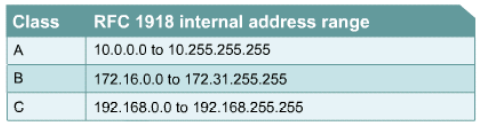
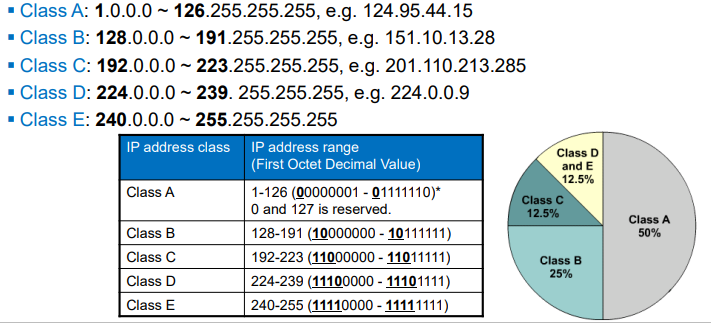
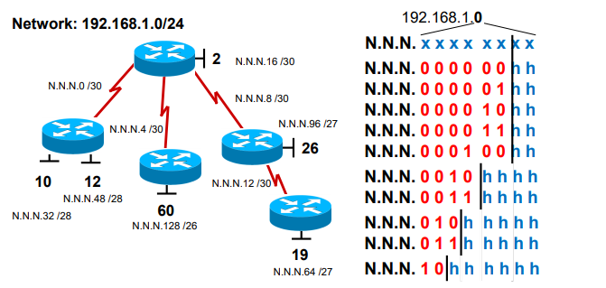
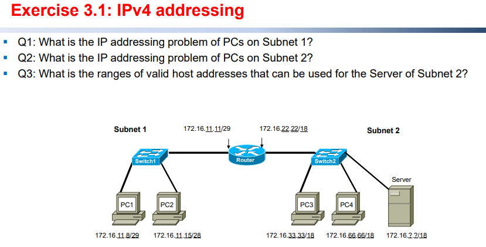
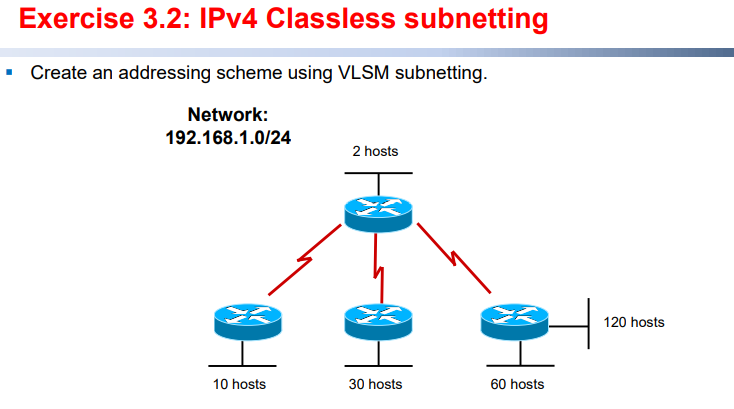
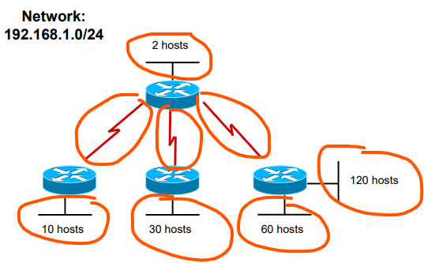
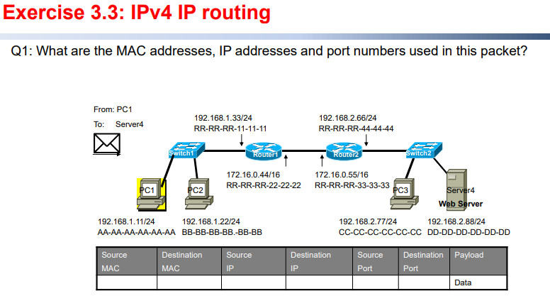
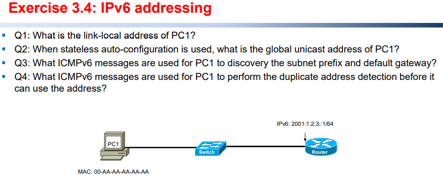

## Chapter 3 Technology, IP Addressing and IP Routing

### Layer 3 technologies

#### IPv4 addressing

###### What are the differences between flat addressing and hierarchical addressing?

==Flat addressing== assigns a device the next available address. For example, the ==MAC addressing==.

==Hierarchical addressing== contains different levels. For example, the ==IP addressing==.

###### What are the ranges of the Class A, B, C addresses and their default subnet masks?

Class A: `1.0.0.0/8 ~ 126.255.255.255/8` 

Class B: `128.0.0.0/16 ~ 191.255.255.255/16`

Class C: `192.0.0.0/24 ~ 223.255.255.255/24`

###### What are the three ranges of private IP addresses?

There are certain addresses in each class of IPv4 address that are not assigned. These addresses are  called ==private addresses==. `RFC 1918` sets aside 3 blocks of IPv4 addresses for private, internal use.  These 3 blocks consist of one Class A, a range of Class B addresses, and a range of Class C  addresses.

###### What is the difference of network address, broadcast address and host address? What are these  types of addresses used for?

(**IP addresses**: Addresses in computer networks which contains network address and host address.)

**Network address**: Used to identify the network itself where the host portion were all zeros. For instance:

**Host address** is the address in which the host portion cannot be all zeros (0s) or all ones (1s), can be assigned to a device on the network. For instance:

**Broadcast address**: Used for broadcasting packets to all the devices on a network. If the host portion were all ones (1s), it would be a broadcast address. For example:

#### IPv4 subnetting

###### What is IPv4 classful subnetting?

Classful addressing is an IPv4 addressing architecture that divides addresses into five groups.

###### What is IPv4 classless subnetting? 

Classless addressing is an IPv4 addressing architecture that uses ==VLSM== (variable-length subnet masking).

#### IPv6 addressing

###### How to represent IPv6 address in full form and simplified form?

Full form example: `FE80:0:0:0:0:2AA:FE9A:4CA2`

Simplified form example: `FE80::2AA:FE9A:4CA2`

###### What are the three types of IPv6 addresses? What specific addresses are defined for these types  IPv6 addresses?

The three types of IPv6 addresses are **unicast, multicast and anycast** respectively.

- **Unicast (one to one)**: A packet addressed to a unicast address is delivered to a single interface.

- **Multicast (one to many)**: A multicast address identifies multiple interfaces. A packet addressed to a multicast address is delivered to all interfaces that are identified by the address.

- **Anycast (one to nearest-one / one to one-of-many)**: An anycast address identifies multiple interfaces. A packet addressed to an anycast address is delivered to a single interface, the nearest interface that is identified by the address. The “nearest” interface is defined as being closest in terms of routing distance.

Specific addresses of these three types of IPv6 addresses are:

- Prefix of **Multicast** is `FF00::/8`.

- Prefix of **Link-local unicast** is `FE80::/10`.

- Prefix of **global unicast** is `2000::/3`.

###### How to form a link-local address? How to form a global unicast address using stateless auto-configuration?

link-local scope all-nodes (`FF02::1`) and all-routers (`FF02::2`) multicast address.

Stateless autoconfiguration uses the information in RA(Router Advertisement) messages to configure the IPv6 hosts automatically. Thus, every IPv6 hosts (other than routers) is able to build its own global unicast address.

#### IPv6 neighbor discovery protocol (NDP)

###### What 4 ICMPv6 messages are used in NDP?

RA(Router Advertisement)

RS(Router Solicitation)

NS(Neighbor Solicitation)

NA(Neighbor Advertisement)

See more for: [NDP - Neighbor Discovery Protocol (howdoesinternetwork.com)](https://howdoesinternetwork.com/2012/ndp-ipv6-neighbor-discovery-protocol)

###### What ICMPv6 messages are used for the functions provided by NDP? (For example, Address  resolution, Duplicate address detection, Prefix and Router discovery.)

DAD (Duplicate address detection) mechanism is realized through **NS and NA** messages. 

What is DAD: when a new unicast address is configured, it will perform DAD testing— sending a NS message which contain the destination address of itself through the network. (for example, if the new address that want to allocate is `2000::1`, it will send the NS message with source address `::` and destination address `2000::1`). Note that the node will ignore the NS message sent by itself. If nobody respond a NA message, we can consider that this unicast address is unique on this link. This method is call DAD.

See more for: [paper-03.pdf (thomasclausen.org)](http://interop.thomasclausen.org/Interop05/Papers/Papers/paper-03.pdf)

[What is duplicate address detection? (ibm.com)](https://www.ibm.com/support/pages/what-duplicate-address-detection)

Prefix and Router discovery mechanism is realized through **RS and RA** messages.

Router will send RA messages periodically in order to let the host computers and other equipment know of its existence, and the RA messages contain the prefix network information and more. Sometimes host computer will also actively send RS messages for communication with other nodes, and the router will respond with a RA message.

See more for: [IPv6 part 10: Neighbor Discovery – Router Discovery - Intense School](http://resources.intenseschool.com/ipv6-neighbor-discovery-router-discovery/)

#### IP Routing

###### What are the differences between layer 2 switching and layer 3 routing?

**Layer 2 switching** is based on data-link layer information, e.g. MAC addresses. Switches (typically  stands for layer 2 switches) use layer 2 switching to forward frames.

**Layer 3 routing** is based on network layer addresses information, e.g. IP addresses. Routers or  layer 3 switches use layer 3 switching to route a packet. It has 2 processes which is Path determination and Packet switching.

###### What is the difference between the next-hop and the default gateway?

**Default gateway** is used for a host to communicate with hosts on other networks. The default gateway's IP address must be in the same network subnet as the source host.

**Next hop** is a routing term that refers to the next closest router a packet can go through.

There are practically incomparable between default gateway and next hop.

###### What are the differences between the intra-subnet and inter-subnet communications?

If a host communicates with each other ==within== a subnet, called ==intra-subnet communication.==

If the IP communication is between hosts in ==different== IP subnets, called ==inter-subnet  communication==.

###### How to use Address Resolution Protocol (ARP) in the intra-subnet and inter-subnet communications?

ARP is working in the networking layer, which is responsible for ==resolving IP address into MAC address==.

In the intra-subnet communication, the source device will broadcast an ARP request and wait for an ARP reply from the destination devices. The source devices then record the destination IP and MAC address to an ARP table.

In the inter-subnet communication, however, the source device will obtain the MAC address of the default gateway router through ARP request.

###### For inter-subnet communication, how do IP addresses and MAC addresses change in the packet  during the data transmission?

IP addresses are ==changeless== during the data transmission.

MAC address are ==changing== based on different routers during the data transmission.=

---

Q1:

Since subnet mast is 29, which means:`11111111.11111111.11111111.111111000`. Only 3bits are dynamic, which is $2^3=8$.

Since the IP address of router is `172.16.11.11/29`, the sub-network segment is `172.16.11.8--172.16.11.15`.

**Note that** the host address with all 0s or with all 1s cannot be used for networking, which means `172.16.11.8` and `172.16.11.15` cannot be a client IP.

Therefore, the IP address of PC1 and PC2 are both wrong. What is more, the subnet mask of PC2 is not corresponding with this network domain(it should be 29).

Q2:

In the same way of Q1, we know the subnet mask of this network domain is 18 (`11111111.11111111.11000000.00000000`). $6bits$ are dynamic,which is $2^6=64$. The sub-network segment is `172.16.0.0--172.16.63.255`.

Therefor, PC3 is in this segment while PC4 is not in this subnet domain.

Q3:

We have already know that `172.16.0.0` is for network address and `172.16.63.255` is for broadcast address. Thus, the range of valid host address is `172.16.0.1--172.16.63.254`.

---

VLSM steps:

**Step 1: Divide the subnet**

**Note that** routers divide broadcast domain, therefore a point-to-point WAN connection is also a subnet.

**Step 2: Allocate the subnet(usually from largest to smallest)**

Subnet mask=24, `1111111.1111111.1111111.0000000`, which means all subnets are in the form of `192.168.1.H` and $H$ contains 8 bits. Now lets allocate the $H$:

`192.168.1.0XXXXXXX` $\to$ 120 hosts

`192.168.1.10XXXXXX` $\to$ 60 hosts

`192.168.1.110XXXXX` $\to$ 30 hosts

`192.168.1.1110XXXX` $\to$ 10 hosts

`192.168.1.111100XX` $\to$ 2 hosts

`192.168.1.111101XX` $\to$ WAN link 1

`192.168.1.111110XX` $\to$ WAN link 2

`192.168.1.111111XX` $\to$ WAN link 3

**Note that** ==at most== a 30-bit mask can be used for point-to-point WAN connections since the first address and the last address are used for network address and broadcast address separately, which occupy 2 addresses, and the source address and destination address also occupy 2 addresses. Therefore, at least 4 addresses ($2^2$) are used and $32-2=30$.

IP routing contains several steps, each step is in the same broadcast domain, but the source IP and destination IP are always changeless. In this example, they are always `192.168.1.11` and `192.168.2.88`.

Q1: `FE80::/10`

Q2: ???

Q3: RS-RA

Q4: DAD

