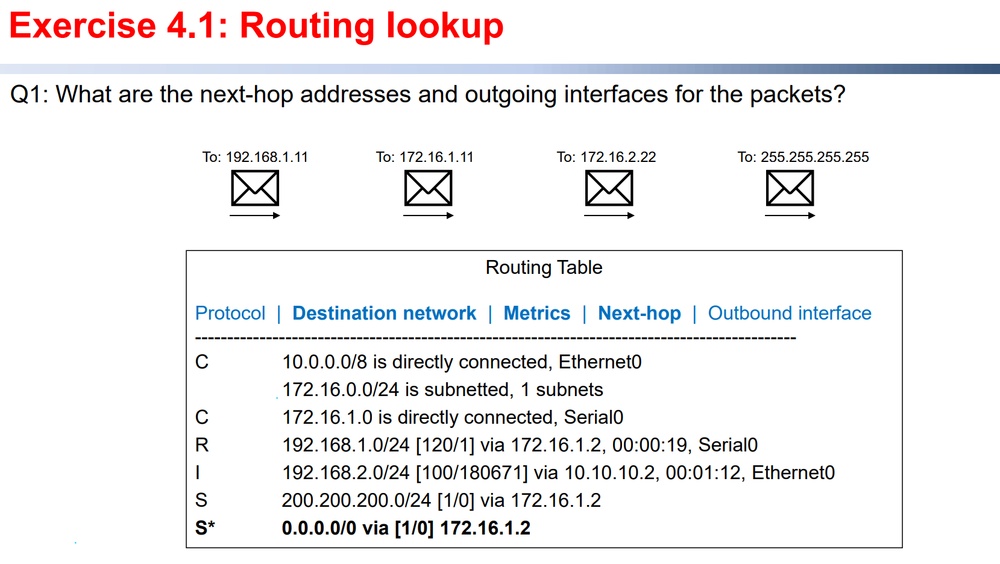
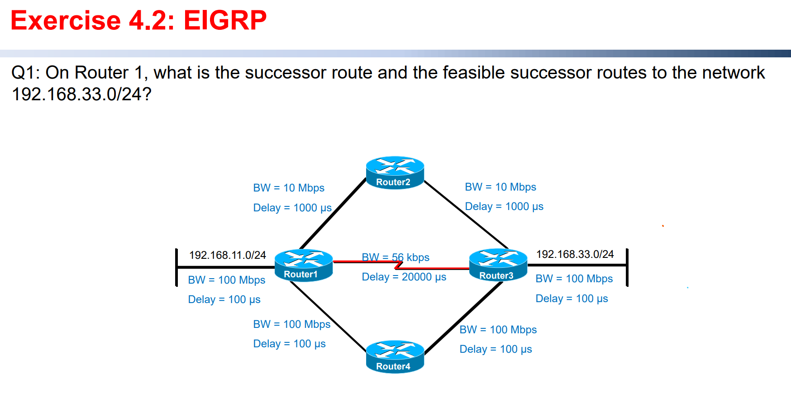
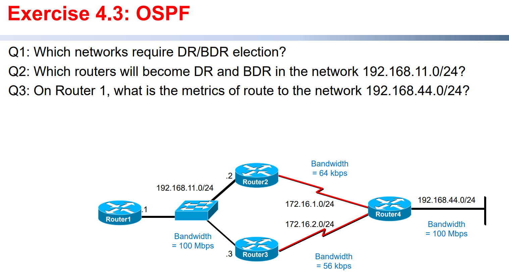

## Layer 3, Routing Protocols

#### Routing protocols

###### What are the differences between Interior Gateway Protocol (IGP) and Exterior Gateway Protocol  (EGP)? List some example of them.

​		Interior Gateway Protocols (IGP) route data ==in== an autonomous system. Like EIGRP, OSPF.

​		Exterior Gateway Protocols (EGP) route data ==between== autonomous system. Like BGP.

###### What algorithm is used by distance vector routing protocols?

​		Distance vector routing protocol algorithm: ==Bellman-Ford algorithm==

​		Link-state routing protocol algorithm: ==Dijkstra algorithm==

###### What are the features of distance vector routing protocols?

​		==Features:== Periodic updates, send entire routing table to directly connected routers, do not know the  exact network topology.

When the topology changes, routing table updates must occur. It passes periodic copies of a routing  table from router to router. Distance-vector algorithms call for each router to send its entire routing  table to each of its directly connected neighboring routers.

​		The algorithm eventually accumulates network distances so that it can maintain a database of  network topology information.

​		Distance-vector algorithms do not know the exact topology of an internetwork.

###### What algorithm is used by link-state routing protocols?

​		Distance vector routing protocol algorithm: ==Bellman-Ford algorithm==

​		Link-state routing protocol algorithm: ==Dijkstra algorithm==

###### What are the features of link-state routing protocols?

​		==Features:== Trigger updates, send partial routing to all routers on the network, know the exact  network topology.

​		It exchanges LSAs (Link-state advertisements) to collect the routing information between routers  starting with directly connected networks.

​		Each router in parallel with the others constructs this logical topology as a tree, with itself as the root,  consisting of all possible paths to each network in the link-state protocol internetwork.

​		SPF algorithm calculation is performed on the database resulting in the SPF tree. A list of the known  paths and interfaces is stored in the routing tables. 

​		A link-state routing algorithm maintains full knowledge of distant routers and how they interconnect.

#### EIGRP

###### What three tables are maintained by EIGRP for each routed protocol? What information are stored  in these tables? Which tables does EIGRP store the primary route (successor) to the destination?  Which tables does EIGRP store the backup route (feasible successor) to the destination?

Three tables: ==neighbor table,  topology table and routing table==

Both topology table and routing table stored the successor route (primary route).

Topology table stored the feasible successor route (backup route).

See more for: [EIGRP路由协议 - 简书 (jianshu.com)](https://www.jianshu.com/p/5ec0e020d97a)

###### What are the operations of DUAL? How can EIGRP determine the feasible distance, reported  distance, successor and feasible successor for a destination network?

DUAL (Diffusing Update Algorithm) is the method to guarantee the successor distance and feasible successor distance of a non-circle topology network.

FD (Feasible Distance): the local route’s metric of the ==best route== to reach a specific network.

RD (Reported Distance): the metric advertised by the neighbor router for a specific route.

Successor for a destination network: the next hop on the primary route with the shortest feasible distance to the destination.

Feasible successor for a destination network: When a destination network is removed from the EIGRP topology, a router initiates a route querying process in an attempt to locate a different route to that destination. As it is preferable to avoid this querying process, EIGRP routers will opportunistically store backup routes, known as *feasible successors*, when certain requirements are met.

###### What are used as metric for EIGRP? How to calculate the metric for a destination network?

$$
Metric = Bandwidth + Delay
$$

Note that the unit of bandwidth is ==$Kbps$== and the unit of delay is ==$\mu s$==
$$
FD=\Big( \frac{10^7}{BandWidth}+\frac{Delay(\mu s)}{10}  \Big)\times 256
$$

###### Which multicast addresses are used by EIGRP to exchange the routing information?

IPv4: `224.0.0.10`

IPv6: `FF02::A`

#### OSPF

###### What three databases are maintained by OSPF? What information are stored in these databases?

Three databases: ==neighbor database,  topology database and routing database==

See more for: [OSPF详解（一）_智慧云工具箱的博客-CSDN博客_ospf详解](https://blog.csdn.net/qq_44967475/article/details/90901793)

###### What types of networks need a DR (Designated Router) and BDR (Backup Designated Router)  election? Why?How to determine the DR and BDR in OSPF network?

==Multi-access networks== need a DR and BDR election.

==Point-to-point networks== do **NOT** need a DR or BDR election.

DR is the ==largest== number of the router ID set of a sub-network.

BDR is the ==second largest== number of the router ID set of a sub-network.

###### What is used as metric for OSPF? How to calculate the metric for a destination network?

$$
OSPF\ Cost=\sum \frac{10^8}{BandWidth}
$$

Note that the unit of bandwidth is ==$bps$==

###### Which multicast addresses are used by OSPF to exchange the routing information?

IPv4: `224.0.0.5` or `224.0.0.6`

IPv6: `FF02::5` or `FF02::6`

To `192.168.1.11`: Find out `192.168.1.0/24` in routing table and next-hop is `172.16.1.2`

To `172,16.1.1`: Find out `172.16.1.0/24` in routing table and next-hop is Serial0

To `172.16.2.22`: Find out `0.0.0.0/0` in routing table and next-hop is `172.16.1.2`

To `255.255.255.255` drop since it is a broadcast IP therefore there is no next-hop.

Note that ==Successor route== means the best route and ==Feasible successor route== means backup route.

And the **feasible distance** calculation formula is: 
$$
FD=\Big( \frac{10^7}{BandWidth(Kbps)}+\frac{Delay(\mu s)}{10}  \Big)\times 256
$$
Route I: $Router1\to Router2\to Router3\to192.168.33.0/24$
$$
FD_2=\Big( \frac{10^7}{10\times 10^3}+\frac{1000+1000+100}{10}  \Big)\times 256=309760
$$
Route II: $Router1\to Router3\to192.168.33.0/24$
$$
FD_3=\Big( \frac{10^7}{56}+\frac{20000+100}{10}  \Big)\times 256=46228845
$$
Route III: $Router1\to Router4\to Router3\to192.168.33.0/24$
$$
FD_4=\Big( \frac{10^7}{100\times 10^3}+\frac{100+100+100}{10}  \Big)\times 256=33280
$$
Since $FD_4$ is the shortest path (easy to compare), route III is called successor route.

Now let’s calculate feasible successor route, or say, backup route.

Because *Router 4* is the successor router, we only need to calculate the RD of *Router 2* and *Router 3*. If $RD<FD$, we can say the route is a feasible successor route.

Route I: $Router2\to Router3\to192.168.33.0/24$
$$
RD_2=\Big( \frac{10^7}{10\times 10^3}+\frac{1000+100}{10}  \Big)\times 256
$$
Route II: $Router3\to192.168.33.0/24$
$$
RD_3=\Big( \frac{10^7}{100\times 10^3}+\frac{100}{10}  \Big)\times 256\\
$$
Since $RD_3$ is faster than $RD_2$, Route II is called feasible successor route.

Q1:

`192.168.11.0/24` sub-network and `192.168.44.0/24` sub-network require DR/BDR election.

Q2:

Use ==Router ID== only to choose DR and BDR.

The IP of Router1 is `192.168.11.1` 

The IP of Router2 is `192.168.11.2`

The IP of Router3 is `192.168.11.3`

Since the IP of Router 3 is the largest, DR is Router 3.

Since the IP of Router 2 is the second largest, BDR is Router 2.

Q3:
$$
Metrics=\frac{10^8}{100\times10^6}+\frac{10^8}{64\times 10^3}+\frac{10^8}{100\times10^6}
$$
Note that the unit of bandwidth is ==$bps$==, NOT *Kbps*!!!

---

$$
END
$$

