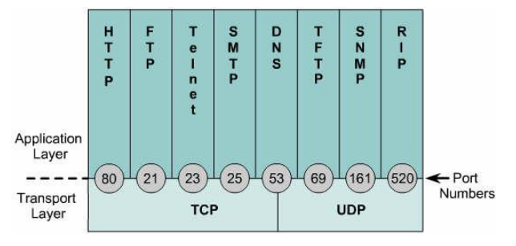
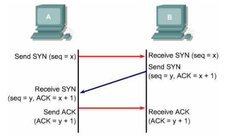
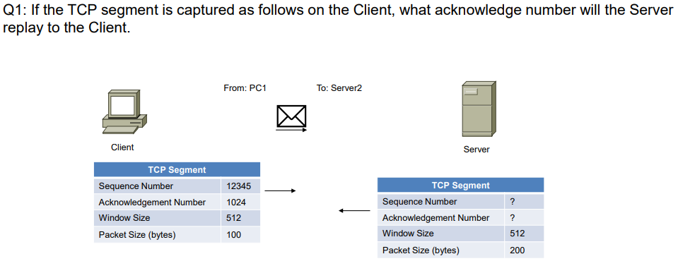
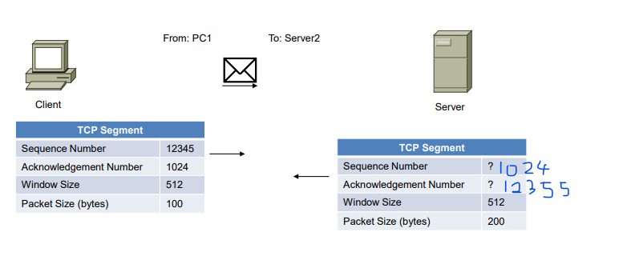

### Layer 4 Technology, Transport Protocols

#### Transport protocols (TCP and UDP)

###### What are the differences between connect-oriented and connectionless services? Which transport  protocol is providing these services? 

Connection-oriented service is like telephone service, the first message sent from source device will first received by destination device, which means the messages are ==in order==. TCP belongs to connection-oriented transport protocol.

Connectionless service is like postal service, the first message sent from source device may not first received by destination device, which means the messages are ==not in order==. UDP belongs to connectionless transport protocol.

###### What functions are provided by the transport protocols of TCP and UDP? 

TCP:

- Connection-oriented. 

- Divides outgoing messages into segments, and reassembles messages at the destination host. 

- Reliable delivery that re-sends anything not received. 

- Provides flow control.

UDP:

- Connectionless 
- Unreliable delivery that uses no acknowledgments, and provides no software checking for message  delivery
- Provides no flow control

###### Which application layer protocols use TCP or UDP as transport protocol? 

TCP protocols include: FTP, HTTP, SMTP and Telnet.

UDP protocols include: DNS, SNMP, TFTP and DHCP.

###### What is the purpose of port number? How to assign the port number for the application on the server site and client site? List some common used port numbers for famous application protocols.

Transport layer assigns port numbers to each of these ==applications or services==  to keep track of ==different conversations== that cross the network ==at the same time==.

Port numbers have the following assigned ranges:

- $0$ ~ $1023$: Well-known ports numbers. These numbers are reserved for well-known services and applications.

- $1024$ ~ $49151$: Registered for vendor-specific applications. 

  ​	These port numbers are assigned to individual applications that a user has chosen to install rather  than common applications that would receive a Well Known Port. When not used for a server  resource, these ports may also be used dynamically selected by a client as its source port.

- $49152$ ~ $65535$: Private and/or dynamically assigned ports numbers. 

  ​	Also known as Ephemeral Ports, these are usually assigned dynamically to client applications when  initiating a connection.

  

#### TCP services

###### How does TCP use three-way handshake to establish a connection? 

###### How does TCP use sequence number and acknowledgment to provide reliable transmission?

See more for three-way handshake. Client and Server has exchanged the sequence number and acknowledgment number.

Pay attention to the direction that messaged are sent. In this example, message is from client to server, therefore the $ACK=Seq\ number + Packet\ Size$. However, if the message is sent by server, the ACK would changed into $ACK=Seq\ number - Packet\ Size$.

