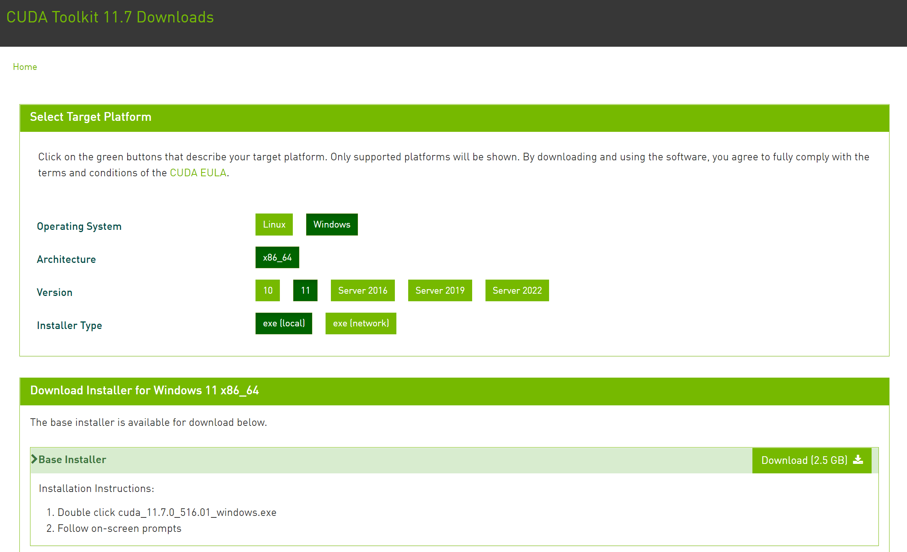
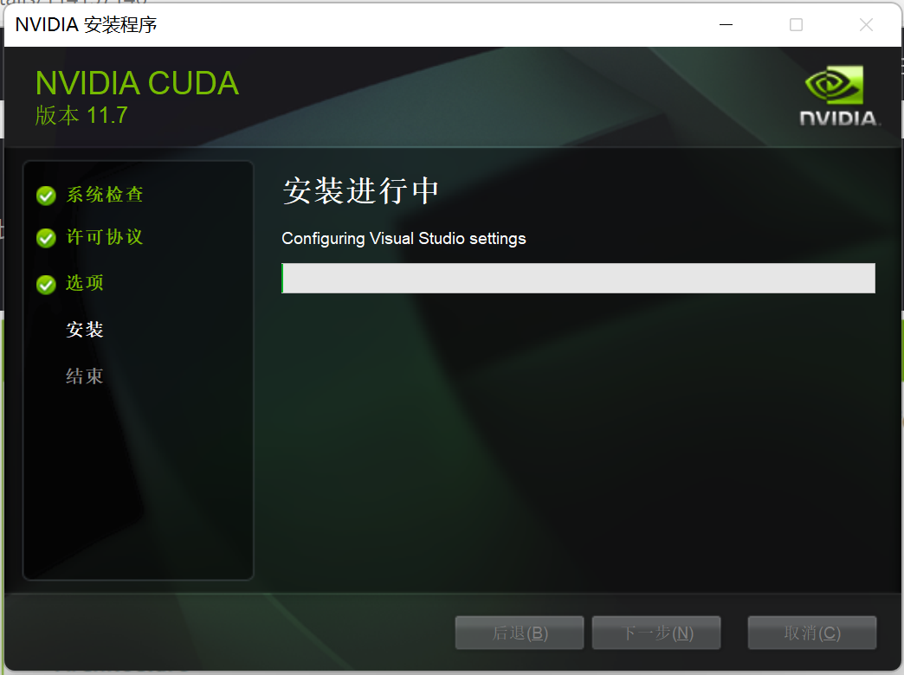
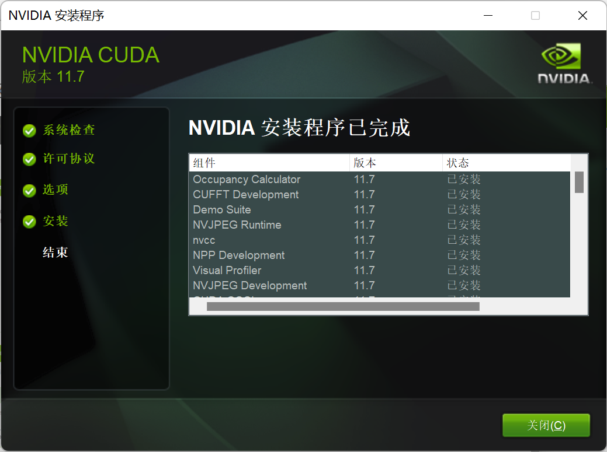
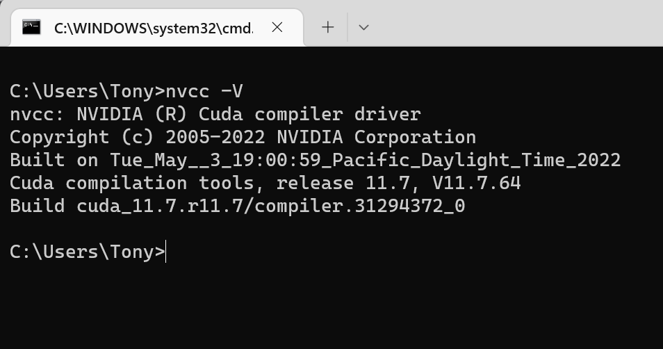
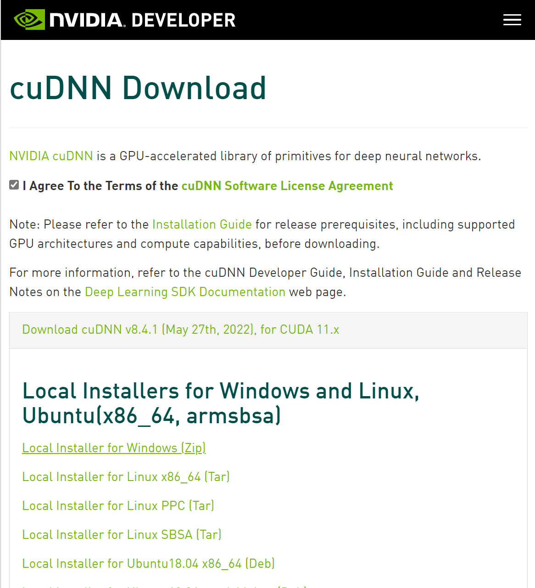
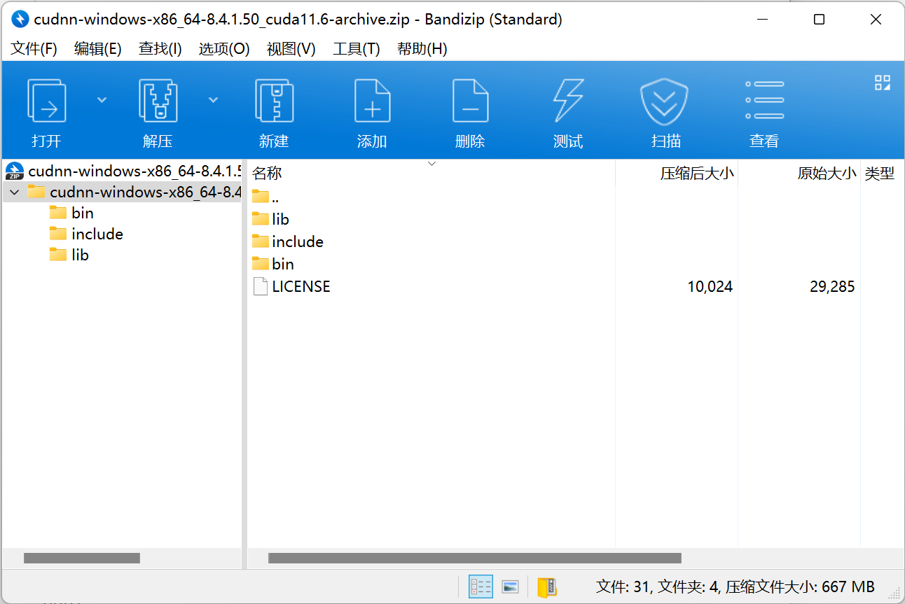

# CUDA安装教程

CUDA仅针对NVIDIA显卡进行加速，对于AMD显卡及Inter集成显卡没有加速效果，此教程仅适用于拥有NVIDIA显卡电脑的朋友。

## CUDA下载

CUDA下载网址：https://developer.nvidia.com/cuda-toolkit-archive

选择电脑系统和版本型号，较旧的电脑需要根据电脑显卡版本选择较旧的CUDA Toolkit，一般电脑选择最新版即可。

傻瓜式下一步：

使用命令`nvcc -V`验证是否安装成功：

## cuDNN下载

cuDNN下载网址：https://developer.nvidia.com/cudnn

选择电脑系统和版本型号，较旧的电脑需要根据电脑显卡版本选择较旧的CUDNN，一般电脑选择最新版即可。

下载后打开压缩包：

将下载好的cudnn文件复制到cuda的安装目录下面，默认路径为C:\Program Files\NVIDIA GPU Computing Toolkit\CUDA\vXX.X.

