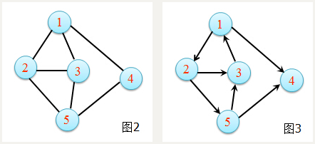
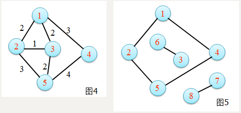
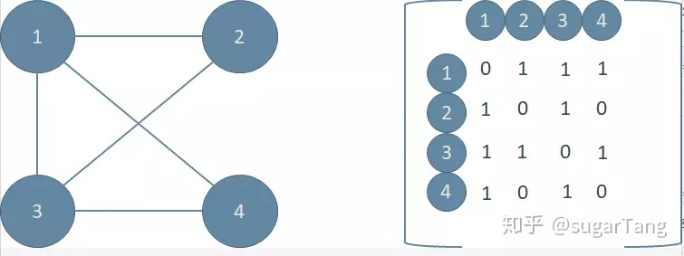
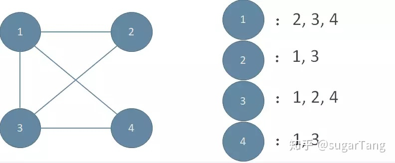
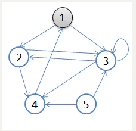

## 基础知识

### 图的定义和分类

- **图的定义** 是一个顶点集合V和一个顶点间关系的集合E组成，记G=(V,E) V：顶点的有限非空集合。 E：顶点间关系的有限集合（边集）。

- **无向图** (graph)在G=(V,E)中，如果对于任意的结点a,b∈V，当(a,b)∈E时，必有(b,a)∈E（即关系R对称），如图二。
  $$
  V={1,2,3,4,5}\\ 
  E={(1,2),(1,3),(1,4),(2,3),(2,5),(3,5),(4,5)}
  $$
  
- **有向图** (digraph)在G=(V,E)中，如果对于任意的结点a,b∈V，当(a,b)∈E时，(b,a)∈E未必成立，如图三。 
  $$
  V={1,2,3,4,5}\\
  E={<1,2>,<1,4>,<2,3>,<2,5>,<3,1>,<5,3>,<5,4>}
  $$



- **带权图** 一般的图边上没有数字，边仅表示两个顶点间相连接关系 ，如图四。
- **连通图**图中任意两个顶点都是连通的，称为连通图；否则为非连通图，如图五。



### 邻接矩阵和邻接表

- **邻接矩阵**

邻接矩阵的优势是方便定义，只需要一个二维矩阵就可以解决；缺点也显而易见，浪费空间。



- **邻接表**

邻接表的优势自然就是尽可能的节省更多的空间，但是与之相对应的就是定义起来很麻烦，需要用链表或者vector来实现。



*(图是网上抄的，看水印，如有侵权，请联系我)

## 图的遍历(DFS&&BFS)

------

好了，上面我们学习了图的概念以及如何存图，接下来就是重头戏了。

接下来便是如何实现图的搜索，首先我们来看这样一个有向图， 我们不妨设从1号顶点起始。



在搜索过程中，我们维护一个布尔数组bool visited[N+1]，这个数组用来表示每个顶点是不是已经遍历过了。

接下来，从1号开始进行DFS，遍历过的节点就在`visited[]`中标注。visited[i] == true表示顶点i已经遍历过了，visited[i] == false表示i还没有遍历过。DFS的具体方法可以用递归实现，直到所有节点都被遍历过结束。如果采用邻接矩阵，伪代码如下：

```python
Visited[]={0}
DFS(x):
	Visited[x]=true
	for(i=1;i<=N;i++):
		if(!Visited[i] && map[x][i]):
			DFS(i)
```

## 代码实现

------

### DFS递归实现

```c++
#include <iostream>
#define N 5
using namespace std;
int maze[N][N] = {
    { 0, 1, 1, 0, 0 },
    { 0, 0, 1, 0, 1 },
    { 0, 0, 1, 0, 0 },
    { 1, 1, 0, 0, 1 },
    { 0, 0, 1, 0, 0 }
};
bool visited[N + 1];
void DFS(int start)
{
    visited[start] = true;
    for (int i = 1; i <= N; i++)
        if (!visited[i] && maze[start - 1][i - 1] == 1)
            DFS(i);
    cout << start << " ";
}
int main()
{
    for (int i = 1; i <= N; i++)
    {
        if (visited[i])
            continue;
        DFS(i);
    }
    return 0;
}
```

### DFS非递归实现

```c++
#include <iostream>
#include <stack>
#define N 5
using namespace std;
int maze[N][N] = {
    { 0, 1, 1, 0, 0 },
    { 0, 0, 1, 0, 1 },
    { 0, 0, 1, 0, 0 },
    { 1, 1, 0, 0, 1 },
    { 0, 0, 1, 0, 0 }
};
bool visited[N + 1];
void DFS(int start)
{
    stack<int> s;
    s.push(start);
    visited[start] = true;
    bool is_push = false;
    while (!s.empty())
    {
        is_push = false;
        int v = s.top();
        for (int i = 1; i <= N; i++)
        {
            if (maze[v - 1][i - 1] == 1 && !visited[i])
            {
                visited[i] = true;
                s.push(i);
                is_push = true;
                break;
            }
        }
        if (!is_push)
        {
            cout << v << " ";
            s.pop();
        }
    }
}
int main()
{
    for (int i = 1; i <= N; i++)
    {
        if (visited[i])
            continue;
        DFS(i);
    }
    return 0;
}
```

### BFS实现

```c++
#include <iostream>
#include <queue>
#define N 5
using namespace std;
int maze[N][N] = {
    { 0, 1, 1, 0, 0 },
    { 0, 0, 1, 1, 0 },
    { 0, 1, 1, 1, 0 },
    { 1, 0, 0, 0, 0 },
    { 0, 0, 1, 1, 0 }
};
bool visited[N + 1];
void BFS(int start)
{
    queue<int> Q;
    Q.push(start);
    visited[start] = true;
    while (!Q.empty())
    {
        int front = Q.front();
        cout << front << " ";
        Q.pop();
        for (int i = 1; i <= N; i++)
            if (!visited[i] && maze[front - 1][i - 1] == 1)
            {
                visited[i] = true;
                Q.push(i);
            }
    }
}
int main()
{
    for (int i = 1; i <= N; i++)
    {
        if (visited[i])
            continue;
        BFS(i);
    }
    return 0;
}
```
