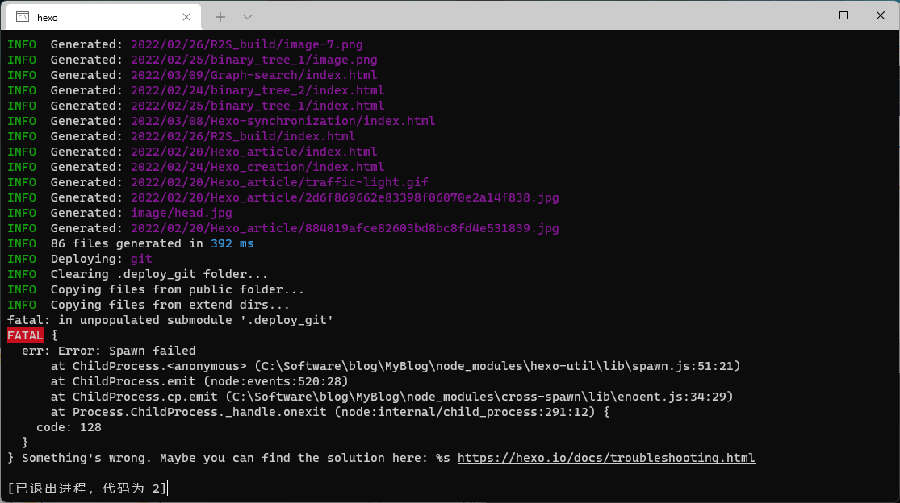
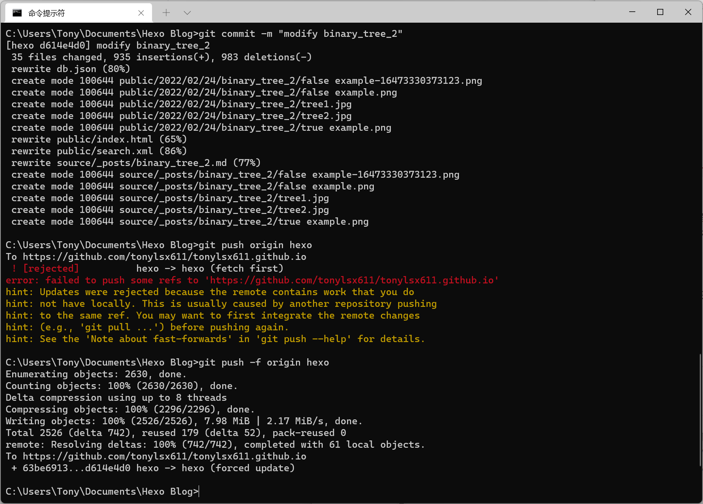
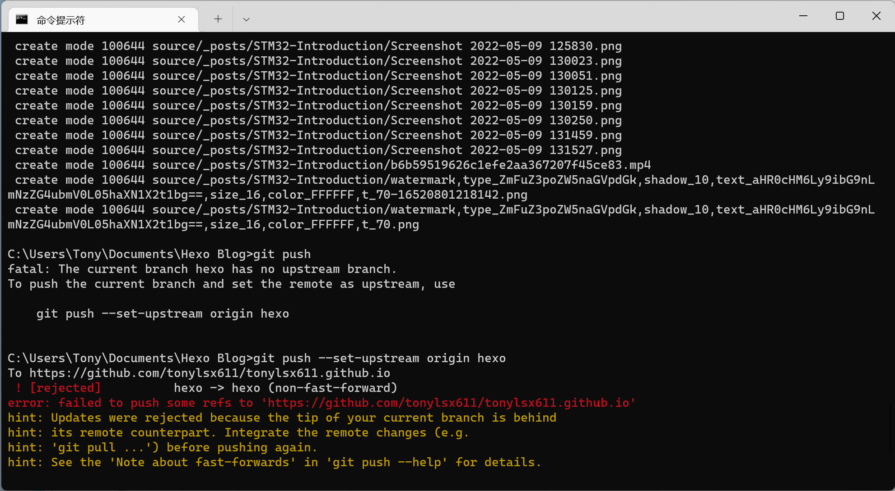

## 如何实现同步

Hexo的同步本质上很简单，使用`git`命令push一下，然后在另一台电脑pull一下就OK。但是我在实际的同步过程中却遇到了各种的报错，这篇文章同样也记录一下我遇到的问题，也为了后期我再次换电脑，或者再次遇到奇奇怪怪的报错做参考。

我现在在家里使用**台式电脑**，在外使用轻薄的商务本（以下简称**笔记本**），所以就以此为例，介绍如何实现两个设备间的同步问题。

首先，我的本地blog储存在台式电脑上面，我们需要将这个blog上传到GitHub上，准确的说是你的GitHub的分支上。我们的目的就是在你的GitHub仓库建一个分支，然后把这个分支当作一个中介，存储我们的源文件，当在A电脑上修改过后直接上传（push）到分支上，然后在B电脑上下载（pull）该分支的所有文件，这样就实现了多设备同步。

### 上传本地仓库到远程仓库

*注意所有命令都要在Hexo项目的目录下执行。

```bash
git init # 首先要在台式电脑上初始化git
git remote add origin https://github.com/username/username.github.io.git # 添加Github上的仓库地址
# username是你的GitHub的用户名
git checkout -b branch_name # 新建分支并切换到新建的分支
# branch_name随便起名字，不过最好简单一点，比如Hexo
git add . # 添加所有本地文件到本地的git
git commit -m "This is the first time to syn!" # 提交备注
# “这里的内容随便写，不过这句代码一定不要省略，后面会出问题！”
git push origin branch_name # 本地文件上传到hexo分支
```

### 首次从笔记本下载工程文件

*注意另一台电脑上要部署好所有的环境，如git，Nodejs，SSH等，详情参考：[Hexo 网站搭建指南](https://tonylsx611.github.io/2022/02/24/Hexo_creation/)

*注意所有命令都要在Hexo项目的目录下执行，没有目录的话找个地方新建一个。

```bash
git clone -b branch_name https://github.com/username/username.github.io
# 克隆分支到本地的博客文件夹
sudo npm install -g hexo-cli # install hexo
sudo npm install # 安装依赖库
sudo npm install hexo-deployer-git # git部署相关配置
```

### 首次用笔记本更新文件

```bash
hexo clean && hexo d && hexo g && hexo s #更新Github中的master文件
# 如果上面这部成功部署，就可以更新分支文件了
git add .
git commit -m "..."
git push origin branch_name
```

### 返回台式电脑进行编辑

```bash
git pull origin branch_name # 从Github同步数据到台式电脑
# 或者直接git pull也可以


# 修改或者更新文章。。。


hexo clean && hexo d && hexo g && hexo s #更新Github中的master文件
# 如果上面这部成功部署，就可以更新分支文件了
git add .
git commit -m "..."
git push origin branch_name
#有没有发现，跟上面的代码一样了，没错，这样就形成了循环！
```

完成首次同步之后的任何设备都可以使用上面的代码进行同步和更新。

## 同步过程中遇到的问题

### git pull文件冲突报错


报错信息：

`error: Your local changes to the following files would be overwritten by merge`

报错原因：

在同步的时候出现两个相同文件名内容不同的文件，导致冲突；比如笔记本修改了之前的某个文章，在台式机`pull` 的时候就会产生这样的错误。

解决方法：

```bash
git stash # 备份工作区内容
git pull origin branch_name # 下载分支内容
git stash pop # 恢复工作区内容
```

### Clone后首次部署报错



报错信息：

```bash
fatal: in unpopulated submodule '.deploy.git'
FATAL:{
	error: Error: Spawn failed
		...
}
```

报错原因：

克隆远程分支到本地电脑的时候，把`.deploy.git`也一并克隆了过来，这个文件夹是部署到master的临时缓存文件夹，是另一个电脑部署用的，因此会产生冲突。

解决方法：

删掉本地的`.deploy.git`文件夹，重新部署。如果还有问题，可能是你开了多个命令行，多个terminal会产生冲突，全部关掉，重开一个来部署。

### 本地未关联远程分支报错

报错信息：

```bash
There is no tracking information for the current branch.
Please specify which branch you want to merge with.
See git-pull(1) for details.

git pull <remote> <branch>

If you wish to set tracking information for this branch you can do so with:

git branch --set-upstream-to=origin/<branch> release
```

报错原因：

在建立新的本地分支后，未与GitHub分支关联，通常出现在首次添加新的电脑时报错。

解决方法：

他不是说的明明白白的嘛，你就按照他的提示加一行代码，关联上就完了！这里的`remote_branch`就是GitHub上的远程分支，`your branch`就是你的本地分支。

```bash
git branch --set-upstream-to=origin/remote_branch your_branch
```

### fetch first 报错



报错原因：

远程库版本与本地版本不一致导致的报错。

解决方法：

```bash
git pull --rebase origin your_branch
```

### Non-fast-forward 报错



报错原因：

别人上传到远程仓库后，你没有及时的同步或拉取到本地，但是你同时又添加了一些内容。当你在提交时，它会检测到你之前从远程仓库拉取的时候的仓库状态和现在的不一样。于是，它为了安全起见拒绝了你的提交。

解决方法（推荐）：先合并之前的历史，再进行提交

```bash
git fetch origin your_branch # 先抓取远程仓库的更新到本地
git merge origin your_branch # 然后与你的本地仓库合并
git pull --rebase origin your_branch # 然后就可以提交修改了

```

解决方法（不推荐）：丢弃之前的历史，强行提交

```bash
git push --force # 这种方法很不安全
```

---

注：本文部分内容参考自[Hexo博客的安装部署及多电脑同步](https://cloud.tencent.com/developer/article/1046404)，如有侵权，请联系我。
