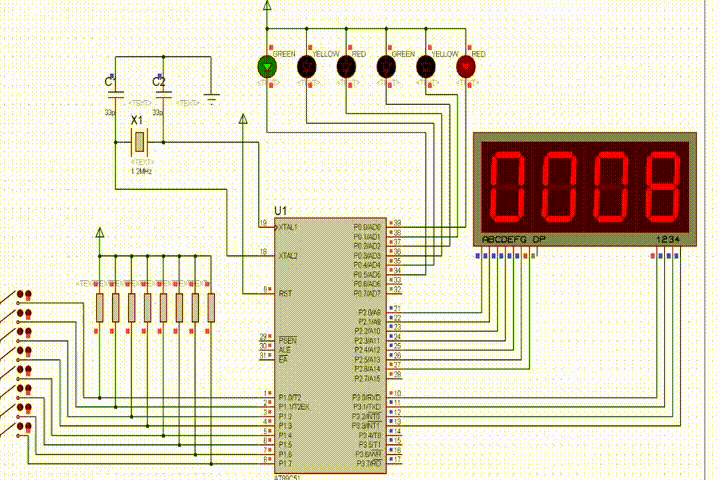

---

title: Hexo文章发布指南
date: 2022-02-20 00:34:49
author: Tony
categories:
	- Hexo搭建
tags: 
	- Hexo
katex: true
icon: icon-women-line
---

## Upload your first article

### Create a new post

``` bash
hexo new "My New Post"
```

More info: [Writing](https://hexo.io/docs/writing.html)

### Run server

``` bash
hexo server
```

More info: [Server](https://hexo.io/docs/server.html)

### Generate static files

``` bash
hexo generate
```

More info: [Generating](https://hexo.io/docs/generating.html)

### Deploy to remote sites

``` bash
hexo deploy
```

More info: [Deployment](https://hexo.io/docs/one-command-deployment.html)

### Advanced Settings

Create a bat format file (e.g. `start.bat`) in the root folder of your blog.

```bash
hexo clean & hexo d & hexo g & hexo s
pause
```

Then every time you uploaded a file or change any settings, you can just double click the .bat file to update your blog, which is very convenience.


# 文章标题H1


在md下直接使用 # 进行新建标题，左侧菜单栏会自动生成H1-H6的标题，very nice!

- 标题样式：

## H2

### H3

#### H4 

##### H5

###### H6

# 头部字段

在文章的第一行使用三个`-`（就是分割线）来创建头部字段。

- 格式如下：

```
title: Hexo文章发布指南
date: 2077-02-20 00:34:49
author: Tony
categories:
	- Hexo搭建
tags: 
	- tag1
	- tag2
katex: true
```

# 数学公式

行内公式使用\$将数学公式括起来就好，行间公式使用两个\$\$，这跟md的格式是一样的。

需要注意的是，如果文章中需要使用数学公式，最好在头部字段前添加`katex: true`的字样。

- 数学公式样例：

我是行内公式：$x=x^{45}+3$，我还可以接着写。。。
$$
x_1=x_3+2\times x^6\\
\alpha：我是行间公式\\
\left[
\begin{matrix}
1 & 2 & 3\\
4 & 5 & 6\\
7 & 8 & 9\\
\end{matrix}
\right]
$$

# 图片

只需要将图片拖入md文档中即可，md会自动创建一个与文件名相同的文件夹以储存所有的图片素材，并会自动将图片复制到该文件夹中，因此所有的图片只需要输入相对路径即可。

比如，本文章的名字为test，那么只需要这样写：``

注：Hexo支持GIF格式的图片哦！




# 代码

没啥可说的。。。

```c++
#include<iostream>
using namespace std;
int main()
{
	int a,b,c;
	cin>>a>>c;
	for(int i=0;i<a;i++)
		cout<<c*a<<endl;
	return 0;
}
```

# 文字

- 高亮语法：==Highlight==ing （==）
- 加粗：**Bold** （\*\*）
- 斜体：*Wall*（\*）
- 删除线：~~请给我打钱~~（~~）

# 音频及视频

暂不支持。。。

（正在努力开发中。。。）


```html
<video src='test/DSC_7412.MOV' 
       type='video/mp4' 
       controls='controls'  
       preload="auto"
       width='100%' 
       height='100%'>
</video>
```

$$
END
$$
