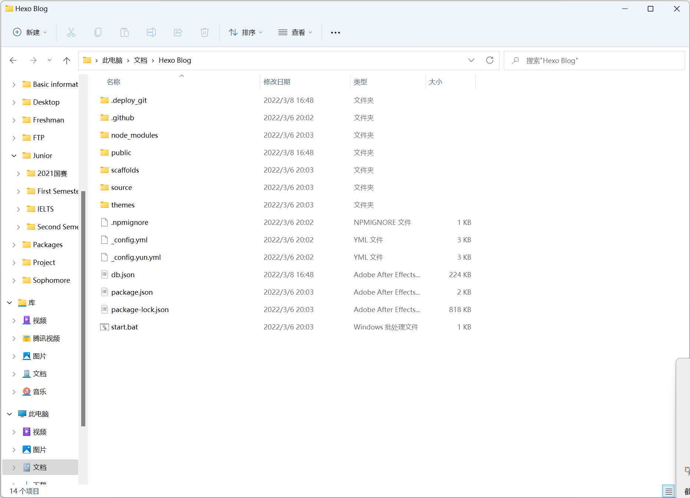
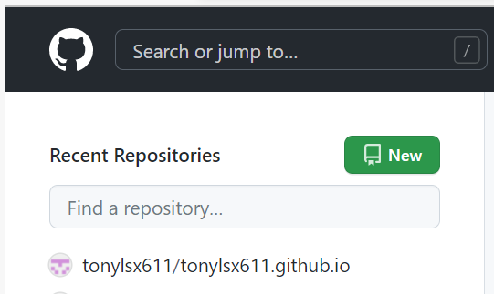

# Hexo 网站搭建指南

Welcome to [Hexo](https://hexo.io/)! 

This is a Guideline of building your own hexo, which is written in English, but easy to understand!

## Preparation and Installation

### Git Installation

- Linux/Mac:

```bash
sudo apt install git
```

- Windows:

Official link: [Download git](https://gitforwindows.org/)

- Check whether installed or not:

```bash
git --version
```

### Nodejs Installation

- Linux/Mac:

```bash
sudo apt install nodejs
sudo aot install npm
```

- Windows:

Official link: [nodejs](https://nodejs.org/en/download/) (Suggest you to choose LTS version)

- Check whether installed or not:

```bash
node -v
npm -v
```

### Hexo Installation

- Linux/Mac:

```bash
sudo npm install -g hexo-cli
```

- Windows:

```bash
npm install -g hexo-cli
```

- Check whether installed or not:

```bash
hexo -v
```

## Deploy local Hexo

​		First you need to **choose or create a folder** to storage the local hexo website. For instance, in `C:/Software/My_Hexo`.

​		Then right click the folder, click `open in Windows terminal`; or just use command line to get into that folder.

```bash
sudo hexo init Mybolg
ls Myblog
sudo npm install
```

​		*Note that you can replace `Mybolg` into any word you like.

​		Now you can see some files inside the folder, but only three folders you need to concerntrated.



- node_modules: 依赖包
- public：存放生成的页面
- scaffolds：生成文章的一些模板
- ==source==：你的文章和素材放在这里
- ==themes==：字面意思
- ==_config.yml==: 博客的配置文件

## Use GitHub to host

### Create a new repository on GitHub

​		Firstly, you need to have a GitHub account…

​		Then, create a **new repository** on GitHub and named `yourusername.github.io`, note that you **must** named like this (`yourusername` is your user name), otherwise the deployment cannot be recognized.

 

### Add SSH key to GitHub

​		Back to the terminal, generate the SSH and add it into GitHub so that GitHub can know whether the your computer are visiting the corresponding account.

```bash
git cofig --global user.name "yourusername"
git cofig --global user.email "youremail"
ssh-keygen -t rsa -C "youremail"
```

​		The computer then will tell you the path of `.ssh`, find it on your computer, and open it via notepad.

​		To say it simpler, SSH is just the ID of your computer, GitHub recognized your computer via this ID. `id_rsa` is your private key that you cannot show it to others, while `id_rsa.pub` is the public key, you can copy the info to GitHub.

​		`Github -> settings -> personal settings -> SSH and PGP keys -> New SSH key`

​		You can verify whether add the SSH key successfully via your terminal:

```bash
ssh -T git@github.com
```

### Deploy hexo to GitHub

​		Open your folder, remember the three folders that I let you to concentrate? Now it turns into `_config.yml` file, open it and add something in the end:

```bash
deploy:
  type: git
  repo: https://github.com/yourusername/yourusername.github.io.git
  branch: master
```

​		*Notice the format must be totally same with me, pay attention to the **blanks**.

​		Before deployment, you need to install the `deploy-git` in your computer so that you can deploy your own hexo into GitHub.

```bash
sudo npm install hexo-deployer-git --save
```

​		Finally, deploy your website via the following commands, and you can visit your bolg via `http://yourusername.github.io`.

```bash
hexo clean
hexo deploy
hexo generate
```

---

注：本文部分内容引用自[hexo史上最全搭建教程_Fangzh的技术博客](https://blog.csdn.net/sinat_37781304/article/details/82729029)， 如有侵权，请联系我。