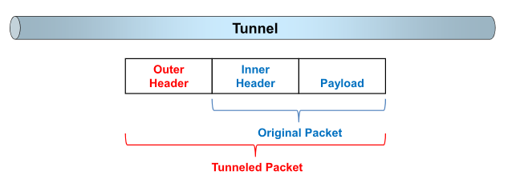
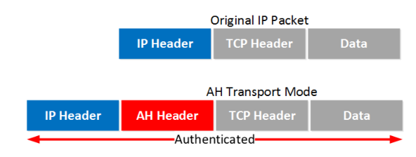
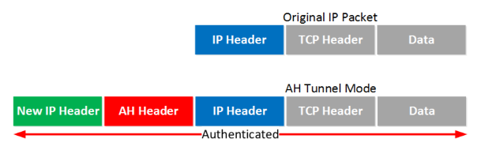
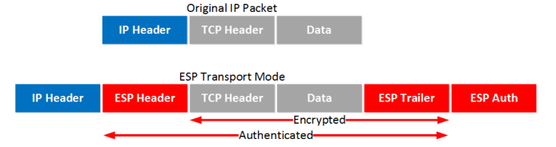
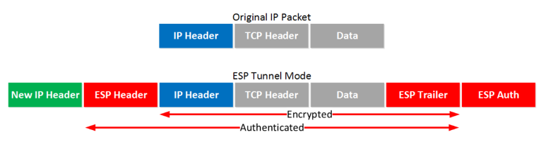
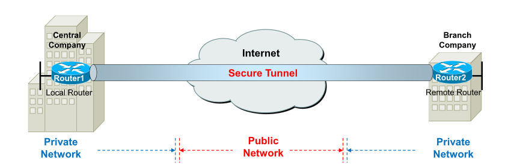
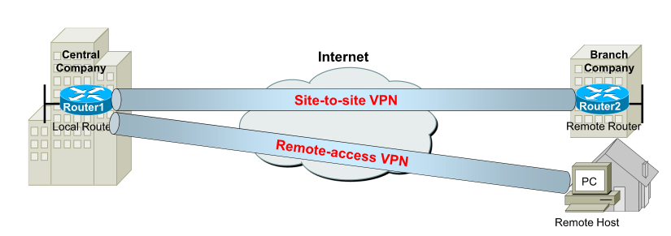

# Secure Tunnel

## Tunneling

隧道是一种用于将数据安全地从一个网络传输到另一个网络的协议。

Tunneling is the technology to establish a logical connection between two end-points.

当数据通过隧道传输时，它在穿过隧道时被分成称为*数据包的*更小部分。数据包通过隧道加密，并发生另一个称为*封装的*过程。对于传输，私有网络数据和协议细节被封装在公共网络传输单元中。这些单位具有公共数据的外观，允许它们通过互联网发送。封装使数据包能够到达其预定目的地。解封装和解密发生在最终目的地。

At the sending site, the original packet is encapsulated with a new outer header, then the tunneled packet is routed to the destination according to the information in the outer header, and finally the outer header is de-encapsulated at the receiving side. The original packet can be continued being routed according to the information in the inner header.

## Tunneling protocols

$$
Tunnel\ Protocols 
\left\{
\begin{matrix}
	unsecure
	\left\{
	\begin{matrix}
		Layer\ 2\ Tunneling\ Protocol\ (L2TP)\\
		Generic\ Routing\ Encapsulation\ (GRE)\\
	\end{matrix}
	\right.
	\\
	secure\to

	\begin{matrix}
		Internet\ Protocol\ Security\ (IPsec)
	\end{matrix}

\end{matrix}
\right.
$$

Internet Protocol Security (IPsec) is a framework that can protect IP traffic on the network layer with the following features:

- Confidentiality 机密性
- Integrity 数据完整性
- Authentication 源鉴别
- Anti-reply 重放攻击防护

## IPsec sub-protocols

$$
IPsec
\left\{
\begin{matrix}
	Authentication\ Header\ (AH)
	\left\{
	\begin{matrix}
		MD5\\
		SHA\\
	\end{matrix}
	\right.
	\\
	Encapsulated\ Security\ Payload\ (ESP)
	\left\{
	\begin{matrix}
		DES\\
		3DES\\
		AES\\
	\end{matrix}
	\right.
	\\
\end{matrix}
\right.
$$

AH协议提供源鉴别和数据完整性服务，但不提供机密性服务。

ESP协议提供源鉴别，数据完整性和机密性服务； 因此ESP协议应用更为广泛。

AH protocol produce Integrity and Authentication services, but do not produce Confidentiality.

ESP protocol produce Confidentiality, Authentication and Integrity; therefore ESP protocol has a broader application.

## IPsec Datagram

$$
IPsec
\left\{
\begin{matrix}
	tunnel\ mode\to
	2\ routers, router\ and\ host, 2\ hosts
	\\
	transport\ mode\to
	2\ hosts\ only
	\\
\end{matrix}
\right.
$$

IPsec supports two modes of operation:

The **Transport Mode** is most commonly used to protect the communication between two hosts. 

The **Tunnel Mode** is most commonly used to protect the communication between two routers by building a secure tunnel, commonly known as a **VPN**.

## Authentication Header Protocol

Layer 3 protocol

**Transport mode**: an AH header after the IP header. The entire IP packet will be authenticated.

**Tunnel mode**: a new IP header is added on top of the original IP packet. 

## Encapsulating Security Payload Protocol

Layer 3 protocol

**Transport mode**: the original IP header is used, and an ESP header and trailer are added. The transport layer (TCP for example) and payload will be encrypted. It also offers authentication but unlike AH, it’s not for the entire IP packet. 

**Tunnel mode**: a new header is added, and the original IP header is now also encrypted.

# Virtual Private Network

A Virtual private network (VPN) is a private network that securely connects two or more remote sites across a public network such as the Internet. Instead of using dedicated physical connections between networks, VPNs use virtual connections (secure tunnel) routed through public networks. 

## VPN Security

- Data confidentiality: DES, 3DES, AES (ESP of IPsec)
- Data integrity: MD5, SHA (AH of IPsec)
- Data origin authentication: PSK, RSA.

**IPsec VPN** consists of set of standards used to establish a VPN connection. Within the VPN implementation, IPsec is applied in tunnel mode, which supports the **Encapsulating Security Payload** **(ESP)** and **Authentication Header (AH)** protocols.

## Types of VPN

## Security Associations

IPsec datagram在两个实体之间发送(e.g. router-router, router-host, host-host)，在datagram发送之前，两者创建了一个网络层的逻辑连接，我们将这个逻辑连接称为安全关联( Security Association, SA)。

一个SA是一个单工逻辑链接，也就是说，如果两个设备之间要互相发送datagram，那么至少要创建2个SA，每个方向至少创建一个。

A Security Associations (SA) is a unidirectional agreement between the VPN participants that specify the security parameter index (SPI), destination IP address, and security protocol to use in securing a  communication channel. 

Full bidirectional communication requires at least two SAs, one for each direction.

## IPsec VPN operations

1. Interesting traffic initiates the IPsec process
2. IKE phase 1 - generate the IKE SA for IKE phase 2.
3.  IKE phase 2 - generate the IPsec SA for data transfer.
4. Data transfer between IPsec peers 
5. IPsec tunnel termination.

*more info of IKE: [IPSec VPN之IKE协议详解 | 曹世宏的博客 (cshihong.github.io)](https://cshihong.github.io/2019/04/03/IPSec-VPN之IKE协议详解/)