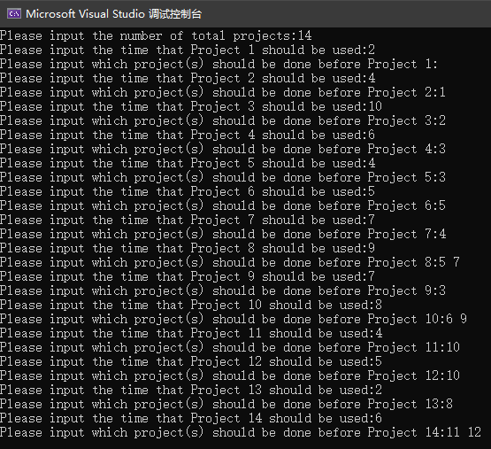
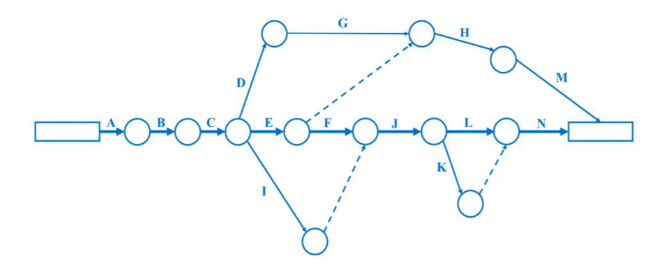
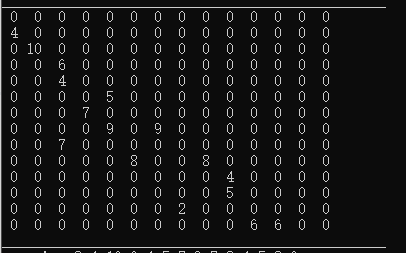
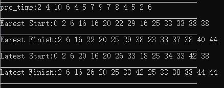
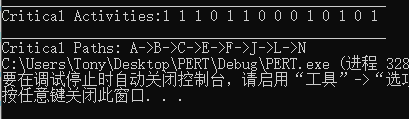

PERT: Program Evaluation and Review Technique

## 1. Tasks

Try to write source code to implement the REPT process, i.e., identifying critical activities and critical path, and calculating the time to complete this software project. The following requirements should be satisfied:

1. Upload all source code files (non including some compiling files, configuration files, etc.).
2. Given a example (the example in the slide or your another example) as an input of your source code, show the result of your source code by screenshot.
3. You choose use a file folder to include all these files, and the compress it into a compressed file for submission.

## 2. Basic Algorithms to solve this issue

### 2.0 Variables and its meaning

- EST: Earliest Start Time
- EFT: Earliest Finish Time
- LST: Latest Start Time
- LFT: Latest Finish Time
- PRT: Project Time Usage (of each activity)

### 2.1 Store data into adjacency matrix

In a PRET example, firstly we need to know how many activities should we solve, namely, input num as the total of PRET activities. Next, we need to build an array to storage the time usage in each of the task, namely, PRT.

The most difficult task, relatively speaking compared with the following input, is to storage the immediate predecessors of each activities. We can either use adjacency matrix or adjacency linked list to storage the predecessors, in my program, I will use matrix instead of linked list since the value num is not too large.

### 2.2 Topological sort

As we all know, topological sort algorithm is useful and convenient to solve the dependency resolution which is extremely similar to PREP, hence I will use topological sort algorithm to implement the **Earliest Start Time** of each node. And the key formula to get EST is

```
EST[j] = max(EST[i] + PRT[i],EST[j])
```

**Earliest Finish Time** is simple to achieve when we know the EST since
`EFT = EST+PRT`

The rest of two arrays **Latest Start Time** and **Latest Finish Time** is harder to find out. Actually, we can find out either of the two values and the other is easy to know since
`LST=LFT-PRT`

What I need to do is reverse all the arrows in PREP, that is, change the last activity to the first activity and change the first activity to the last one, and reverse all the activities and immediate predecessors. Using the same method with solving the EST, we can find out the LFT in the same way. Just Transpose the adjacency matrix, and use the key formula
`LST[j]=min(LFT[i]-PRT[i],LFT[j])`

### 2.3 Solutions

After Getting four arrays EST, EFT, LST, LFT, we can easily find the Critical activities and Critical paths by Slacks, and the formula is
`Slack = LST-EST=LFT-EFT`

If Slack is not zero, then this activity is a critical activity and those slacks can contribute to the critical path.

## 3. Example and Results

While using the example given below, we can create a graph and given it into adjacency matrix.

| ACTIVIEY CODE | IMMEDIATE PREDCESSORS | TIME USAGE |
| :------------ | :-------------------- | :--------- |
| 1             | –                     | 2          |
| 2             | 1                     | 4          |
| 3             | 2                     | 10         |
| 4             | 3                     | 6          |
| 5             | 3                     | 4          |
| 6             | 5                     | 5          |
| 7             | 4                     | 7          |
| 8             | 5 7                   | 9          |
| 9             | 3                     | 7          |
| 10            | 6 9                   | 8          |
| 11            | 10                    | 4          |
| 12            | 10                    | 5          |
| 13            | 8                     | 2          |
| 14            | 11 12                 | 6          |

The input in the program is shown below:



And the graph is shown in the graph into a matrix.





Finally we can get the solutions using topological sort algorithm.



And the solution is shown below.



## 4. Code

```c
#include<iostream>
#include<vector>
#include<sstream>
#include<string>
#include<iomanip>
#include<fstream>
#include<stack>
using namespace std;
ifstream fin("data.txt");
int num;
int main()
{
	//******************* Read Datas *******************
	cout << "Please input the number of total projects:";
	fin >> num;
	cout << num << endl;
	int* pro_time = new int[num + 2];//Project time usage
	vector<vector<int>> map(num + 2, vector<int>(num + 2));//adjacency matrix

	for (int i = 1; i <= num; i++)
		for (int j = 1; j <= num; j++)
			map[i][j] = 0;

	for (int i = 1; i <= num; i++)
	{
		cout << "Please input the time that Project " << i << " should be used:";
		fin >> pro_time[i];
		cout << pro_time[i] << endl;
		cout << "Please input which project(s) should be done before Project " << i << ":";

		vector<int> temp;
		fin.get();
		string str;
		getline(fin, str);
		int tt;
		stringstream ss(str);
		while (ss >> tt)
			temp.push_back(tt);
		
		cout << str << endl;
		if (temp.empty())
			continue;
		else
			for (auto tt : temp)
				map[tt][i] = pro_time[i];
	}

	//******************* EST and EFT *******************
	int* Earliset_Start = new int[num + 2];
	for (int i = 1; i <= num; i++)
		Earliset_Start[i] = 0;

	//******************* Topological Sort *******************
	stack<int> stk;
	stk.push(1);
	while (!stk.empty())
	{
		int i = stk.top();
		stk.pop();
		for (int j = i + 1; j <= num; j++)
			if (map[i][j] != 0)
			{
				stk.push(j);
				Earliset_Start[j] = max(Earliset_Start[i] + pro_time[i], Earliset_Start[j]);
			}
	}

	//Earliset Finish
	int* Earliset_Finish = new int[num + 2];
	for (int i = 1; i <= num; i++)
		Earliset_Finish[i] = Earliset_Start[i] + pro_time[i];

	//******************* LST and LFT **************************
	for (int i = 1; i <= num; i++)
		for (int j = i; j <= num; j++)
			if (map[i][j] != 0)
			{
				map[j][i] = map[i][j];
				map[i][j] = 0;
			}

	int* Latest_Finish = new int[num + 2];
	int Finish_time = Earliset_Finish[num];
	for (int i = 1; i <= num; i++)
		Latest_Finish[i] = Finish_time;
	//******************* Topological Sort *******************
	
	stk.push(num);//need to optimize...
	stk.push(num - 1);//need to optimize...
	while (!stk.empty())
	{
		int i = stk.top();
		stk.pop();
		for (int j = 1; j < i; j++)
			if (map[i][j] != 0)
			{
				stk.push(j);
				Latest_Finish[j] = min(Latest_Finish[i] - pro_time[i], Latest_Finish[j]);	
			}
	}

	int* Latest_Start = new int[num + 2];
	for (int i = 1; i <= num; i++)
		Latest_Start[i] = Latest_Finish[i] - pro_time[i];

	//Critical Activities
	bool* Critical_Activities = new bool[num + 2];
	for (int i = 1; i <= num; i++)
		if (Latest_Start[i] - Earliset_Start[i] != 0)
			Critical_Activities[i] = false;
		else
			Critical_Activities[i] = true;

	//******************* Solutions *******************
	printf("________________________________________________\n");
	for (int i = 1; i <= num; i++)
	{
		for (int j = 1; j <= num; j++)
			cout << setw(2) << map[i][j] << " ";
		cout << endl;
	}
	printf("________________________________________________\n");
	cout << "pro_time:";
	for (int i = 1; i <= num; i++)
		cout << pro_time[i] << " ";
	printf("\n________________________________________________\n");
	cout << "Earest Start:";
	for (int i = 1; i <= num; i++)
		cout << Earliset_Start[i] << " ";
	printf("\n________________________________________________\n");
	cout << "Earest Finish:";
	for (int i = 1; i <= num; i++)
		cout << Earliset_Finish[i] << " ";
	printf("\n________________________________________________\n");
	cout << "Latest Start:";
	for (int i = 1; i <= num; i++)
		cout << Latest_Start[i] << " ";
	printf("\n________________________________________________\n");
	cout << "Latest Finish:";
	for (int i = 1; i <= num; i++)
		cout << Latest_Finish[i] << " ";
	printf("\n________________________________________________\n");
	cout << "Critical Activities:";
	for (int i = 1; i <= num; i++)
		cout << Critical_Activities[i] << " ";
	printf("\n________________________________________________\n");
	cout << "Critical Paths: A";
	for (int i = 2; i <= num; i++)
		if (Critical_Activities[i])
			cout << "->" << char(i + 64);

	return 0;
}
```