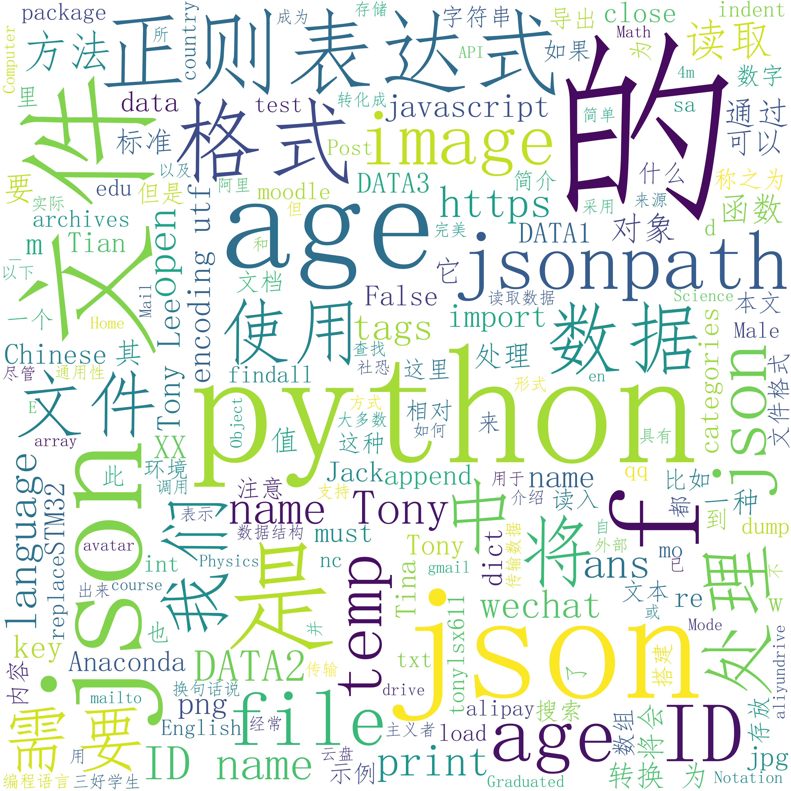
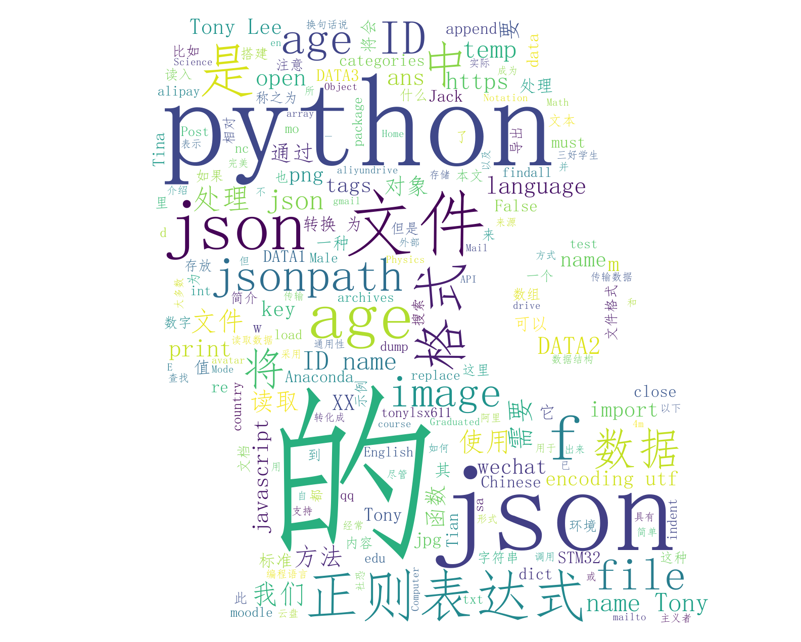

# Python WordCloud简介

### Code

```python
import wordcloud
import jieba # 用于中文词语分割
from urllib import request
from html2text import html2text


def main():
    w = wordcloud.WordCloud(width=3500, height=3500, font_path=r'C:\Windows\Fonts\simfang.ttf', background_color="white")
    w.generate(" ".join(jieba.cut(file_content, cut_all=False)))
    w.to_file("output.png")


if __name__ == '__main__':
    # url = 'http://tonylsx.top/2022/04/09/4-dimensional/'
    url = 'http://tonylsx.top/2022/07/21/Python-json/'
    file = request.urlopen(url)

    file_text = file.read().decode('utf-8')
    file_content = html2text(file_text)
    # print(file_content)
    main()

```

### WordCloud Output

WordCloud输出图片(`output.png`)：



# 为WordCloud添加图片轮廓

### Code

```python
import wordcloud
import jieba
from imageio import imread
from urllib import request
from html2text import html2text


def main():
    photo1 = imread("photo.png")
    print(photo1.shape)  # (748, 1029, 4)
    photo2 = imread("photo2.jpg")
    print(photo2.shape)  # (1270, 1585, 3)

    w = wordcloud.WordCloud(width=3500, height=3500, font_path=r'C:\Windows\Fonts\simfang.ttf',
                            mask=photo2, background_color="white")
    w.generate(" ".join(jieba.cut(file_content, cut_all=False)))
    w.to_file("output.png")


if __name__ == '__main__':
    # url = 'http://tonylsx.top/2022/04/09/4-dimensional/'
    url = 'http://tonylsx.top/2022/07/21/Python-json/'
    file = request.urlopen(url)

    file_text = file.read().decode('utf-8')
    file_content = html2text(file_text)
    # print(file_content)
    main()

```

代码中可以看到，`.png`图片是四维数组，其中第四维度是$\alpha$通道，代表透明度；`.jpg`图片是三维数组，三个维度分别代表RGB三元色。通过调整图片元素的值，全0代表白色，全255代表黑色，可以控制WordCloud的输出轮廓，实现美丽且优雅的图片哦~

### WordCloud Output

原图片(`photo2.png`)：


WordCloud输出图片(`output.png`)：


