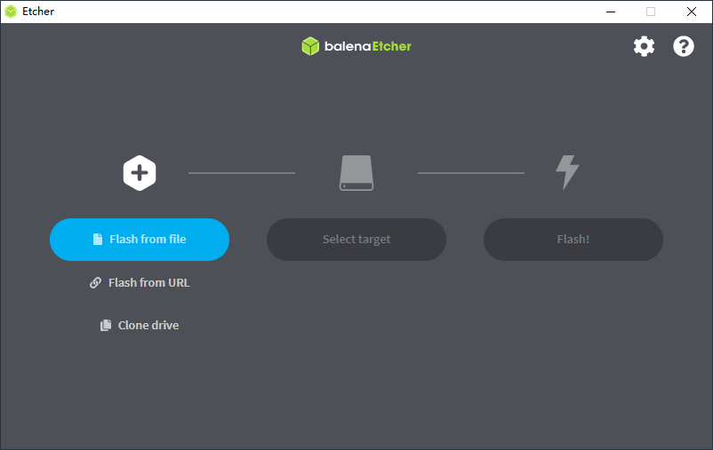
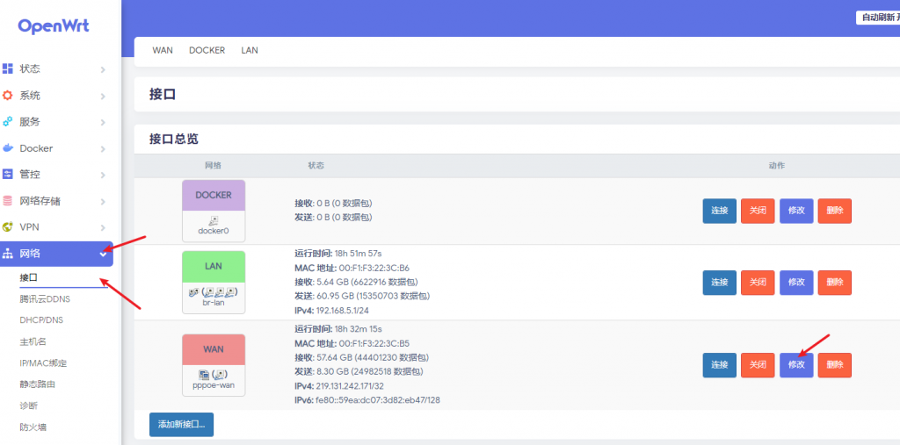
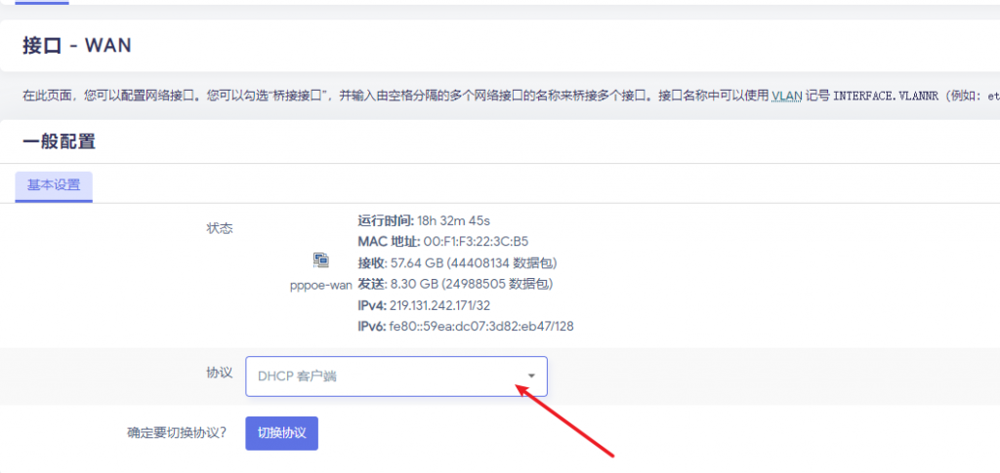
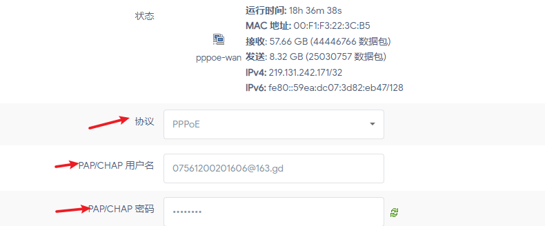
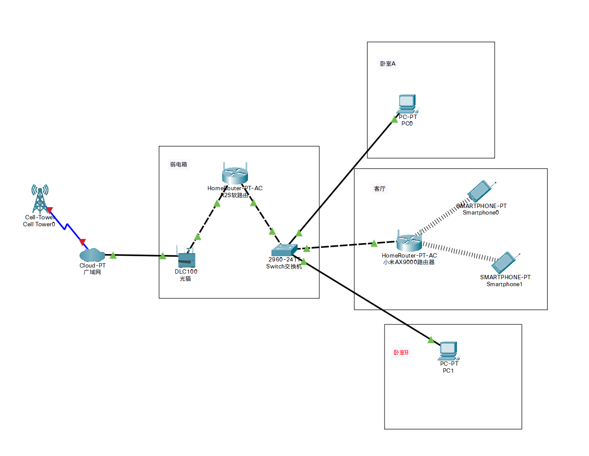

## 前言

本文授权转载自[R2S家庭组网实操 – Orange Tien](https://www.bytedance.fit/?p=1051)，作者：Orange Tien，在此基础上略加修改，~~并不会定期更新~~。

本文主要介绍R2S的基本使用方法，目前本人（Tony）也在原作者（Orange Tien）的怂恿下在两个地方分别搭建了两个R2S，看起来很简单，其实不是一帆风顺；因此也会把实际组网中遇到的问题列到最后供大家参考。

## 确定所需物理设备

- 一台R2S软路由以及它的电源线
- 两根用不着太长的网线一张TF卡（作为R2S的系统盘）以及一个读写TF卡的读卡器
- 一台可以插网线的电脑
- 交换机（可选）
- 插排（某些时候插座不够用）

## 烧录OpenWrt系统

烧录软件：[BalenaEtcher](https://www.balena.io/etcher/)

软路由系统：

[OpenWrt-R2S-dongdong](https://bigdongdong.cowtransfer.com/s/a3420546d30343)

[OpenWrt-R2S-esir](https://bigdongdong.cowtransfer.com/s/9a349ee597aa4f)

第一个链接比较新，界面比较好看一些，推荐选择这个下载；第二个系统是eSir大人写的2020版本，已经很旧了；~~奈何暂时没找到别的系统~~，如果自行找到更好的系统也可以不用这俩链接。注意系统是要支持Arm架构的，因为Openwrt不是x86架构下的产物。

##  开始烧录系统至TF卡

打开BalenaEtcher，选择Flash from file，然后将OpenWrt系统烧录到TF卡中即可。

注意：选择文件时只选择镜像文件，不要把那些七七八八的文档说明也选进去。选择`.gz`(`.img`)文件来烧录即可，烧录完成后直接拔掉读卡器；系统会提示格式化，此时千万**不要**格式化！！！（~~否则，就重来一遍吧~~）

##  登入R2S后台

把烧录好固件的TF卡插入R2S，然后给它插上电源，WAN口可以不接，将R2S的LAN口连接电脑的网口，根据所刷入的固件（软路由系统）的不同来决定后台地址，一般来说，软路由后台是`192.168.X.1` ，本文的系统后台是`192.168.22.1`，所以说我们在电脑浏览器内输入`192.168.5.1`(`192.168.22.1`)以进入后台。后台账号是root，默认密码基本都是password（若下载本文的系统，密码则为空），具体操作链接里面写的很清楚。

## 拨号或者DHCP客户端

### 光猫拨号

如果你家里的组网方式是通过光猫拨号（通常都是光猫拨号），那么设置方法如下：

选择 网络-接口， 然后选择 修改WAN口设置

将WAN口设置成DHCP客户端，然后保存应用即可，此外无须做其他任何设置。

### R2S拨号

如果你的光猫是桥接，那么就由路由器来拨号（通常来说，哪个网络设备配置更好，就誰来拨号，由于R2S的稳定性远不如光猫，所以这里选择光猫拨号更好），设置方法如下：

同样，选择修改WAN口，协议设置成PPPoE, PAP/CHAP，账号密码就是光猫的账号密码。比如电信宽带就是以`@163.gd`结尾的，密码如果忘记的话直接拨打10000（10086）重置就好，省时省力。

接下来，需要用超级管理员账号登陆到光猫的IP中（`192.168.1.1`）,各大运营商的超级管理员账号和密码可以自行搜索。选择 网络-协议，然后设置成DHCP客户端。

### 小结

用什么拨号，什么就选择PPPoE，然后其它设备就都设置成DHCP。

用光猫拨号，光猫的设置里面就选择PPPoE，软路由以及其它路由器就选择DHCP客户端；

用R2S拨号，光猫和其它路由设备的设置里面就选择DHCP客户端，软路由选择PPPoE。

## 各设备接入网络

将软路由的WAN口与光猫的千兆口相连，然后断开软路由的LAN口与电脑网口的连接，此时软路由的LAN口根据各人组网要求的不同选择接不同的设备，可以接交换机，也可以接一台路由器（路由器设置为有线中继模式，也就是无线AP模式）

如果家中设备比较多，或者很多屋子都需要连网线的话，可以买一个最便宜的千兆交换机放到弱电箱中，然后吧R2S接到交换机与光猫中间，这样就可以实现整个局域网都接入到软路由中来。（我来草草的画个图）

## 利用插件设置科学上网

根据前面的步骤，如果你的设备能够正常访问网络了，就可以开始探索OpenWrt的各类插件了。关于科学上网，常见的插件有PassWall, ShadowScoksR++, OpenClash，由于OpenClash具备强大的分流策略机制（根据你访问的域名或者IP的不同决定走不同的节点），我们在此以OpenCalsh为例设置科学上网

首先，在服务菜单中找到OpenClash，然后选择配置文件订阅，选择添加配置文件

配置文件名随便写，用途是给用户自己区分的，订阅地址填上机场给你的订阅地址，其余地方无需设置，直接应用并保存即可。然后回到OpenClash主页，配置文件区域发送了变化。

最后点击左下角的启动按钮，等待服务器上线运行即可。

如果你设置后无法正常科学上网，原因是有很多的，需要你自己慢慢排查。

## 更多（原作者的话）

[NanoPi R2S WIKI](https://wiki.friendlyarm.com/wiki/index.php/NanoPi_R2S/zh)

上面的链接是R2S的WIKI书，上面详细记录了R2S的配置以及实际测速情况，也有如何编译系统等教程。

个人使用R2S两年，从大一到大三都在用这个，感觉就是到千兆不太行，500M是瓶颈了，然后连久了没那么稳定，官网手册上宣传它是又稳定又能达到千兆的，这个听听就好，R2S本来是适合入门的，但是现在价格炒的太高了，没这个必要去买它，目前有很多更具有性价比的软路由可供选择。

此外向大家推荐软路由界的大佬: [JackStone的Youtube主页](https://youtube.com/c/jackstone) ，人称老白，做了很多小主机的视频，如果想选购更具性价比的设备，可以看他的合集，比如2021软路由选购建议这些。

## 组网时遇到过的问题（我的话）

1. 组网的过程中可能出现无法自动分配IP地址的问题，比如说小米的路由器默认会分配`192.168.31.XXX`；如果你会手动配置的话可以试试，不过最简单的办法就是等，去洗个澡回来就好了。如果还没好，那么可以考虑RESET一下路由器。
2. OpenClash插件在首次启动的时候，可能会启动失败，他会提示需要你选择编译架构，按照他的提示，选择Arm-v8架构即可。
3. 网线通常插上马上就会亮灯，5s左右就能ping通，不过不要太相信科学。~~我有一次ping了10多分钟。~~真的，不通的话不一定是没插紧，也不一定是插错了，**很有可能是因为你没给我微信或者支付宝赞赏**。
4. R2S是很基础的一款软路由，稳定性可能不会太好，不过最有可能导致网络不稳定的还是机场的选择，如果选择廉价机场的话，要做好不知道什么时候突然断网10分钟的准备。
5. 计算机网络这门学科是玄学的一个分支。

