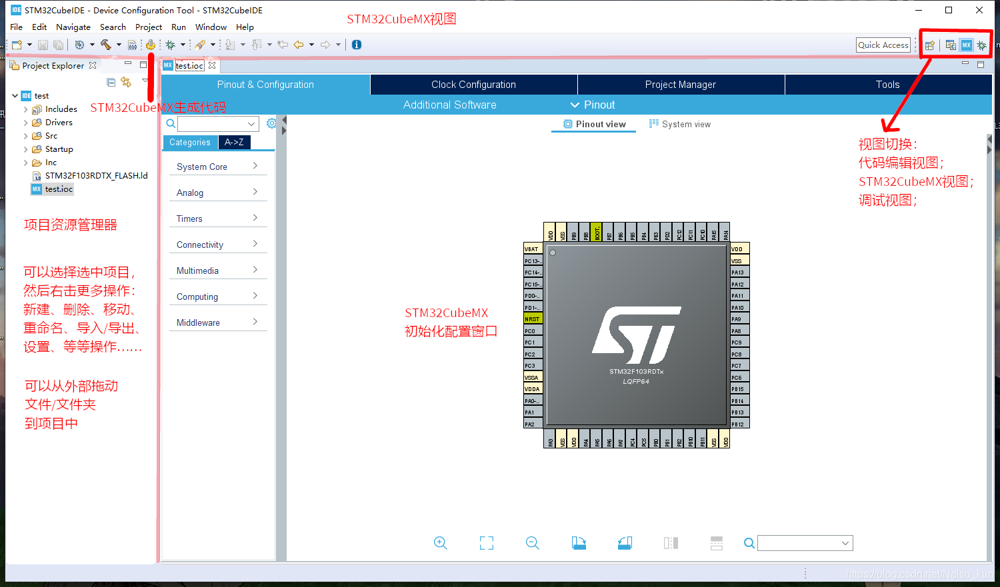
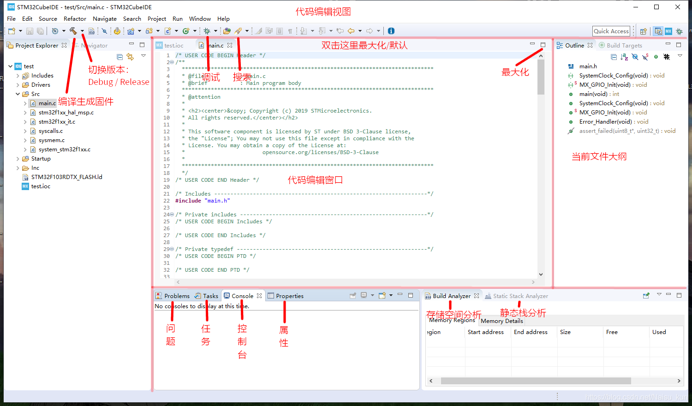
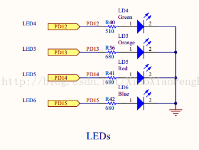

# STM32 介绍

STM32单片机主要是由意法半导体公司设计的微控制器,其具有低功耗、低成本和高性能的特点,适用于嵌入式应用。其采用ARM Cortex-O内核,根据其内核架构的不同,可以将其分成一系列产品,当前主流的产品包括STM32F0、STM32F1、STM32F3,具有超低功耗的产品包括STM32L0、STM32L1、STM32L4等。由于STM32单片机中应用的内核具有先进的架构,使其在实施性能以及功耗控制等方面都具有较强表现,因此在整合和集成方面就有较大的优势,开发起来较为方便,该类型的单片机能非常迅速地实现开发和投入市场,当前市场中这种类型的单片机十分常见,类型多样,包括基础型、智能型和高级型等,应用都比较广泛。

# STM32 Cube IDE 介绍

首先下载STM32的编程IDE：STM32CubeIDE. (下载链接：[STM32CubeIDE - Integrated Development Environment for STM32 - STMicroelectronics](https://www.st.com/en/development-tools/stm32cubeide.html?msclkid=3559ada6cf6311ecbd9f53d57c28a659))

与其它编程语言一样，嵌入式开发同样倾向于使用高大上的IDE进行编程，其原因是此类IDE可以自动生成绝大部分代码，以及代码补全，编译运行烧录等一条龙服务。不需要用户手动写入大量枯燥无味的代码，极大地降低学习成本。

下载后新建工程文件，本次编程的目标是**将一个简单的跑马灯代码烧录到单片机中**并运行MCU。

新建工程文件后需要手动选择MCU的具体型号，左上角搜索单片机的具体型号即可，选中手里的单片机型号，右下角点击下一步。


接下来会跳出如下界面，选择工程存放的目录和工程名称，其它的不需要做调整。这里我们选择C语言作为目标语言即可，不需要选择C++语言，如果你熟悉C++的单片机编译就当我没说。


接下来就会跳出STM32Cube IDE的主界面，我这里引用了[Naisu Xu的博客](https://blog.csdn.net/Naisu_kun/article/details/95935283?msclkid=ca6cf665cf6511ecae8b0207cf9b728f)里面的一篇文章里的图片来介绍整个界面的各个模块的功能。



最初的界面是单片机CPU的引脚视图，右上角可以切换到代码编辑视图；我们在编译工程时将频繁地使用这两个视图。



#  STM32 开发流程

首先在引脚视图下找到RCC， RCC是控制时钟频率的引脚，将High Speed Clock (HSE)调整成 Crystal/Ceramic Resonator模式。调整之后可以看到视图中的两个控制RCC的引脚变绿。


接下来找到SYS引脚，该引脚指向的是Debug模块，将其点亮可以更好的支持编译和调试代码，不过对于跑马灯程序来讲，可以忽略这一步。


下一步，找到自己手中的单片机的原理图，找到LED指示灯，我自己的STM32F407的LED灯的原理图如下，可以看到$PD12, PD13, PD14, PD15$引脚分别控制四种不同颜色的二极管。



右键点击$PD12$引脚，选择$GPIO\_Output$将其点亮，将GPIO调整到$Pull-up$，并将引脚名称变为$LED_3$。如下图所示：


同理设置好$PD13, PD14, PD15$的引脚，可以从上图中看到引脚在设置好之后会变绿。这时候转到代码编辑模式，可以看到我们在设置好这些引脚后在`main.h`中会自动生成一些宏定义代码，如下图所示：


```c
#define LED4_Pin GPIO_PIN_12
#define LED4_GPIO_Port GPIOD
#define LED3_Pin GPIO_PIN_13
#define LED3_GPIO_Port GPIOD
#define LED5_Pin GPIO_PIN_14
#define LED5_GPIO_Port GPIOD
```

接下来转到`main.c`函数中，在`while()`循环中加入代码。需要注意的是，要在`/* USER CODE BEGIN WHILE */ `和`/* USER CODE END WHILE */`之间编写代码，否则在重新编译固件的时候会将其余代码全部初始化。


```c
  /* USER CODE BEGIN WHILE */
  while (1)
  {
	  HAL_GPIO_WritePin(LED3_GPIO_Port, LED3_Pin, GPIO_PIN_RESET);
	  HAL_Delay(100);
	  HAL_GPIO_WritePin(LED3_GPIO_Port, LED3_Pin, GPIO_PIN_SET);
	  HAL_GPIO_WritePin(LED4_GPIO_Port, LED4_Pin, GPIO_PIN_RESET);
	  HAL_Delay(100);
	  HAL_GPIO_WritePin(LED4_GPIO_Port, LED4_Pin, GPIO_PIN_SET);
	  HAL_GPIO_WritePin(LED5_GPIO_Port, LED5_Pin, GPIO_PIN_RESET);
	  HAL_Delay(100);
	  HAL_GPIO_WritePin(LED5_GPIO_Port, LED5_Pin, GPIO_PIN_SET);
    /* USER CODE END WHILE */

    /* USER CODE BEGIN 3 */

  }
```

写好后点击编译固件（就是那个锤子），然后在电脑上链接单片机，点击运行程序即可将代码写入单片机。


大功告成了！

<video src="STM32-Introduction/b6b59519626c1efe2aa367207f45ce83.mp4"></video>
