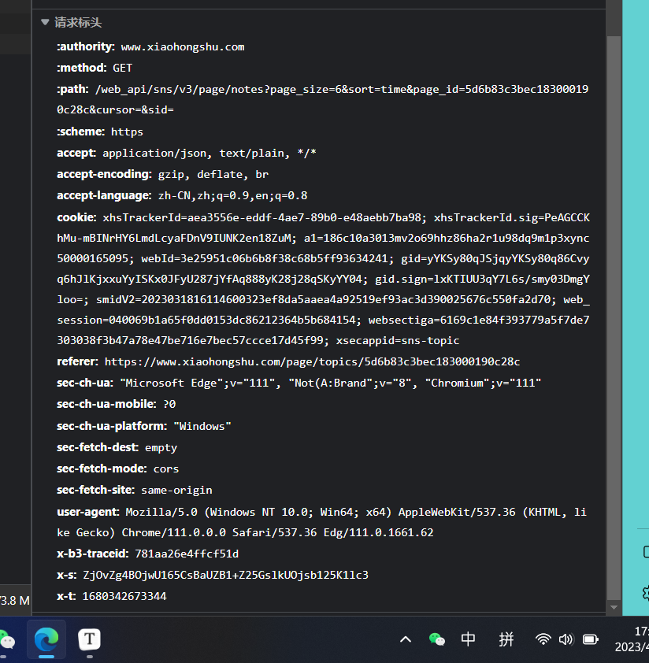
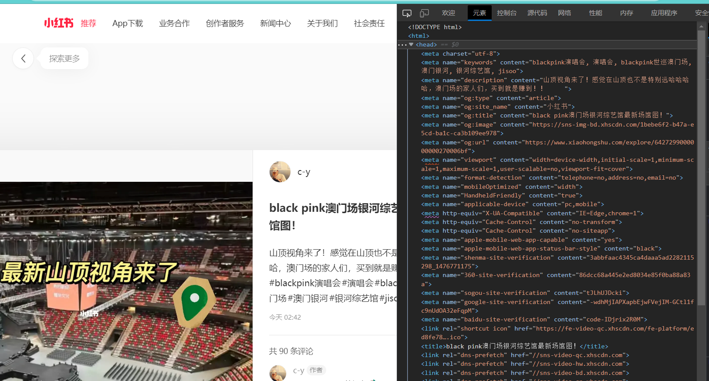

小红书爬虫相比于其它静态页面爬虫难度较大，而且互联网上关于小红书爬虫的相关的信息很少。小红书网页版并没有搜索入口，因此网络中大多爬取的方式是通过移动端获取，即通过模拟器（如Nox）和客户端抓包（如Appium）相结合的方式爬取。

由于本人缺乏移动端爬虫的经验，因此本人尝试通过网页进行爬取。网页端爬取通常有两种方式，比较安全的方式是通过`request.get()`函数抓取网络`json`内容，另一种比较通用的方式是通过模拟浏览器访问的方式抓取html文件；不过后者的方式爬取速度缓慢且容易被反爬。

在尝试了很多种方式之后，对于本人最终采用了Selenium模拟的方式进行爬取小红书。因为通过`request.get()`的方式需要`request.options()`预请求，其中存在`x-s, x-t, x-bstraceid`三个必填的加密参数，而这三个加密参数并不是恒定不变的，因此获取难度较大。（需要分析Java Script代码，对该文件进行逆向解析才可以，否则小红书Server将会返回`-1`）而本人对JS语言并没有很熟悉，因此最终采用了模拟浏览器的方法进行爬取小红书。



获取每个文章ID的方式，经过研究发现并没有`x-s, x-t, x-bstraceid`参数的限制，因此可以使用`requests.get()`的方式进行获取。获取ID的函数具体实现方式如下：

```python
def find_uid(page_id):
    url1 = "https://www.xiaohongshu.com/web_api/sns/v3/page/notes"

    param1 = {
        'page_size': 20,  # max = 20
        'page_id': page_id,
        'cursor': None,
        'sid': None,
    }
    sort = ['hot', 'time']  # 按热度/按时间
    param1['sort'] = sort[1]

    data = dataset()

    for page in range(51):  # 翻页数 max = 1000/page_size
        response = requests.get(url1, headers=headers, params=param1)
        resp_json = response.json()
        text = resp_json["data"]["notes"]
        cursor = resp_json["data"]["cursor"]
        param1['cursor'] = cursor
        # print(cursor)
        for num in range(len(text)):
            print(">> ", text[num]["id"], ": ", text[num]["title"])
            if text[num]["id"] not in data.id:
                data.id.append(text[num]["id"])  # uid
                data.title.append(text[num]["title"])  # title
                data.like.append(text[num]["likes"])  # likes
                temp = []
                image_list = text[num]["images_list"]  # image
                for photo in range(len(image_list)):
                    temp.append(image_list[photo]["url_size_large"])
                data.image.append(temp)

        sleep(4)

    return data
```

通过Selenium模拟浏览器请求的具体代码如下：

```python
opt = Options()
opt.add_experimental_option("excludeSwitches", ["enable-automation"])
opt.add_experimental_option('useAutomationExtension', False)
opt.add_argument('lang=zh-CN,zh,zh-TW,en-US,en')
opt.add_argument('user-agent=Mozilla/5.0 (Windows NT 10.0; Win64; x64) AppleWebKit/537.36 (KHTML, like Gecko) Chrome/111.0.0.0 Safari/537.36 Edg/111.0.1661.54')
opt.add_argument("disable-blink-features=AutomationControlled")

driver = webdriver.Chrome(ChromeDriverManager().install(), chrome_options=opt)

def simulation(uid):
    # driver.refresh()  # 第一次get的时候需要刷新一下refresh!!!
    driver.get('https://www.xiaohongshu.com/explore/' + str(uid))
    sleep(float(random.randint(50, 100) / 10))
    # source = driver.page_source
    try:
        keyword = driver.find_elements(By.XPATH, "//meta[@name='keywords']")
        descript = driver.find_elements(By.XPATH, "//meta[@name='description']")
        # title = driver.find_elements(By.XPATH, "//meta[@name='og:title']")
    except:
        return '', ''

    if keyword[-1].get_attribute('content') != '':
        return keyword[-1].get_attribute('content'), descript[-1].get_attribute('content')
    else:
        return '', ''
```



## 全部代码

```python
import os.path
import requests
import random
import openpyxl as op
from selenium import webdriver
from selenium.webdriver.chrome.options import Options
from selenium.webdriver.common.by import By
from webdriver_manager.chrome import ChromeDriverManager
from time import sleep


class dataset:
    def __init__(self):
        self.id = []
        self.image = []
        self.like = []
        self.read = []
        self.title = []


headers = {
    # 'authority': 'www.xiaohongshu.com',
    'accept': 'application/json, text/plain, */*',
    'accept-language': 'zh-CN,zh;q=0.9,en;q=0.8',
    'cookie': 'your cookie...',
    'sec-ch-ua': '"Chromium";v="110", "Not A(Brand";v="24", "Microsoft Edge";v="110"',
    'sec-ch-ua-mobile': '?0',
    'sec-ch-ua-platform': '"Windows"',
    'sec-fetch-dest': 'empty',
    'sec-fetch-mode': 'cors',
    'sec-fetch-site': 'same-origin',
    'server-version': 'v2023.02.13.1',
    'user-agent': 'Mozilla/5.0 (Windows NT 10.0; Win64; x64) AppleWebKit/537.36 (KHTML, like Gecko) Chrome/110.0.0.0 '
                  'Safari/537.36 Edg/110.0.1587.69',
    # 'x-b3traceid': '4320d4c1abdb0538',
    # 'x-s': 'sYMK1gc+1l5b1iFi1iqvsl1iOgFL1g9Cs6FLO6TbZj93',
    # 'x-t': x_t,
}


def make_img(pos, data):
    uid = data.id[pos]
    for num in range(len(data.image[pos])):
        img = requests.get(data.image[pos][num]).content
        with open("Image/" + str(uid) + "/" + str(uid) + "_" + str(num) + ".jpg", "wb") as f:
            f.write(img)
        sleep(0.5)


if __name__ == "__main__":
    keyword = "5d6b83c3bec183000190c28c"
    data_list = find_uid(keyword)
    print(len(data_list.id), len(data_list.title), len(data_list.image))

    opt = Options()
    opt.add_experimental_option("excludeSwitches", ["enable-automation"])
    opt.add_experimental_option('useAutomationExtension', False)
    opt.add_argument('lang=zh-CN,zh,zh-TW,en-US,en')
    opt.add_argument('user-agent=Mozilla/5.0 (Windows NT 10.0; Win64; x64) AppleWebKit/537.36 (KHTML, like Gecko) '
                     'Chrome/111.0.0.0 Safari/537.36 Edg/111.0.1661.54')
    opt.add_argument("disable-blink-features=AutomationControlled")

    driver = webdriver.Chrome(ChromeDriverManager().install(), chrome_options=opt)

    wb = op.load_workbook("test.xlsx")
    ws = wb['Sheet1']

    for i in range(len(data_list.id)):
        if not os.path.exists("Image/" + str(data_list.id[i])):
            os.makedirs("Image/" + str(data_list.id[i]))  # 创建文件夹

            keyword, descript = simulation(data_list.id[i])
            print("ID:", data_list.id[i])
            print("Title:", data_list.title[i])
            print("Like:", data_list.like[i])
            print("Keyword:", keyword)
            print("Description:", descript)
            print("-" * 50)

            # write to excel
            d = data_list.id[i], data_list.title[i], data_list.like[i], keyword, descript
            try:
                ws.append(d)
                wb.save("test.xlsx")
            except:
                print("Error: Cannot save to Excel!!!")

            make_img(i, data_list)

        else:  # 之前已经爬取过了
            print(">> 爬过的帖子...")
            continue
    exit(0)

```

