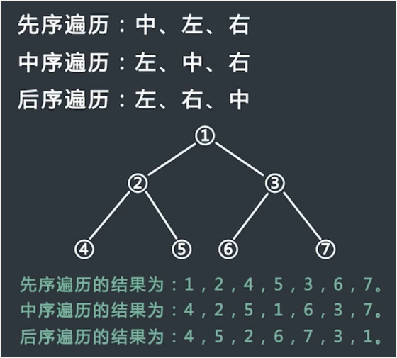
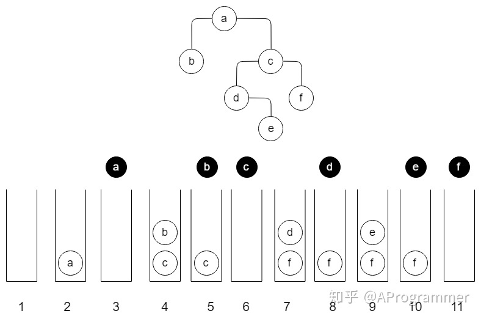

## 前言

> 人为什么难做选择？

**选择意味着放弃**

你选择一方，也就意味着放弃了另一方。摆在你面前的选择项越接近，你的选择就会越困难，因为放弃其中任何一个选择项都不容易。如果摆在你面前的选择项对比明显，那么选择起来就会轻松许多，大家几乎都会毫不犹豫的选择“好”的选择项，放弃掉“差”的选择项。

**选择永远都不是完美的**

选择永远都不可能十全十美，只可能满足尽量多的侧重点。选择的时候想满足越多的侧重点，可能就会越难做出选择。所以在选择上不要过于追求完美。

警惕**逃避性选择**——不知道自己要去哪儿，还要选择离开。

有一种选择是对现状不满，想逃离这种现状，但是却不知道去哪里。举个例子，可能目前的公司有各种问题，比如开发流程不规范等，如果因为这些问题离开，可能就会从一个坑跳到另外一个更大的坑。当决定离开的时候，一定是自己有明确的目标，很清楚自己想要什么。

------

## 二叉树的定义

二叉树要么为空，要么由根节点（root），左子树（left subtree）和右子树（right subtree）组成，而且左子树和右子树分别是一棵二叉树。

------

## 二叉树的遍历

- 先序遍历$PreOrder(T)=Root(T)+PreOrder(left subT)+PreOrder(right subT)$
- 中序遍历$InOrder(T)=InOrder(left subT)+Root(T)+InOrder(right subT)$
- 后序遍历$PostOrder(T)=PostOrder(left subT)+PostOrder(Right subT)+Root(T)$



------


```
struct Bitree //definition
{
    int data;
    Bitree Lchild;
    Bitree Rchild;
};
```

## 先序遍历

1. 递归实现

```
void PreOrderTraverse(BiTree tree)
{
    if (tree == NULL)
        return;
    cout << tree->data;
    PreOrderTraverse(tree->lchild);
    PreOrderTraverse(tree->rchild);
}
```

2. 迭代实现

```
void PreOrder(BiTree Root)
{
    stack <BiTree> s;
    if (root) //如果根节点不为空
        s.push(root); //则令根节点入栈
    while (!s.empty()) //在栈变空之前反复循环
    { 
        root = s.pop(); 
        cout << root->data; //弹出并访问当前节点
        //下面左右孩子的顺序不能颠倒
        //必须先让右孩子先入栈，再让左孩子入栈。
        if (root->RChild)
            s.push(root->RChild); //右孩子先入后出
        if (root->LChild)
            s.push(root->LChild); //左孩子后入先出
    }
}
```

我们通过一个实例来了解一下该迭代版本是如何工作的 :



## 中序遍历

1. 递归实现

```
void InOrderTraverse(BiTree tree)
{
    if (!tree)
        return;
    InOrderTraverse(tree->lchild);
    cout << tree->data;
    IndOrderTraverse(tree->rchild);
}
```

2. 迭代实现

```
void InOrderTraverse(BiTree root)
{
   Stack<BiTree> S; //辅助栈
   while (true)
      if (root) 
      {
         S.push (root); //根节点进栈
         root = root->LChild; //深入遍历左子树
      } 
      else if (!S.empty()) 
      {
         root = S.pop(); //尚未访问的最低祖先节点退栈
         cout << root->data; //访问该祖先节点
         root = root->RChild; //遍历祖先的右子树
      } 
      else
         break; //遍历完成
}
```

## 后序遍历

1. 递归实现

```
void PostOrderTraverse(BiTree tree)
{
    if (!tree)
        return;
    InOrderTraverse(tree->Lchild);
    IndOrderTraverse(tree->Rchild);
    cout << tree->data;
}
```

2. 迭代实现

```
#define A !cur->Lchild && !cur->Rchild
//如果P不存在左孩子和右孩子，则可以直接访问它；
#define B pre==cur->Lchild || pre==cur->Rchild
//P存在左孩子或者右孩子，但是其左孩子和右孩子都已被访问过了;
void PostOrder(BiTree Root)
{
    if (!Root)
        return;
    stack <BiTree> s;//辅助栈
    BiTree cur=Root,pre=NULL;
    s.push(Root);//根节点进栈
    while (!s.empty())
    {
        cur=s.top();
        if (A || B)
        {
            cout << cur->data;
            s.pop();
            pre=cur;
        }
        else
        {
            if (cur->Rchild)
                s.push(cur->Rchild);
            if (cur->Lchild)
                s.push(cur->Lchild);
        }
    }
}

```

------

下一篇文章：[数组与链式二叉树之间的转换 | Tony (tonylsx611.github.io)](https://tonylsx611.github.io/2022/02/24/binary_tree_2/)
$$
END
$$