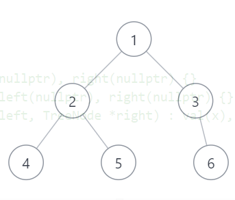

## 前言

对二叉树不是很了解的同学可以先看一下我之前的文章：[链式二叉树简介](https://tonylsx611.github.io/2022/02/25/binary_tree_1/)

## 数组二叉树转链表

将一棵完全二叉树转换成链表形式是比较常见的一种做法，我们首先声明一个int类型的数组，然后把它放入链表二叉树中。这个过程相对来说是很容易实现的。

```c
int length = 7;
int arr[length] = { 1, 2, 3, 4, 5, NULL, 6 };
```



之后的任务就是将数组转化为链表形式，链表的定义如下：

```c
struct TreeNode //二叉树的格式
{
    int val;
    TreeNode* left;
    TreeNode* right;
    TreeNode() : val(0), left(nullptr), right(nullptr) {}
    TreeNode(int x) : val(x), left(nullptr), right(nullptr) {}
    TreeNode(int x, TreeNode* left, TreeNode* right) : val(x), left(left), right(right) {}
};
```

转化的过程也很容易，其实这是一个数学问题，对于一棵完全二叉树（满二叉树），节点`tree[i]`的左子树永远是`tree[2*i+1]`，节点`tree[i]`的右子树永远是`tree[2*i+2]`；并且我们只需要递归到倒数第二层的树即可，即`if (i < length/2)`。

```c
TreeNode* addtree(TreeNode* tree, int arr[], int i)//数组转链表
{
	if (arr[i] == 0)
        return NULL;
    if (i < length/2)//arr.length()
    {
        TreeNode* tree = new TreeNode();
        
        tree->val = arr[i];
        tree->left = addtree(tree, arr, i + i + 1);
        tree->right = addtree(tree, arr, i + i + 2);
        return tree;
    }
    return NULL;
}
```

## 链表二叉树转数组

比较困难的是如何将链表二叉树转换为数组，因为链表形式下并不一定每一个节点都有两个子节点，因此链表二叉树是没有办法直接转化成一棵数组型的完全二叉树（可能也可以，但是我不会，欢迎在评论区讨论）。

如果可以获得链式二叉树的高度，那么可以通过BFS来遍历整个链表，即使链表的节点没有左枝或右枝，也把一个空节点加进stack中，这样理论上可以实现链表到数组的转换，不过实现起来还是非常麻烦。

因此，我们绝大多数情况下是不会将链表转化成数组的，因为在链表中操作数据是非常方便的（当然在数组中操作也不麻烦），我们做的最多的事情就是搜索和遍历二叉树，如果不是很理解前一句话，建议再次回顾一下上一篇文章：[链式二叉树简介](https://tonylsx611.github.io/2022/02/25/binary_tree_1/)

## 例题

Leetcode链接: [98. 验证二叉搜索树 - 力扣（LeetCode） (leetcode-cn.com)](https://leetcode-cn.com/problems/validate-binary-search-tree/)

**题目描述：**

给你一个二叉树的根节点 root ，判断其是否是一个有效的二叉搜索树。

有效 二叉搜索树定义如下：

- 节点的左子树只包含 小于 当前节点的数。
- 节点的右子树只包含 大于 当前节点的数。
- 所有左子树和右子树自身必须也是二叉搜索树。

**输入输出样例：**


```bash
input: root=[2,1,3]
output: true
```


```bash
input: root = [5,1,4,null,null,3,6]
output: false
explanation: 根节点的值是 5 ，但是右子节点的值是 4 。
```

**提示：**

- 树中节点数目范围在$[1, 10^4]$ 内
- $-2^{31} \leq Node.val \leq 2^{31} - 1$

## 例题分析

我最初的思路是，只要保证**每一个节点大于左枝，小于右枝**即可。

对于这样的思路，直接对链表进行BFS搜索即可，如果不会BFS算法，可以参考：[BFS简介](https://tonylsx611.github.io/2022/03/10/BFS/)。当然，其他的搜索算法也可以考虑，比如DFS，或者前序中序后序遍历每一个节点，然后判断每个节点的两个子节点就可以。我这里就用BFS来实现，代码如下：

```c
class Solution {
public:
    TreeNode* temp;
    bool isValidBST(TreeNode* root)
    {
        queue<TreeNode*> Q;
        TreeNode* node;
        Q.push(root);
        while (!Q.empty())
        {
            node = Q.front();
            temp = node;
            if (node->left != NULL)
            {
                if (node->left->val >= temp->val)
                    return false;
                Q.push(node->left);
            }
            if (node->right != NULL)
            {
                if (node->right->val <= temp->val)
                    return false;
                Q.push(node->right);
            }
            Q.pop();
        }
        return true;
    }
};
```

但是，我发现我的理解是有问题的，这个题目要求是节点下面的**所有左子树**的值都要小于该节点，节点下面**所有右子树**的值都要大于该节点！

比如这个例子，对于该题来说，他的答案应该是false。因为根节点的值是5，但是右侧分支中有一个节点的值是3，小于根节点的值。


因此，对于这种情况，我们应该优先考虑对二叉树进行中序遍历，中序遍历的结果如果是升序就返回true，否则返回false。

比如上面这个错误的样例的中序遍历结果为：`root=[4,5,3,6,7];`，他不是单调递增的数组。

再比如，我们来看一个正确的样例，他的中序遍历的结果为：`root=[4,5,6,7,9]`，他是单调递增的数组。


因此，我们的思路就可以转变为，**判断该二叉树的中序遍历结果是否为单调递增**，来判断其是否是一个有效的二叉搜索树，代码如下：

```c
class Solution {
public:
    int btree[10001];
    int ptr = 0;
    void inorder(TreeNode* root)
    {
        if (root == NULL)
            return;
        if (root->left)
            inorder(root->left);
        btree[ptr] = root->val;
        ptr++;
        if (root->right)
            inorder(root->right);
    }
    bool isValidBST(TreeNode* root)
    {
        inorder(root);
        //for(int i=0;i<ptr;i++)
        //    cout<<btree[i]<<" ";    
        for (int i = 0; i < ptr - 1; i++)
            if (btree[i] >= btree[i + 1])
                return false;
        return true;
    }
};
```

