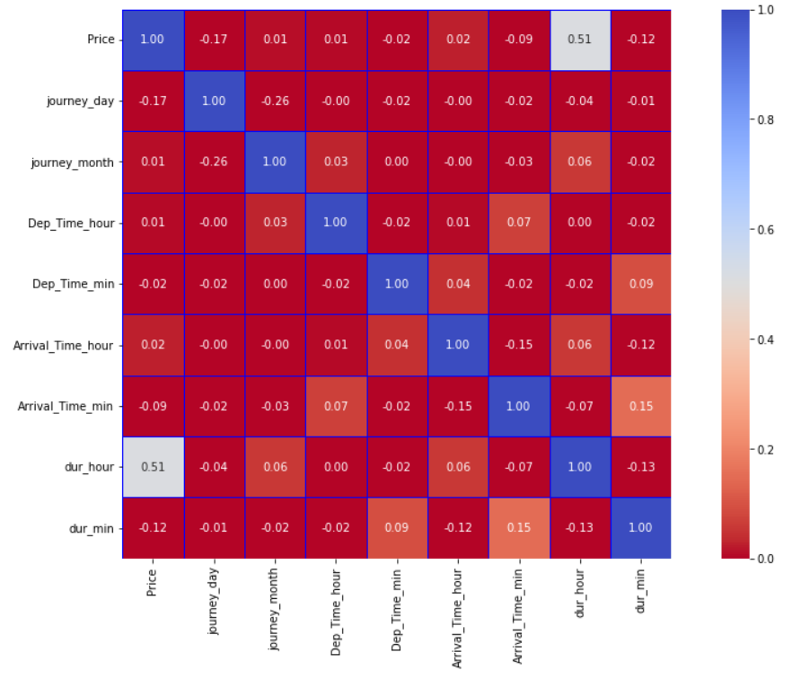
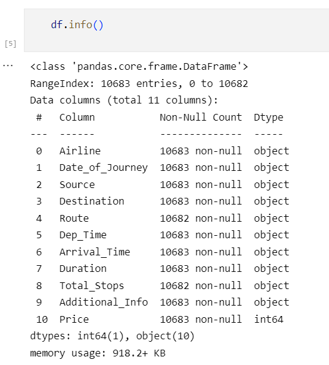
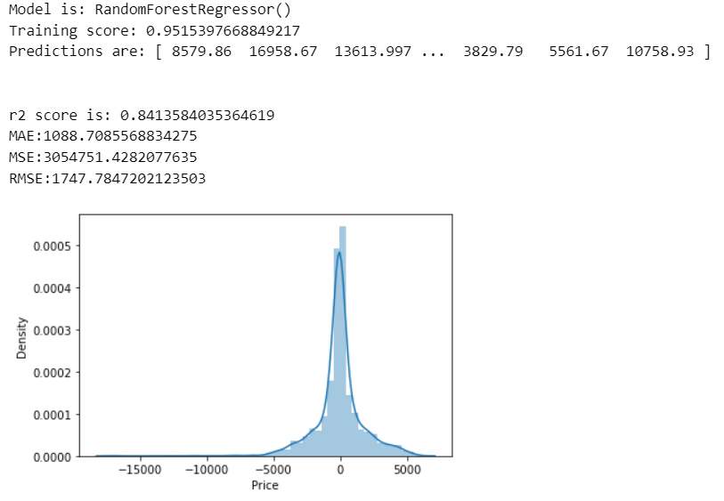
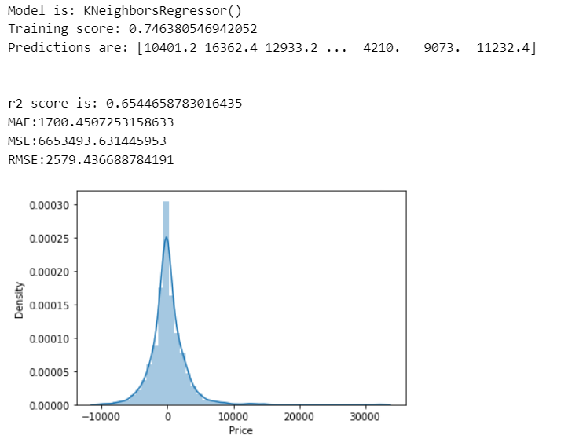
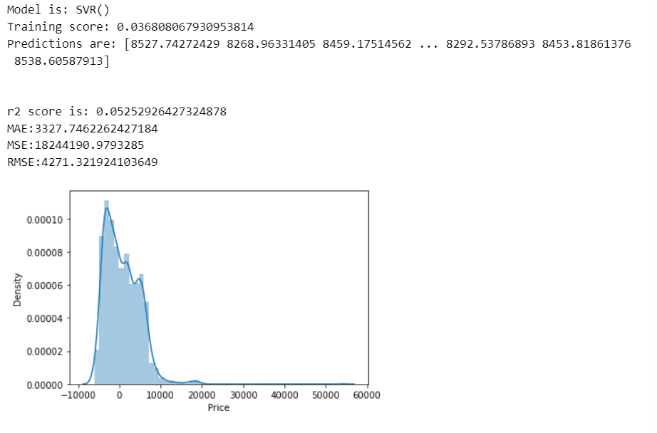
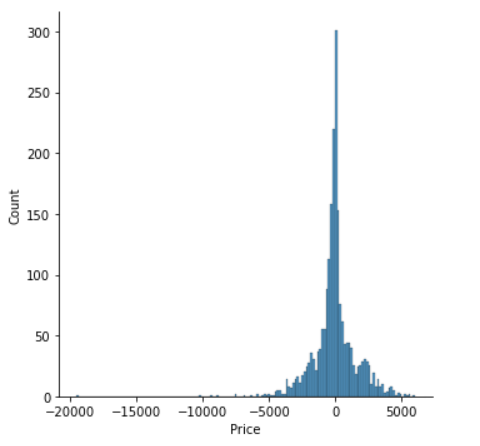

机器学习模型大致分为有监督模型、无监督模型（以及概率模型）。我们熟知的线性回归和神经网络模型都是基于有监督的机器学习模型。


从模型的个数和性质角度来看，我们可以将机器学习模型分为单模型和集成模型（single model and ensemble model）。单模型为仅以某种模型独立训练和验证，如线性回归和逻辑回归模型等，集成模型为多个独立模型组合构成一个混合模型，使得模型获得更合理的于此模型，如随机森林等模型。


从监督类型角度看，机器学习模型分为监督模型和无监督模型（supervised model and unsupervised model)。无监督模型是指从无标注的数据中学习得到模型，监督学习模型则需要在训练过程中根据数据的输入和输出进行学习。


对于机票预测，我们需要选取集成-监督学习模型以得到最佳预测结果；在机票价格数据验证方面我们采用r2_score指标，同时可以观测真实值与预测值之间的区别，进而调整模型参数来进一步提升模型拟合度。

## 数据清洗代码

```python
import pandas as pd 
import numpy as np 
import seaborn as sns 
import matplotlib.pyplot as plt
from sklearn.preprocessing import StandardScaler
from sklearn.model_selection import train_test_split,GridSearchCV
from sklearn.metrics import accuracy_score,confusion_matrix

df=pd.read_excel('Train.xlsx')
df.head()

plt.figure(figsize=(16,9))
sns.heatmap(df.corr(),
            annot=True,  
            center=0.5,  
            fmt='.2f',  
            linewidth=0.5,  
            linecolor='blue',  
            vmin=0, vmax=1,  
            xticklabels=True, yticklabels=True, 
            square=True,
            cbar=True,  
            cmap='coolwarm_r',  
            )
plt.show

```



数据清洗的目标就是把`df`中所有`object`类型的数据变为`int`类型，以便于通过机器学习数据预测。



```python
#drop the nullvalues
df.dropna(inplace=True)
df.isnull().sum()
def change_into_datetime(col):
    df[col]=pd.to_datetime(df[col])
df.columns
for i in ['Date_of_Journey','Dep_Time', 'Arrival_Time']:
    change_into_datetime(i)
df.dtypes
df['journey_day']=df['Date_of_Journey'].dt.day
df['journey_month']=df['Date_of_Journey'].dt.month
df.head(10)
df.drop('Date_of_Journey', axis=1, inplace=True)
def extract_hour(data,col):
    data[col+'_hour']=data[col].dt.hour
    
def extract_min(data,col):
    data[col+'_min']=data[col].dt.minute
    

def drop_col(data,col):
    data.drop(col,axis=1,inplace=True)
  
extract_hour(df,'Dep_Time')

#extracting minutes
extract_min(df,'Dep_Time')

#drop the column
drop_col(df,'Dep_Time')

extract_hour(df,'Arrival_Time')

#extracting min
extract_min(df,'Arrival_Time')


#drop the column
drop_col(df,'Arrival_Time')

duration=list(df['Duration'])
for i in range(len(duration)):
    if len(duration[i].split(' '))==2:
        pass
    else:
        if 'h' in duration[i]: # Check if duration contains only hour
             duration[i]=duration[i] + ' 0m' # Adds 0 minute
        else:
             duration[i]='0h '+ duration[i]
             
df['Duration']=duration
df.head()
def hour(x):
    return x.split(' ')[0][0:-1]

def minutes(x):
    return x.split(' ')[1][0:-1]
    
df['dur_hour']=df['Duration'].apply(hour)
df['dur_min']=df['Duration'].apply(minutes)
drop_col(df,'Duration')
df['dur_hour'] = df['dur_hour'].astype(int)
df['dur_min'] = df['dur_min'].astype(int)
column=[column for column in df.columns if df[column].dtype=='object']
# column
# ['Airline', 'Source', 'Destination', 'Route', 'Total_Stops', 'Additional_Info']
continuous_col =[column for column in df.columns if df[column].dtype!='object']
# continuous_col
# ['Price',
# 'journey_day',
# 'journey_month',
# 'Dep_Time_hour',
# 'Dep_Time_min',
# 'Arrival_Time_hour',
# 'Arrival_Time_min',
# 'dur_hour',
# 'dur_min']
categorical = df[column]
categorical.head()
categorical['Airline'].value_counts()
# Jet Airways                          3849
# IndiGo                               2053
# Air India                            1751
# Multiple carriers                    1196
# SpiceJet                              818
# Vistara                               479
# Air Asia                              319
# GoAir                                 194
# Multiple carriers Premium economy      13
# Jet Airways Business                    6
# Vistara Premium economy                 3
# Trujet                                  1
# Name: Airline, dtype: int64
plt.figure(figsize=(15,8))
sns.boxplot(x='Airline',y='Price',data=df.sort_values('Price',ascending=False))

# As Airline is Nominal Categorical data we will perform OneHotEncoding
Airline=pd.get_dummies(categorical['Airline'],drop_first=True)

#encoding of source column
source=pd.get_dummies(categorical['Source'],drop_first=True)

#encoding of destination column
destination=pd.get_dummies(categorical['Destination'],drop_first=True)

categorical['Route1']=categorical['Route'].str.split('→').str[0]
categorical['Route2']=categorical['Route'].str.split('→').str[1]
categorical['Route3']=categorical['Route'].str.split('→').str[2]
categorical['Route4']=categorical['Route'].str.split('→').str[3]
categorical['Route5']=categorical['Route'].str.split('→').str[4]

drop_col(categorical,'Route')

for i in ['Route3', 'Route4', 'Route5']:
    categorical[i].fillna('None',inplace=True)
    
categorical.isnull().sum() # all zeros

for i in categorical.columns:
    print('{} has total {} categories'.format(i,len(categorical[i].value_counts())))
    
# Airline has total 12 categories
# Source has total 5 categories
# Destination has total 6 categories
# Total_Stops has total 5 categories
# Additional_Info has total 10 categories
# Route1 has total 5 categories
# Route2 has total 45 categories
# Route3 has total 30 categories
# Route4 has total 14 categories
# Route5 has total 6 categories

# Applying label encoder
from sklearn.preprocessing import LabelEncoder
encoder = LabelEncoder()

for i in ['Route1', 'Route2', 'Route3', 'Route4', 'Route5']:

categorical[i]=encoder.fit_transform(categorical[i])
    
drop_col(categorical,'Additional_Info')

# encoding Total stops
dict={'non-stop':0, '2 stops':2, '1 stop':1, '3 stops':3, '4 stops':4}
categorical['Total_Stops']=categorical['Total_Stops'].map(dict)

drop_col(categorical,'Source')
drop_col(categorical,'Destination')
drop_col(categorical,'Airline')

final_df=pd.concat([categorical,Airline,source,destination,df[continuous_col]],axis=1)
 
X=final_df.drop('Price',axis=1)
y=df['Price']
```

## 数据预测代码

```python
from sklearn.feature_selection import mutual_info_classif
from sklearn.model_selection import train_test_split
from sklearn.metrics import r2_score,mean_absolute_error,mean_squared_error
from sklearn.linear_model import LogisticRegression
from sklearn.neighbors import KNeighborsRegressor
from sklearn.tree import DecisionTreeRegressor
from sklearn.ensemble import GradientBoostingRegressor,RandomForestRegressor
from sklearn.naive_bayes import MultinomialNB
from sklearn.svm import SVR

mutual_info_classif(X,y) # 标准化 归一化

imp = pd.DataFrame(mutual_info_classif(X,y),index=X.columns)

# spiliting the dataset

X_train,X_test,y_train,y_test = train_test_split(X,y,test_size=0.20,random_state=123)


def predict(ml_model):
    print('Model is: {}'.format(ml_model))
    model= ml_model.fit(X_train,y_train)
    print("Training score: {}".format(model.score(X_train,y_train)))
    predictions = model.predict(X_test)
    print("Predictions are: {}".format(predictions))
    print('\n')
    r2score=r2_score(y_test,predictions) 
    print("r2 score is: {}".format(r2score))
          
    print('MAE:{}'.format(mean_absolute_error(y_test,predictions)))
    print('MSE:{}'.format(mean_squared_error(y_test,predictions)))
    print('RMSE:{}'.format(np.sqrt(mean_squared_error(y_test,predictions))))
     
    sns.distplot(y_test-predictions) 

```

###### Random Forest Regressors

```python
predict(RandomForestRegressor())
```

 

###### K-Neighbor Regressors

```python
predict(KNeighborsRegressor())
```



###### Simple Vector Regressors

```python
predict(SVR())
```



## 优化预测代码

```python
from sklearn.model_selection import RandomizedSearchCV

random_grid = {
    'n_estimators' : [100, 120, 150, 180, 200,220],
    'max_features':['auto','sqrt'],
    'max_depth':[5,10,15,20],
    }

rf=RandomForestRegressor()
rf_random=RandomizedSearchCV(estimator=rf,param_distributions=random_grid,cv=3,verbose=2,n_jobs=-1,)

rf_random.fit(X_train,y_train)

# best parameter
rf_random.best_params_
# {'n_estimators': 200, 'max_features': 'auto', 'max_depth': 15}

#predicting the values
prediction = rf_random.predict(X_test)

#distribution plot between actual value and predicted value
sns.displot(y_test-prediction)

r2_score(y_test,prediction) # 0.8602
```



---

本文部分内容和图片引用自文章：[【机器学习基础】机器学习模型与算法最全分类汇总！_风度78的博客-CSDN博客](https://blog.csdn.net/fengdu78/article/details/115878843)，如有侵权，请联系我。

