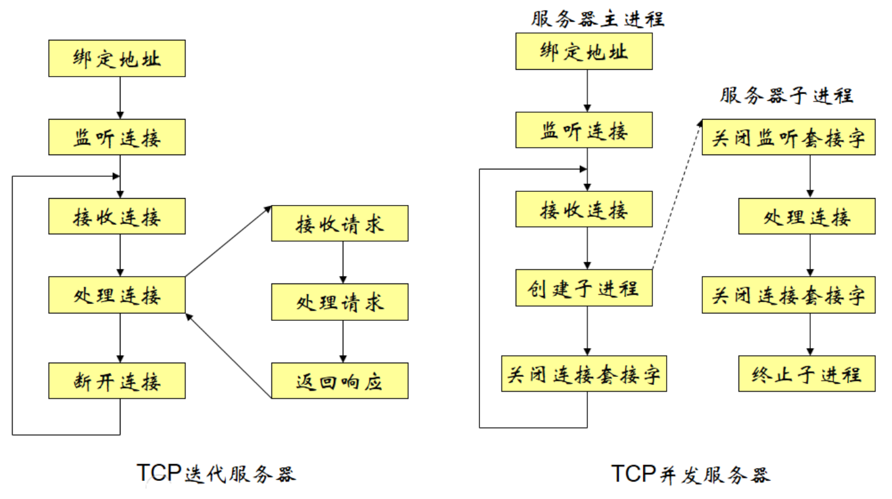

## 迭代服务器与并发服务器的区别



## Windows Server

```c
#pragma comment(lib, "ws2_32.lib")
#include <iostream>
#include <thread>
#include <string>
#include <winsock2.h>
#include <windows.h>

using namespace std;
SOCKET s;
sockaddr_in ss;
//SOCKET fd;

void Windows_init()
{
    WORD sockVersion = MAKEWORD(2, 2);
    WSADATA wsdata;
    if (WSAStartup(sockVersion, &wsdata) != 0)
    {
        cerr << "Initialize Error!"<<endl;
    }
}

void create_socket()
{
    s = socket(AF_INET, SOCK_STREAM, IPPROTO_TCP);
    if (s == INVALID_SOCKET)
    {
        cerr << "socket Error!" << endl;
    }

    memset(&ss, 0, sizeof(ss));
    ss.sin_family = AF_INET;//IPv4
    ss.sin_port = htons(6789);//port No.
    ss.sin_addr.s_addr = inet_addr("127.0.0.1");
    if (bind(s, (sockaddr*)&ss, sizeof(ss)) == SOCKET_ERROR)
    {
        cerr<<"Bind Error!"<<endl;
    }
    if(listen(s, 5) < 0)
    {
        cerr<<"Listen Error!"<<endl;
    }
    cout<<"Server is running..."<<endl;
}

void accept_socket(int &fd)
{
    sockaddr_in clnt_addr;
    int clnt_addr_size = sizeof(clnt_addr);
    fd = accept(s, (sockaddr*) &clnt_addr, &clnt_addr_size);
    if (fd == INVALID_SOCKET)
        cerr << "Accept Error" << endl;
    else
        cout<<"Connected to Server:" << fd << endl;
}

void thread_n(int n)
{
    cout<<"Start thread "<<n<<endl;
    string msg = "Hi, Client " + to_string(n);
    send(n, msg.c_str(), msg.length(), 0);
    cout << "Sending:\" " << msg << "\" to Client..." << endl;
    while(true)
    {
        char message[256];
        memset(message, NULL, sizeof(message));
        int jud = recv(n, message, sizeof(message), 0);
        if (jud < 0)
        {
            cerr<<"Receive Error!!!"<<endl;
            cout<<"Did you close the Window?"<<endl;
            break;
        }
        if (strcmp(message, "quit\n") == false)
        {
            cout << "  Bye-bye " << n << "!" << endl;
            break;
        }
        else
            cout << "  Received by Client: " << message << endl;
        cout << "Clients " << n << " request..." << endl;
    }
    cout<<"Finish thread " << n << endl;
}

int main()
{
    Windows_init();
    create_socket();
    thread threads[10];
    int n = 0;
    while(1)
    {
        int fd = 0;
        accept_socket(fd);
        threads[n] = thread(thread_n, fd);
        //threads[n].join();
        threads[n].detach();
        n++;
        if(n == 10)
            n = 0;
    }
    closesocket(s);
    WSACleanup();
    return 0;
}

```

