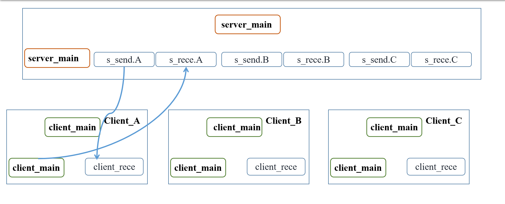

## 原理



## Server Code

```python
from queue import Queue
import socket
import threading
import time

clients = []
messages = []


def new_thread(sock, addr, q):
    msg = "Hello, " + str(addr[1]) + "! You've joined the group."
    sock.send(msg.encode())
    temp_msg = "Client " + str(addr) + " join the group"
    messages.append(temp_msg)
    print(temp_msg)
    for i in range(int((threading.active_count() - 2) / 2)):
        q.put(addr[1])
    print("Now there are ", int((threading.active_count() - 1) / 2), " people in the group!")

    while True:
        msg = sock.recv(256).decode('utf-8')
        if msg == "quit":
            temp_msg = "Bye-bye" + str(addr) + "!"
            messages.append(temp_msg)
            print(temp_msg)  # (Id, port)
            for i in range(int((threading.active_count() - 1) / 2)):
                q.put(addr[1])
            print("Now there are ", int((threading.active_count() - 3) / 2), " people in the group!")
            break
        elif msg == "":
            temp_msg = addr + "has quit the group accidentally..."
            messages.append(temp_msg)
            print(temp_msg)
            for i in range(int((threading.active_count() - 1) / 2)):
                q.put(addr[1])
            print("Now there are ", int((threading.active_count() - 3) / 2), " people in the group!")
            break
        else:
            temp_msg = "    " + str(addr[1]) + ": " + msg
            messages.append(temp_msg)
            for i in range(int((threading.active_count() - 1) / 2)):
                q.put(addr[1])
            print(temp_msg)
    clients.remove(sock)
    sock.close()


def message_record(sock, q):
    time.sleep(0.5)
    while True:
        if q.get() != sock.getpeername()[1]:
            sock.send(messages[-1].encode())
        time.sleep(0.5)


if __name__ == '__main__':
    q = Queue()
    try:
        s = socket.socket(socket.AF_INET, socket.SOCK_STREAM)
    except Exception:
        print("Socket Error!")

    try:
        s.bind(('127.0.0.1', 7777))
    except Exception:
        print("Bind Error!")

    try:
        s.listen(5)
    except Exception:
        print("Listen Error!")

    print('Server is running...')

    while True:
        try:
            sock, addr = s.accept()
        except Exception:
            print("Accept Error!")

        clients.append(sock)
        t = threading.Thread(target=new_thread, args=(sock, addr, q, ))
        t.start()
        t1 = threading.Thread(target=message_record, args=(sock, q, ))
        t1.start()

```

## Client Code

```python
import socket
import threading


def recv_thread(sock):
    while 2 == 2:
        message = sock.recv(256).decode('utf-8')
        if message != "":
            print(message)


if __name__ == '__main__':
    try:
        s = socket.socket(socket.AF_INET, socket.SOCK_STREAM)
    except Exception:
        print("Socket Error!")
    try:
        s.connect(('127.0.0.1', 7777))
    except Exception:
        print("Connection Error!")

    t = threading.Thread(target=recv_thread, args=(s, ))
    t.start()

    while True:
        msg = input()
        if not msg:
            continue
        s.send(msg.encode())
        if msg == "quit":
            print("See you next time, bye!")
            s.close()
            break

```

