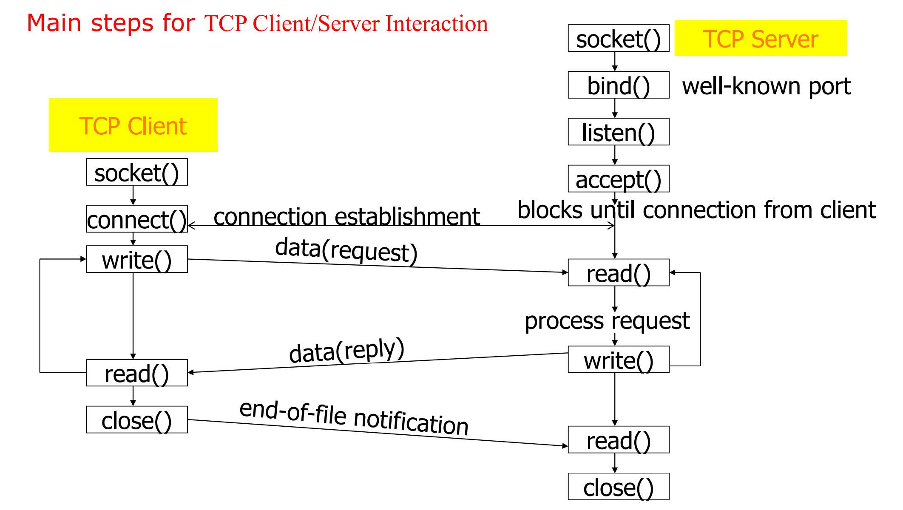
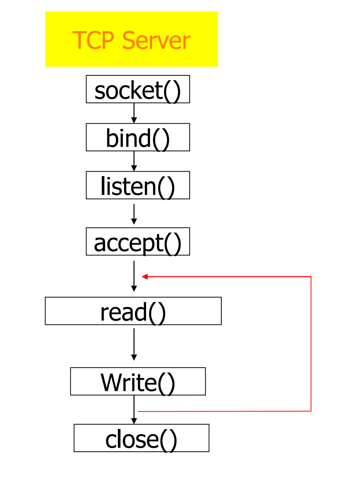

## 实现多条信息收发



## Windows Server

```c
#pragma comment(lib, "ws2_32.lib")
#include <iostream>
#include <cstdlib>
#include <string>
#include <winsock2.h>
using namespace std;

int main()
{
    //初始化模块，仅Windows系统需要
    WORD sockVersion = MAKEWORD(2, 2);
    WSADATA wsdata;
    if (WSAStartup(sockVersion, &wsdata) != 0)
    {
        cout << "Initialize Error!"<<endl;
        exit(-1);
    }
    //建立socket
    SOCKET s = socket(AF_INET, SOCK_STREAM, IPPROTO_TCP);
    if (s == INVALID_SOCKET)
    {
        cout << "socket Error!" << endl;
        exit(-1);
    }

    sockaddr_in ss;
    memset(&ss, 0, sizeof(ss));
    ss.sin_family = AF_INET;//IPv4
    ss.sin_port = htons(6666);//port No.
    ss.sin_addr.s_addr = inet_addr("127.0.0.1");
    //ss.sin_addr.s_addr = htonl(INADDR_LOOPBACK);
    //bind:socket绑定IP地址和端口用于监听
    if (bind(s, (sockaddr*)&ss, sizeof(ss)) == SOCKET_ERROR)
    {
        cout<<"Bind Error!"<<endl;
        exit(-1);
    }
    //listen:设定可同时排队的Client最大连接个数
    if(listen(s, 1) < 0)
    {
        cout<<"Listen Error!"<<endl;
        return -1;
    }
    cout<<"Server is running..."<<endl;
    for(;;)
    {
        //accept:等待客户端链接
    	sockaddr_in clnt_addr;
    	int clnt_addr_size = sizeof(clnt_addr);
    	int fd = accept(s, (sockaddr *) &clnt_addr, &clnt_addr_size);
    	//int fd = accept(s, (sockaddr*)NULL, NULL);
    	if (fd < 0)
    	{
        	cout << "Accept Error" << endl;
        	exit(-1);
    	}
    	else
        	cout<<"Connected to Server:"<<fd<<endl;
    	string msg = "Hi, Client";
    	send(fd, msg.c_str(), msg.length(), 0);
    	cout << "Sending:\" " << msg << "\" to Client..." << endl;
    	while(1)
    	{
        	cout << "Waiting for Clients request..." << endl;
        	string message;
        	int jud = recv(fd, message.to_cstr(), 256, 0);
        	if (jud < 0)
        	{
            	cout<<"Receive Error!!!"<<endl;
            	break;
        	}
        	if (message == "quit")
        	{
            	cout << "  Bye-bye " << fd << "!" << endl;
            	closesocket(fd);
            	break;
        	} 
            else
            	cout << "  Received by Client: " << message << endl;
    	}
    }
    closesocket(s);
    return 0;
}
```

## Windows Client

```c
#pragma comment(lib, "ws2_32.lib")
#include <iostream>
#include <cstdlib>
#include <string>
#include <winsock2.h>
#include <string>
using namespace std;
int main()
{
    //初始化模块，仅Windows系统需要
    WORD sockVersion = MAKEWORD(2, 2);
    WSADATA wsdata;
    if (WSAStartup(sockVersion, &wsdata) != 0)
    {
        cout << "Initialize Error!"<<endl;
        exit(-1);
    }
    SOCKET s = socket(AF_INET, SOCK_STREAM, IPPROTO_TCP);
    if (s == INVALID_SOCKET)
    {
        cout<<"Invalid Socket!"<<endl;
        exit(-1);
    }
    sockaddr_in ss;
    memset(&ss, 0, sizeof(ss));
    ss.sin_family = AF_INET;//IPv4
    ss.sin_port = htons(6666);//port No.
    ss.sin_addr.s_addr = htonl(INADDR_LOOPBACK);
    if(connect(s, (sockaddr*)&ss, sizeof(ss)) == SOCKET_ERROR)
    {
        cout<<"Connect Error!"<<endl;
        closesocket(s);
        exit(-1);
    }
    string message;
    if(recv(s, message.c_str(), 256, 0) > 0)
    {
        cout<<"Successfully Connected to Server: ";
        cout<<message<<endl;
    }
    while(1)
    {
        string msg;
        cout<<"Please input your message:";
        getline(cin, msg);
        int send_len = send(s, msg.c_str(), msg.length(), 0);
        if(send_len < 0)
        {
            cout<<"Sending Error!!!"<<endl;
            break;
        }
        else if(msg == "quit")
        {
            cout<<"See you next time, bye!"<<endl;
            closesocket(s);
            break;
        }
    }
    return 0;
}
```

## Linux Server

```c
#include <stdio.h>
#include <sys/types.h>
#include <sys/socket.h>
#include <stdlib.h>
#include <unistd.h>
#include <netinet/in.h>
#include <ctype.h>

int main()
{
    //建立socket
    int s = socket(AF_INET, SOCK_STREAM, IPPROTO_TCP);
    if (s < 0)
    {
        printf("Socket Error!\n");
        exit(-1);
    }

    struct sockaddr_in ss;
    memset(&ss, 0, sizeof(ss));
    ss.sin_family = AF_INET;//IPv4
    ss.sin_port = htons(6666);//port No.
    //ss.sin_addr.s_addr = inet_addr("127.0.0.1");
    ss.sin_addr.s_addr = htonl(INADDR_ANY);
    //bind:socket绑定IP地址和端口用于监听
    if (bind(s, (sockaddr*)&ss, sizeof(ss)) < 0)
    {
        printf("Bind Error!\n");
        exit(-1);
    }
    //listen:设定可同时排队的Client最大连接个数
    if(listen(s, 1) < 0)
    {
        printf("Listen Error!\n");
        return -1;
    }
    printf("======Server is running...======\n");
    for(;;)
    {
        //accept:等待客户端链接
    	int fd = accept(s, (struct sockaddr*)NULL, NULL);
    	if (fd < 0)
    	{
        	printf("Accept Error!\n");
        	exit(-1);
    	}
    	else
        	printf("Client %d, welcome!\n", connfd);
    	char msg[32] = "Hi, Client";
    	//send(fd, msg.c_str(), msg.length(), 0);
        write(fd, msg, sizeof(msg));
        printf("Sending:\"%s\" to Client\n", msg);
    	while(1)
    	{
            printf("Waiting for Clients request...\n");
        	char message[32];
        	memset(message, 0, sizeof(message));
        	//int jud = recv(fd, message, sizeof(message), 0);
            int jud = write(fd, message, sizeof(message));
        	if (jud < 0)
        	{
                printf("Receive Error!!!\n");
            	break;
        	}
        	if (strcmp(message, "quit") == 0)
        	{
                printf("Bye-bye %d!", fd);
            	close(fd);
            	break;
        	} 
            else
                printf("  Received by Client: %s", message);
    	}
    }
    close(s);
    return 0;
}
```

## Linux Client

```c
#include <stdio.h>
#include <sys/types.h>
#include <sys/socket.h>
#include <stdlib.h>
#include <unistd.h>
#include <netinet/in.h>
#include <ctype.h>
int main()
{
    int s = socket(AF_INET, SOCK_STREAM, 0);
    if (s < 0)
    {
        printf("Socket Error!\n");
        exit(-1);
    }
    struct sockaddr_in ss;
    memset(&ss, 0, sizeof(ss));
    ss.sin_family = AF_INET;//IPv4
    ss.sin_port = htons(6666);//port No.
    ss.sin_addr.s_addr = htonl(INADDR_LOOPBACK);
    if(connect(s, (sockaddr*)&ss, sizeof(ss)) < 0)
    {
        printf("Connect Error!\n");
        close(s);
        exit(-1);
    }
    char message[32];
    memset(message, 0, sizeof(message));
    if(write(s, message, sizeof(message)) > 0)
        printf("Successfully Connected to Server: %s", message);
    while(1)
    {
        char msg[32];
        printf("Please input your message:");
        gets(msg);
        int send_len = send(s, msg, sizeof(msg));
        if(send_len < 0)
        {
            printf("Sending Error!!!\n");
            break;
        }
        else if(msg == "quit")
        {
            printf("See you next time, bye!\n")
            close(s);
            break;
        }
    }
    return 0;
}
```

## Python Server

```python
import socket

try:
    s = socket.socket(socket.AF_INET, socket.SOCK_STREAM)
except Exception:
    print("Socket Error!")
# listen port
try:
    s.bind(('127.0.0.1', 7777))
except Exception:
    print("Bind Error!")
try:
    s.listen(5)
except Exception:
    print("Listen Error!")
print('Server is running...')
while True:
    try:
        sock, addr = s.accept()
    except Exception:
        print("Accept Error!")
    print("Connected to Server: ", addr)  # (Id, port)
    msg = "Hello Client!"
    sock.send(msg.encode())
    print("Sending \"", msg, "\" to Client...")
    while True:
        print("Waiting for Clients request...")
        message = sock.recv(256).decode('utf-8')
        if message == "quit":
            print("Bye-bye", addr, "!")
            break
        else:
            print("  Received by Client: ", message)
    sock.close()
exit(0)

```

## Python Client

```python
import socket

try:
    s = socket.socket(socket.AF_INET, socket.SOCK_STREAM)
except Exception:
    print("Socket Error!")
try:
    s.connect(('127.0.0.1', 7777))
except Exception:
    print("Connection Error!")
message = s.recv(256).decode('utf-8')
print(message)
while True:
    msg = input("Please input your message: ").strip()
    if not msg:
        continue
    s.send(msg.encode())
    if msg == "quit":
        print("See you next time, bye!")
        s.close()
        break
exit(0)

```

---

上一篇：[Socket网络编程1 | Tony](http://tonylsx.top/2022/09/17/socket-program-1/)

下一篇：[Socket网络编程 3——UDP | Tony](http://tonylsx.top/2022/10/14/socket-program-3/)
