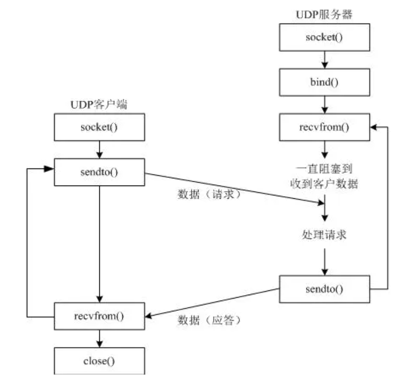

## TCP与UDP的区别



## Windows Server

```c
#pragma comment(lib, "ws2_32.lib")
#include <iostream>
#include <cstdlib>
#include <string>
#include <winsock2.h>
using namespace std;

int main()
{
    //初始化模块，仅Windows系统需要
    WORD sockVersion = MAKEWORD(2, 2);
    WSADATA wsdata;
    if (WSAStartup(sockVersion, &wsdata) != 0)
    {
        cout << "Initialize Error!"<<endl;
        exit(-1);
    }
    //建立socket
    SOCKET s = socket(AF_INET, SOCK_DGRAM, IPPROTO_UDP);
    if (s == INVALID_SOCKET)
    {
        cout << "socket Error!" << endl;
        exit(-1);
    }
    sockaddr_in ss{};
    memset(&ss, 0, sizeof(ss));
    ss.sin_family = AF_INET;//IPv4
    ss.sin_port = htons(6666);//port No.
    ss.sin_addr.s_addr = inet_addr("127.0.0.1");
    //bind:socket绑定IP地址和端口用于监听
    if (bind(s, (sockaddr*)&ss, sizeof(sockaddr)) == SOCKET_ERROR)
    {
        cout<<"Bind Error!"<<endl;
        exit(-1);
    }
    //不需要listen
    cout<<"UDP Server is running..."<<endl;
    while (true)
    {
        bool end_while = false;
        //accept:等待客户端链接
        sockaddr_in client_addr;
        int len = sizeof(client_addr);
        string message;
        recvfrom(s, message.c_str(), 256, 0, (SOCKADDR*)&client_addr, &len);
        string msg = "Hi, Client";
        sendto(s, msg.c_str(), msg.length()+1, 0, (SOCKADDR*)&client_addr, sizeof(SOCKADDR));
        cout << "Sending: \"" << msg << "\" to Client..." << endl;
        while (true)
        {
            cout << "Waiting for Clients request..." << endl;
            int jud = recvfrom(s, message, sizeof(message), 0, (sockaddr*)&client_addr, &len);
            if (jud < 0)
            {
                cout << "Receive Error!!!" << endl;
                cout << "  Make sure your input length < 31."<<endl;
                continue;
            }
            if(strcmp(message, "quit_server") == 0)
            {
                end_while = true;
                cout << "Server is closing..."<<endl;
                break;
            }
            else if(message == "quit")
            {
                cout << "  Bye-bye " << jud << "!" << endl;
                break;
            }
            else
                cout << "  Received by Client: " << message << endl;
            Sleep(1000);
        }
        if(end_while)
            break;
    }
    cout<<"Server has been Closed."<<endl;
    closesocket(s);
    WSACleanup();
    return 0;
}
```

 ## Windows Client

```c
#pragma comment(lib, "ws2_32.lib")
#include <iostream>
#include <cstdlib>
#include <winsock2.h>
#include <string>
using namespace std;

int main()
{
    //初始化模块，仅Windows系统需要
    WORD sockVersion = MAKEWORD(2, 2);
    WSADATA wsdata;
    if (WSAStartup(sockVersion, &wsdata) != 0)
    {
        cout << "Initialize Error!"<<endl;
        exit(-1);
    }
    SOCKET s = socket(AF_INET, SOCK_DGRAM, IPPROTO_UDP);
    if (s == INVALID_SOCKET)
    {
        cout<<"Invalid Socket!"<<endl;
        exit(-1);
    }
    sockaddr_in ss;
    memset(&ss, 0, sizeof(ss));
    ss.sin_family = AF_INET;//IPv4
    ss.sin_port = htons(6666);//port No.
    ss.sin_addr.s_addr = htonl(INADDR_LOOPBACK);
    // No need to Connect()
    string message = "Hi, Server!";
    int len = sizeof(SOCKADDR);
    sendto(s, message.c_str(), message.length(), 0, (sockaddr*)&ss, len);
    if(recvfrom(s, message.c_str(), 256, 0, (sockaddr*)&ss, &len) > 0)
    {
        cout<<"Successfully Connected to Server: ";
        cout<<message<<endl;
    }

    while(true)
    {
        string msg;
        cout<<"Please input your message:";
        getline(cin, msg);
        int send_len = sendto(s, msg.c_str(), msg.length(), 0, (sockaddr*)&ss, len);
        if(send_len < 0)
        {
            cout<<"Sending Error!!!"<<endl;
            break;
        }
        else if(msg == "quit")
        {
            cout<<"See you next time, bye!"<<endl;
            closesocket(s);
            break;
        }
    }
    WSACleanup();
    return 0;
}
```

## Linux Server

```c
#include <stdio.h>
#include <sys/types.h>
#include <sys/socket.h>
#include <stdlib.h>
#include <unistd.h>
#include <netinet/in.h>
#include <ctype.h>

int main(void)
{
    //建立socket
    int s = socket(AF_INET, SOCK_DGRAM, IPPROTO_UDP);
    if (s < 0)
    {
        printf("socket Error!\n");
        exit(-1);
    }
    sockaddr_in ss{};
    memset(&ss, 0, sizeof(ss));
    ss.sin_family = AF_INET;//IPv4
    ss.sin_port = htons(6666);//port No.
    ss.sin_addr.s_addr = inet_addr("127.0.0.1");
    //bind:socket绑定IP地址和端口用于监听
    if (bind(s, (sockaddr*)&ss, sizeof(sockaddr)) < 0)
    {
        printf("Bind Error!\n");
        exit(-1);
    }
    //不需要listen
    printf("UDP Server is running...\n");
    while (true)
    {
        bool end_while = false;
        //accept:等待客户端链接
        sockaddr_in client_addr;
        int len = sizeof(client_addr);
        char message[32];
        memset(message, 0, sizeof(message));
        recvfrom(s, message, sizeof(message), 0, (SOCKADDR*)&client_addr, &len);
        char msg[32] = "Hi, Client";
        sendto(s, msg, sizeof(msg), 0, (SOCKADDR*)&client_addr, sizeof(SOCKADDR));
        printf("Sending: \"%s\" to Client...\n", msg);
        while (true)
        {
            printf("Waiting for Clients request...\n");
            memset(message, 0, sizeof(message));
            int jud = recvfrom(s, message, sizeof(message), 0, (sockaddr*)&client_addr, &len);
            if (jud < 0)
            {
                printf("Receive Error!!!\n  Make sure your input length < 31.\n");
                continue;
            }
            if(strcmp(message, "quit_server") == 0)
            {
                end_while = true;
                printf("Server is closing...\n");
                break;
            }
            else if(strcmp(message, "quit") == 0)
            {
                printf("  Bye-bye %d !\n", jud);
                break;
            }
            else
                printf("  Received by Client: %s\n", message);
        }
        if(end_while)
            break;
    }
    printf("Server has been Closed.\n");
    close(s);
    return 0;
}
```

 ## Linux Client

```c
#include <stdio.h>
#include <sys/types.h>
#include <sys/socket.h>
#include <stdlib.h>
#include <unistd.h>
#include <netinet/in.h>
#include <ctype.h>

int main(void)
{
    int s = socket(AF_INET, SOCK_DGRAM, IPPROTO_UDP);
    if (s < 0)
    {
        printf("socket Error!\n");
        exit(-1);
    }
    sockaddr_in ss;
    memset(&ss, 0, sizeof(ss));
    ss.sin_family = AF_INET;//IPv4
    ss.sin_port = htons(6666);//port No.
    ss.sin_addr.s_addr = htonl(INADDR_LOOPBACK);
    // No need to Connect()
    char message[32] = "Hi, Server!";
    int len = sizeof(SOCKADDR);
    sendto(s, message, sizeof(message), 0, (sockaddr*)&ss, len);
    memset(message, 0, sizeof(message));
    if(recvfrom(s, message, sizeof(message), 0, (sockaddr*)&ss, &len) > 0)
        printf("Successfully Connected to Server: %s\n", message);

    while(true)
    {
        char msg[32];
        printf("Please input your message:");
        gets(msg);
        int send_len = sendto(s, msg, sizeof(msg), 0, (sockaddr*)&ss, len);
        if(send_len < 0)
        {
            printf("Sending Error!!!\n");
            break;
        }
        else if(strcmp(msg, "quit") == 0)
        {
            printf("See you next time, bye!\n");
            close(s);
            break;
        }
    }
    return 0;
}
```


## Python Server

```python
import socket

try:
    s = socket.socket(socket.AF_INET, socket.SOCK_DGRAM)
except Exception:
    print("Socket Error!")
server_add = ('127.0.0.1', 9999)
try:
    s.bind(server_add)
except Exception:
    print("Bind Error!")
# No need to Listen()
print('Server_UDP is running...')
while True:
    # No need to Accept()
    message, client = s.recvfrom(256)
    print(message.decode())
    msg = "Hello, Client!"
    s.sendto(msg.encode(), client)
    print("Sending \"", msg, "\" to Client...")

    while True:
        print("Waiting for Clients request...")
        message, client = s.recvfrom(256)
        if message.decode() == "quit":
            print("Bye-bye", client, "!")
            break
        else:
            print("  Received by Client: ", message.decode())
s.close()
exit(0)

```

## Python Client

```python
import socket

try:
    s = socket.socket(socket.AF_INET, socket.SOCK_DGRAM)
except Exception:
    print("Socket Error!")
server_add = ('127.0.0.1', 9999)
try:
    message = "HI, Server!"
    s.sendto(message.encode(), server_add)
    message, server = s.recvfrom(256)
    print(message.decode())
except socket.timeout:
    print("Time out!")

while True:
    msg = input("Please input your message: ").strip()
    if not msg:
        continue
    s.sendto(msg.encode(), server_add)
    if msg == "quit":
        print("See you next time, bye!")
        s.close()
        break
exit(0)

```

---

上一篇：[Socket网络编程2 | Tony](http://tonylsx.top/2022/10/14/socket-program-2/)

下一篇：还没写好呢...
