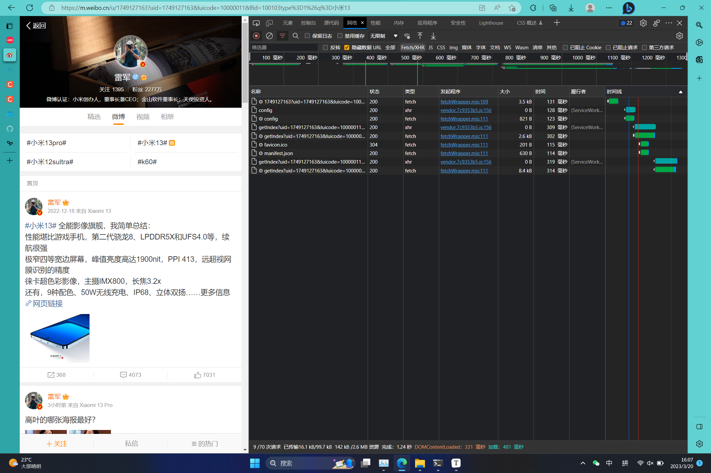
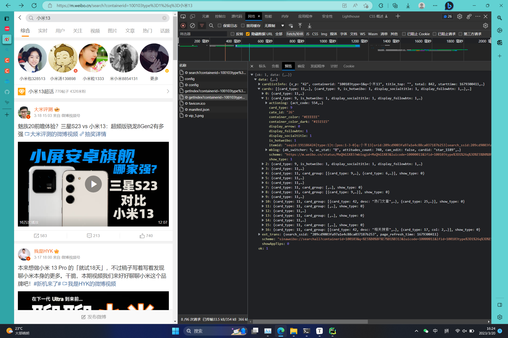

# 内容简介

本文主要内容为微博移动端[[微博 (weibo.cn)](https://m.weibo.cn/)]的正文、图片和评论内容的爬取方法。目前可以实现两个主要的功能：

1. 通过搜索关键词来获取关键词下前50页的热门微博，获取每条微博下的作者信息，评论信息，点赞数和转发数，图片和视频等。


2. 通过搜索博主id获取该博主所发布的所有微博内容，包括评论信息，点赞数和转发数，图片和视频等。



# 数据分析

## 网址分析

以搜索”小米13“关键词为例， 其http网址为：

```http
https://m.weibo.cn/search?containerid=100103type%3D1%26q%3D%E5%B0%8F%E7%B1%B313
```

其中，`%E5%B0%8F%E7%B1%B313`为`小米13`，通过`quote()`函数将中文转换为网址信息，前面的内容`https://m.weibo.cn/search?containerid=100103type%3D1%26q%3D`为固定信息，无论更换任何关键词其值都不发生改变。


该URL为GET请求，请求得到的信息中包含详细的每条卡片信息，包含卡片的ID信息，图片信息，作者信息，发布时间等等。



`data->cards->1->mblog`中包含了我们需要搜集的绝大多数信息，这些信息是开放的未加密的。

## 页面下拉分析

1. 微博关键词页面请求的URL格式为：

```http
https://m.weibo.cn/api/container/getIndex?containerid=100103type=1&q=小米13&page_type=searchall&page=2
```

因此翻页的请求操作就很简单，只需要修改page的值即可。

2. 微博主页下面评论请求的URL格式为：

```http
https://m.weibo.cn/comments/hotflow?id=4881387725260346&mid=4881387725260346&max_id_type=0
https://m.weibo.cn/comments/hotflow?id=4881387725260346&mid=4881387725260346&max_id=190628723632&max_id_type=0
```

因此可以看出翻页请求的方式为修改max_id的值，而max_id的值是从上一个URL获取到的。只需要不停的将上一个max_id迭代给下一个URL中的参数中，直到max_id=0结束迭代即可。


3. 个人主页下面的微博页面请求URL格式为：

```http
https://m.weibo.cn/api/container/getIndex?uid=2022252207&luicode=10000011&lfid=100103type=1&q=小米13&type=uid&value=2022252207&containerid=1005052022252207
https://m.weibo.cn/api/container/getIndex?uid=2022252207&luicode=10000011&lfid=100103type=1&q=小米13&type=uid&value=2022252207&containerid=1076032022252207&since_id=4881342653007337
```

因此可以看出翻页的请求方式为修改since_id的值，而since_id的值也是从上一个URL获取到的。跟上面的操作方法一样迭代，直到`data->cards`为空即可。


# 全部代码

代码涵盖了：

- 爬取关键词下的热门微博
- 爬取用户发布的所有微博

```python
import os.path
import re
import requests
from datetime import datetime
from time import sleep
from urllib.parse import urlencode
from urllib.parse import quote

headers = {
    'authority': 'm.weibo.cn',
    'accept': 'application/json, text/plain, */*',
    'accept-language': 'zh-CN,zh;q=0.9,en-CN;q=0.8,en;q=0.7,es-MX;q=0.6,es;q=0.5',
    'client-version': 'v2.38.9',
    'referer': 'https://m.weibo.cn/detail/4877693583361088',
    'sec-ch-ua': '"Chromium";v="110", "Not A(Brand";v="24", "Microsoft Edge";v="110"',
    'sec-ch-ua-mobile': '?0',
    'sec-ch-ua-platform': '"Windows"',
    'sec-fetch-dest': 'empty',
    'sec-fetch-mode': 'cors',
    'sec-fetch-site': 'same-origin',
    'server-version': 'v2023.02.13.1',
    'user-agent': 'Mozilla/5.0 (Windows NT 10.0; Win64; x64) AppleWebKit/537.36 (KHTML, like Gecko) Chrome/110.0.0.0 '
                  'Safari/537.36 Edg/110.0.1587.63',
    'x-requested-with': 'XMLHttpRequest',
}

cookie = '要写自己的cookie哦'
headers['cookie'] = cookie


def time_format(input_time_str):
    input_format = '%a %b %d %H:%M:%S %z %Y'
    output_format = '%Y-%m-%d %H:%M:%S'
    return datetime.strptime(input_time_str, input_format).strftime(output_format)


def make_text(uid):
    # https://m.weibo.cn/statuses/extend?id=4877693583361088 正文格式

    param0 = {
        'id': uid
    }

    url0 = 'https://m.weibo.cn/statuses/extend?'
    response = requests.get(url0, headers=headers, params=param0)
    resp_json = response.json()
    # print(resp_json)
    if resp_json['ok'] == 1:  # 请求成功
        attitude = resp_json['data']['attitudes_count']  # 点赞数
        comments = resp_json['data']['comments_count']  # 评论数
        reposts = resp_json['data']['reposts_count']  # 转发数
        data = resp_json['data']['longTextContent']  # 正文
        data1 = re.sub("<br />", "\n", data)  # 处理换行符问题
        # 还未处理： #...# 的超链接
        print("正文:", data1)

        # 导出到 data/uid/text.txt 文件中
        with open("data/" + str(uid) + "/" + "text.txt", "w", encoding='utf-8') as f:
            f.write(data1)
    else:
        print(">> 正文获取失败...")


def make_commit(uid):
    # https://m.weibo.cn/comments/hotflow?id=4877693583361088&mid=4877693583361088&max_id_type=0 评论

    # 清空 data/uid/commit.txt 中的内容
    if os.path.exists("data/" + str(uid) + "/commit.txt"):
        with open("data/" + str(uid) + "/commit.txt", "a+") as f:
            f.truncate(0)

    cnt = 0  # 评论数

    param1 = {
        'id': uid,
        'mid': uid,
        'max_id_type': 0,
        'max_id': 0,
    }

    url1 = 'https://m.weibo.cn/comments/hotflow?'
    while 1 == 1:
        url1 += urlencode(param1)
        response = requests.get(url1, headers=headers)
        resp_json = response.json()

        if resp_json['ok'] == 1:  # 请求成功
            data = resp_json['data']
            for num in range(len(data['data'])):
                cnt += 1
                # 写入data/uid/commit.txt
                with open("data/" + str(uid) + "/" + "commit.txt", "a", encoding='utf-8') as f:
                    f.write(str(data['data'][num]) + "\n\n")
                print(data['data'][num])  # 打印每一条评论

            # https://m.weibo.cn/comments/hotflow?id=4876699311019002&mid=4876699311019002&max_id_type=0
            # https://m.weibo.cn/comments/hotflow?id=4876699311019002&mid=4876699311019002&max_id=193017192550121&max_id_type=0
            # 上一页url请求的 max_id 就是下一页的url中的值
            max_id = data['max_id']
            param1['max_id'] = max_id

            if max_id == 0:
                print(">> 没有更多评论了...")
                break
            sleep(1)
        else:
            print(">> 暂无评论...")
            break
    print(">> 评论个数:", cnt)


def find_uid_from_person(name, page):
    # 澳门银河:1921176353
    # uid=1921176353 & luicode=10000011 & lfid=1076031921176353 & value=1921176353 & containerid=1076031921176353
    # uid=1663088660 & luicode=10000011 & lfid=1076031663088660 & value=1663088660 & containerid=1076031663088660
    # 芒果TV: 1663088660
    uid_arr = []
    img_arr = []

    url3 = 'https://m.weibo.cn/api/container/getIndex?'

    param3 = {
        'uid': name,
        't': 0,
        'luicode': 10000011,
        'lfid': str(107603) + str(name),
        'type': 1,
        'type': 'uid',
        'value': name,
        'containerid': str(107603) + str(name),
    }
    url3 += "&page_type=searchall&page="

    for pages in range(1, page + 1):  # pages
        print("-" * 25, "page:", str(pages), "-" * 25)
        response = requests.get(url3, headers=headers, params=param3)
        resp_json = response.json()
        since_id = resp_json['data']['cardlistInfo']['since_id']
        param3['since_id'] = since_id
        val = len(resp_json['data']['cards'])
        for j in range(val):
            if pages == 1 and j == 0:
                continue
            img_url = []
            commit = resp_json['data']['cards'][j]
            if commit['card_type'] == 9:
                if commit['mblog']['created_at'][-4:] == '2023':  # 按时间判断
                    uid_arr.append(commit['mblog']['mid'])  # id
                    # 图片处理
                    if commit['mblog']['pic_num'] != 0:  # 有图片
                        num = len(commit['mblog']['pics'])  # 图片个数
                        for k in range(num):
                            img_url.append(commit['mblog']['pics'][k]['large']['url'])
                    img_arr.append(img_url)

                print(commit['mblog']['mid'])  # uid
                print(commit['mblog']['created_at'])  # create time
            elif commit['card_type'] == 11 and commit['card_group'][0]['card_type'] == 9:
                if commit['card_group'][0]['mblog']['created_at'][-4:] == '2023':  # 按时间判断
                    uid_arr.append(commit['card_group'][0]['mblog']['mid'])  # id
                    # 图片处理
                    if commit['card_group'][0]['mblog']['pic_num'] != 0:  # 有图片
                        # print(commit['card_group'][0]['mblog']['pics'][0]['url'])
                        num = len(commit['card_group'][0]['mblog']['pics'])  # 图片个数
                        for k in range(num):
                            try:
                                img_url.append(commit['card_group'][0]['mblog']['pics'][k]['large']['url'])
                            except:
                                continue
                    img_arr.append(img_url)

                print(commit['card_group'][0]['mblog']['mid'])  # uid
                print(commit['card_group'][0]['mblog']['created_at'])  # create time
        sleep(1)
    return uid_arr, img_arr


def find_uid(keywords, page):
    uid_arr = []
    img_arr = []
    url2 = "https://m.weibo.cn/api/container/getIndex?containerid=100103type%3D1%26q%3D"
    url2 += quote(keywords)
    url2 += "&page_type=searchall&page="
    print("正在查询关键词为", keywords, "的网址:", url2)

    for pages in range(1, page + 1):  # pages
        print("-" * 25, "page:", str(pages), "-" * 25)
        response = requests.get(url2 + str(pages), headers=headers)
        resp_json = response.json()
        val = len(resp_json['data']['cards'])
        for j in range(val):
            if pages == 1 and j == 0:
                continue
            img_url = []
            commit = resp_json['data']['cards'][j]
            if commit['card_type'] == 9:
                if commit['mblog']['created_at'][-4:] == '2023':  # 按时间判断
                    uid_arr.append(commit['mblog']['mid'])  # id
                    # 图片处理
                    if commit['mblog']['pic_num'] != 0:  # 有图片
                        num = len(commit['mblog']['pics'])  # 图片个数
                        for k in range(num):
                            img_url.append(commit['mblog']['pics'][k]['large']['url'])
                    img_arr.append(img_url)

                print(commit['mblog']['mid'])  # uid
                print(commit['mblog']['created_at'])  # create time
            elif commit['card_type'] == 11 and commit['card_group'][0]['card_type'] == 9:
                if commit['card_group'][0]['mblog']['created_at'][-4:] == '2023':  # 按时间判断
                    uid_arr.append(commit['card_group'][0]['mblog']['mid'])  # id
                    # 图片处理
                    if commit['card_group'][0]['mblog']['pic_num'] != 0:  # 有图片
                        # print(commit['card_group'][0]['mblog']['pics'][0]['url'])
                        num = len(commit['card_group'][0]['mblog']['pics'])  # 图片个数
                        for k in range(num):
                            try:
                                img_url.append(commit['card_group'][0]['mblog']['pics'][k]['large']['url'])
                            except:
                                continue
                    img_arr.append(img_url)

                print(commit['card_group'][0]['mblog']['mid'])  # uid
                print(commit['card_group'][0]['mblog']['created_at'])  # create time
        sleep(1)
    return uid_arr, img_arr


def make_img(uid, img_url):
    for num in range(len(img_url)):
        img = requests.get(img_url[num]).content
        with open("data/" + str(uid) + "/" + str(uid) + "_" + str(num) + ".jpg", "wb") as f:
            f.write(img)
        sleep(0.5)


if __name__ == "__main__":
    search_page = 10  # 更改爬取的页数
    choose = input("1:爬取关键词下的热门微博\n2:爬取用户发布的所有微博\n请输入: ")
    if choose == '1':
        # 爬取关键词下的热门微博
        keyword = "银河澳门"
        uid_list, img_list = find_uid(keyword, search_page)
    elif choose == '2':
        # 爬取用户发布的所有微博
        ID = "1663088660"
        uid_list, img_list = find_uid_from_person(ID, search_page)
    else:
        print("输入错误")
        exit(-1)

    for i in range(len(uid_list)):
        if not os.path.exists("data/" + str(uid_list[i])):
            os.makedirs("data/" + str(uid_list[i]))  # 创建文件夹

            make_text(uid_list[i])
            make_commit(uid_list[i])
            make_img(uid_list[i], img_list[i])

        else:  # 之前已经爬取过了
            print(">> 爬过的帖子...")
            continue

    print(">> 共爬取了", len(uid_list), "个微博...")
    exit(0)


```

